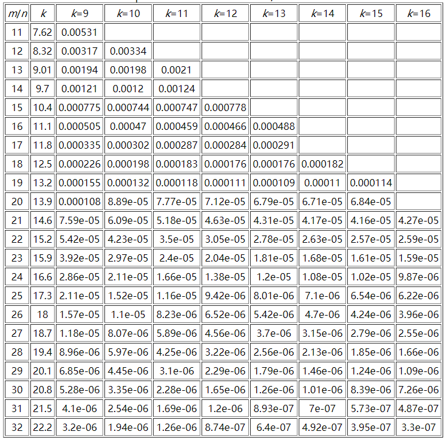

# Redis 相关

本文内容部分摘自网络。

## 为什么 Redis 这么快

经典问题之一，回答此题时切忌堆砌名词，浅尝辄止。最佳回答是先总后分。

**参考答案**

主要是因为 Redis 采用了内存存储、单线程模型、优化的数据结构以及 I/O 多路复用技术。其中：

- 内存存储：所有数据放在内存中，完全避免了相对耗时的磁盘 I/O。
- 单线程模型：单线程模型可以避免锁竞争、上下文切换等开销，也使得代码更加清晰。
- 优化的数据结构：使用了简单动态字符串、双向链表、压缩列表、哈希表、跳表和整数数组等数据结构，能够实现 O(1)或近似 O(1)
  的时间复杂度的操作。
- I/O 多路复用：利用了操作系统提供的多路 I/O 复用 epoll 模型，可以通过事件循环机制高效地监听多个 socket 上的事件。

## 为什么 Redis 使用单线程

- 简单高效：单线程模型使 Redis 的开发和维护更加简单，不需要处理多线程带来的加锁、线程同步等复杂情况。
- 瓶颈不在 CPU：Redis 作为内存数据库，性能瓶颈主要在内存和网络带宽而非 CPU。
- 数据结构简单：Redis 的数据结构被专门设计得很简单高效，绝大部分操作的时间复杂度都是 O(1)，因此单线程已经足以应对大部分读写场景。
- I/O 多路复用：利用了操作系统提供的多路 I/O 复用 epoll 模型，可以高效地监听和处理多个客户端连接。

## 单线程的瓶颈

- 只能用一个 cpu 核(忽略后台线程)
- 如果 value 比较大，redis 的 QPS 会下降得很厉害，有时一个大 key 就可以拖垮
- QPS 难以更上一层楼

## 为什么 Redis 后来引入多线程

### Redis 4.x 的多线程

Redis 在 4.x 版本引入了多线程，用来**异步**执行`UNLINK`、`FLUSHALL ASYNC`、`FLUSHDB ASYNC`命令。
比如对于键的删除，我们一般不需要同步等待完成，而且删除大键是一个耗时操作。所以引入多线程是方便执行那些不需要同步返回的命令。

> [!NOTE]
> `UNLINK`是 Redis 4.0 新增的命令，用于异步删除一个（较大的）键，返回值是实际解除链接的键的数量。
> `DEL`命令仍然是同步删除一个键。

### Redis 6.x 的多线程 I/O

Redis 官方在 2020 年 5 月正式推出 6.0 版本，此版本正式引入了多线程 I/O。

首先要解释 **Redis 的单线程**：Redis 在处理客户端的请求时，包括获取 (socket 读)、解析、执行、内容返回 (socket 写)
等都由一个顺序串行的主线程处理。

随着硬件性能提升，Redis 的单线程性能瓶颈可能出现在网络 IO 的读写，也就是：单个线程处理网络读写的速度跟不上底层网络硬件的速度。
读写网络的 read/write 系统调用占用了 Redis 执行期间大部分 CPU 时间，瓶颈主要在于网络的 IO 消耗。
此时的优化方向：

- 提高网络 IO 性能，典型的实现比如使用 DPDK 来替代内核网络栈的方式。
- 使用多线程充分利用多核，提高网络请求读写的并行度，典型的实现比如 Memcached。

Redis 采用了第二种方式，即 Redis 采用多个 IO 线程来处理网络请求，提高网络请求处理的并行度。
**需要注意的是**，Redis 多 IO 线程模型只用来处理网络读写请求，对于 Redis 内部的KV读写，依然是单线程处理。

**开启多线程**

Redis 6.0 的多线程默认是禁用的，只使用主线程。如需开启需要修改 redis.conf 配置文件：

```shell
io-threads-do-reads yes
io-threads 4 # 建议为CPU核数-1
```

## Redis 的多路复用与 HTTP/2 有何不同

**应用层别不同**

HTTP/2 的多路复用发生在应用层，即在一个 TCP 连接上复用多条流。而 Redis 的多路复用发生在更底层的网络 IO 层，即在一个线程中同时处理多个客户端
socket 连接的 IO 操作。

**目的不同**

HTTP/2 多路复用的主要目的是减少 TCP 连接数，提高带宽利用率。Redis 的多路复用主要目的是保持单线程以及不必要的上下文切换开销。

## Redis 的事务实现

Redis 通过 MULTI、DISCARD、EXEC 和 WATCH 四个命令来实现事务功能，事务提供了一种"将多个命令打包，然后一次性、
按顺序地执行"的机制，并且事务在执行期间不被主动中断，一个事务从开始到执行会经历以下三个阶段：

- WATCH：在事务开始前，用于监视一个或多个键，如果键的值发生了变化，则 EXEC 无法执行，事务中断（在 MULTI 前执行）
    - 事务中断后，WATCH 命令自动取消
    - 单个会话有效
- UNWATCH：取消 WATCH 对所有 key 的监视（在 MULTI 前执行）
- MULTI：标志着事务开始
- 输入其他命令：命令在服务器入列，命令语法错误会导致 EXEC 无法执行，即事务中断（所有命令都不执行）
- EXEC：服务器以先进先出的顺序执行命令，如果命令执行失败，则继续执行下一条命令，也不会回滚已执行的命令。
- DISCARD：取消一个事务（在 EXEC 前执行）

Redis 事务提供一致性和隔离性，但不提供原子性和持久性。

- **一致性**：指不会出现执行一半命令的情况。
- **隔离性**：指事务之间互不干扰，同时也不会在事务内插入其他命令。
- **原子性（X）**：一条命令的执行失败不会导致前面的命令回滚。
- **持久性（X）**：因为 Redis 的持久化都是异步的，做不到实时落盘（为了保证性能）。

## 内存淘汰机制

当 Redis 内存不够用时，它根据设置的淘汰策略来删除部分键。支持以下策略：

- no eviction：当内存使用超过配置时就会返回错误，不会驱逐任何键
- allkeys-lru：加入键的时候，如果过限，首先通过 LRU 算法驱逐最久没有使用的键
- voliatile-lru：加入键的时候如果过限，首先从设置了过期时间的键集合中驱逐最久没有使用的键
- allkey-random：加入键的时候如果过限，从所有 key 中随机删除
- voliatile-random：加入键的时候如果过限，从设置了过期时间的键集合中随机删除
- voliatile-ttl：从配置了过期时间的键中驱逐马上就要过期的键
- volatile-lfu：从所有配置了过期时间的键中驱逐使用频率最少的键
- allkeys-lfu：从所有键中驱逐使用频率最少的键

## 什么是缓存雪崩

缓存在同一时间大面积的失效，后面的请求都直接落到了数据库上，造成数据库短时间内承受大量的请
求。

**解决办法**

根据缓存雪崩的原因执行不同的方案：

- Redis 宕机
    - 集群化或使用哨兵模式部署 Redis。
    - 开启持久化，保证重启后快速恢复缓存数据。
- 大量缓存同时失效
    - 在批量往 redis 存数据的时候，把每个 Key 的失效时间都加个随机值。
    - 或者设置热点数据永远不过期，有更新操作就更新缓存就可以了。
    - 在代码中实现本地缓存，避免请求全部落到数据库。
    - 接口限流。

## 什么是缓存击穿

大量的请求同时查询一个 热 key 时，假设此时，这个 key 正好失效了，就会导致大量的请求都打到数据库上面去，这种现象我们称为击穿。
缓存击穿带来的问题就是会造成某一时刻数据库请求量过大，压力剧增。

**解决办法**

- 热点数据永不过期，由定时任务定期去刷新缓存。
- 互斥锁。在查询 miss 后，从数据库加载缓存前，对操作加一个互斥锁。

## 什么是缓存穿透

请求的数据在缓存和数据库中都不存在，所以查询一直 miss，请求一直落到数据库。此时如果请求量较大就会击垮数据库。

**解决办法**

- 添加参数校验。
- 缓存空值 key。

## 什么是布隆过滤器

它由一个很长的二进制向量和一系列随机映射函数组成。布隆过滤器可以用于检索出一个元素是否在一个集合中，他的优点是空间效率和查询时间远远超过一般的算法。

**原理**

当一个元素被加入集合时，通过 K 个散列函数将这个元素映射成一个位数组中的
K 个点（offset），把它们置为 1。检索时，我们只要看看这些点是不是都是 1 就（大约）知道集合中有
没有它了：如果这些点有任何一个 0，则被检元素一定不在；如果都是 1，则被检元素很可能在。这就
是布隆过滤器的基本思想。

**优点**

- 空间占用极小，因为本身不存储数据而是用比特位表示数据是否存在，某种程度具有保密的效果。
- 插入与查询操作的时间复杂度均为 O(k)，常数级别，k 表示散列函数执行次数。
- 散列函数之间可以相互独立，可以在硬件指令层加速计算。

**缺点**

- 误判（假阳性率）
- 无法删除

**具体使用**

从 Redis 4.0 开始,布隆过滤器作为一个模块被集成到 Redis 中。我们需要先下载并加载布隆模块。
布隆命令使用：

```shell
# 创建布隆过滤器   bloomFilter是键名   0.03 是允许的最大错误率   2000000是预期存储的元素个数
BF.RESERVE bloomFilter 0.03 2000000

# 添加元素
BF.ADD bloomFilter foo

# 添加多个元素
BF.MADD bloomFilter e1 e2

# 判断存在性
BF.EXISTS bloomFilter foo

# 判断多个元素的存在性
BF.MEXISTS {key} {item} {item} ...

# 查看布隆键信息，包含预设容量、实际占用、已插入元素数量等
BF.INFO {key}
```

若是 redis 3.x 版本，只能使用 redis 的 bitmap 来实现，比较麻烦。

### 优势总结

- 极致空间消耗：不存原始数据，仅用 bit 存储标记，10 亿数据只需几百兆内存。
- 极速查询 O(K)：查询速度与数据量无关，与哈希函数数量有关。
- 数据安全：不存明文，天然的数据脱敏。

### 缺点总结

- 误判率问题：判断存在，但实际可能不存在。
- 无法删除：最大的问题，因为 bit 位共用，删一个会影响其他数据。
- 扩容问题：初始化后长度固定，要扩容只能重建整个过滤器。

### 无法删除，那如何解决工程中的数据更新问题

定时重建。具体是：采用双 Buffer 方案，通过定时任务每半小时基于 DB 全量数据，生成新的过滤器，并替换掉旧的过滤器。
这需要业务没有频繁更新以及实时变更的需求。

### 一般使用哪些哈希函数

哈希函数不均匀会导致 bit 集中，误判率上升。

工程中常用：

- MurmurHash（主流选择）
- xxHash（超快）
- CityHash / FarmHash

避免使用：

- CRC32（分布差）
- MD5/SHA（太慢，没有意义）

### 如何控制误判率

使用高质量哈希函数 + 合适的哈希次数。



## Redis 有哪些监控相关命令

主要有 info、monitor、latency 和 slowlog 命令。

### info 命令

`info` 命令用于获取 Redis 服务器的各种信息和统计数据，包括服务器运行状态、配置参数、客户端连接信息、内存使用情况、持久化信息、集群信息等。
这个命令通常用于监控和诊断 Redis 服务器的运行状态。

### monitor 命令

`monitor` 命令用于实时打印出 Redis 服务器接收到的命令，自 1.0 版本开始可用，一般用于调试客户端程序。

```shell
127.0.0.1:6379 >monitor
OK
1616045629.853032 [10 192.168.0.101:37990] "PING"
1616045629.858214 [10 192.168.0.101:37990] "PING"
1616045632.193252 [10 192.168.0.101:37990] "EXISTS" "test_key_from_app"
1616045632.193607 [10 192.168.0.101:37990] "GET" "test_key_from_app"
```

出于安全考虑，`monitor` 命令不记录 config/auth/exec/hello/quit 命令，其中的 hello 命令是 redis 6.0 新增的命令。

### latency 命令

`latency` 命令用于监视和测量 Redis 实例的延迟。比如 Redis 中的 HSCAN/SSCAN/ZSCAN 命令的时间复杂度都是 O(n)
，当操作的数据量非常大的时候，会导致延迟。
还有 ZRANGE/ZREVRANGE 命令也有这种情况。所以我们需要一种方式来检测和监控这些命令的延迟。

```shell
# 默认延迟阈值为0 ms，表示不监控
127.0.0.1:6379> config get latency-monitor-threshold
1) "latency-monitor-threshold"
2) "0"

# 设置10ms，记录大于等于10ms的命令事件
127.0.0.1:6379> config set latency-monitor-threshold 10
OK

# debug模拟命令延迟，`sleep .10` 表示命令停顿10ms
# 此处模拟两条延迟命令
127.0.0.1:6379> debug sleep .10
OK
127.0.0.1:6379> debug sleep .20
OK

# 获取已记录事件的最后一次延迟
127.0.0.1:6379> latency latest
1) 1) "command" # 事件名，此外，还有fast-command、fork事件
   2) (integer) 1714906319 # 最后发生unix时间戳
   3) (integer) 200 # 最后事件延迟，ms
   4) (integer) 200 # 本事件的最大延迟，ms
   
127.0.0.1:6379> debug sleep .10
OK
127.0.0.1:6379> latency latest
1) 1) "command"
   2) (integer) 1714907607
   3) (integer) 101 # 最新的一次
   4) (integer) 200 # 最大的一次

# 查看`command`事件的所有记录，最多包含160个（不会记录具体命令）
127.0.0.1:6379> latency history command
1) 1) (integer) 1714906316
   2) (integer) 101
2) 1) (integer) 1714906319
   2) (integer) 200
3) 1) (integer) 1714907607
   2) (integer) 101

# 清除所有事件记录
127.0.0.1:6379> latency reset
(integer) 1

127.0.0.1:6379> latency history command
(empty list or set)

# 现在使用 graph 子命令绘制字符趋势图
127.0.0.1:6379> debug sleep .1
OK
127.0.0.1:6379> debug sleep .2
OK
127.0.0.1:6379> debug sleep .3
OK
127.0.0.1:6379> debug sleep .2
OK
# 字符图每列下面的垂直标签表示事件是多久之前发生的，竖着看，依次是10s, 8s, 6s, 3s.
127.0.0.1:6379> latency graph command
command - high 300 ms, low 102 ms (all time high 300 ms)
--------------------------------------------------------------------------------
  # 
  |_
 #||
_|||
    
1863
0sss
s

# doctor 子命令提供统计说明和建议
127.0.0.1:6379> latency doctor
Dave, I have observed latency spikes in this Redis instance. You don't mind talking about it, do you Dave?

# 4个延迟毛刺，平均201ms，中位差50ms，持续83s，最差300ms。
1. command: 4 latency spikes (average 201ms, mean deviation 50ms, period 83.00 sec). Worst all time event 300ms.

I have a few advices for you:

- Check your Slow Log to understand what are the commands you are running which are too slow to execute. Please check http://redis.io/commands/slowlog for more information.
- Deleting, expiring or evicting (because of maxmemory policy) large objects is a blocking operation. If you have very large objects that are often deleted, expired, or evicted, try to fragment those objects into multiple smaller objects.
```

常用的两种延迟事件类型：

- command：测量可能很慢（如 O(logN+M)和 O(n）的命令的执行延迟毛刺的事件；
- fast-command：监控时间复杂度为 O(1)和 O(logN)的命令的事件名称；

还有其他事件类型，用于监控 Redis 执行的耗时的特殊操作。

### slowlog 命令

slowlog 命令是对 latency 命令的补充，用于记录超过延迟阈值的 Redis 命令，自 2.2.12 版本可用。

```shell
# 获取慢日志条数限制，默认128条，超出后删除旧的记录。可set
127.0.0.1:6379> config get slowlog-max-len
1) "slowlog-max-len"
2) "128"
# 获取慢日志的延迟阈值，微秒，默认10ms。可set
127.0.0.1:6379> config get slowlog-log-slower-than
1) "slowlog-log-slower-than"
2) "10000"

# 获取慢日志
127.0.0.1:6379> slowlog get 
 1) 1) (integer) 13 # 自增序号
    2) (integer) 1714908107 # unix时间戳
    3) (integer) 202769 # 耗时，微秒
    4) 1) "debug"
       2) "sleep"
       3) ".2"
    5) "127.0.0.1:33970" # client ip和端口
    6) "" # client名称（通过client setname设置，v2.6.9+）
 2) 1) (integer) 12
    2) (integer) 1714908104
    3) (integer) 300173
    4) 1) "debug"
       2) "sleep"
       3) ".3"
    5) "127.0.0.1:33970"
    6) ""
省略部分。

# 慢日志目前条数
127.0.0.1:6379> slowlog len
(integer) 14
# 清空慢日志
127.0.0.1:6379> slowlog reset
OK
127.0.0.1:6379> slowlog len
(integer) 0
127.0.0.1:6379> slowlog get 
(empty list or set)
```

### 参考

- [MONITOR](https://redis.com.cn/commands/monitor.html)
- [Redis 延迟监控](https://redis.com.cn/topics/latency-monitor.html)
- [Redis 自身状态及命令](https://pdai.tech/md/db/nosql-redis/db-redis-y-monitor.html#Redis自身状态及命令)
- [redis 查看耗时久的命令](https://blog.csdn.net/weixin_38155824/article/details/133384252)

## Redis 的持久化策略

todo

## Redis 作为缓存时如何保证与数据库的一致性

这是一个常见面试题。参考答案如下：

- 写操作时：先更新数据库，再**删除**缓存
- 读操作：先尝试读缓存，如果没有命中，再从数据库读取，再更新到缓存（使用GETSET，避免写入脏数据）

通常面试官会连续提出下面的问题。

### 为什么是删除缓存而不是更新缓存

因为多线程并发更新缓存的时候，由于线程执行时序不确定，可能会导致缓存和数据库不一致（缓存了旧数据）。

### 为什么不是先删除缓存再更新数据库

因为第一增加缓存穿透概率，第二在读写并发时可能出现数据不一致的情况。
第二点具体来说就是，线程 1 删除缓存后，线程 2 读取到数据库旧值，更新到缓存，线程 1 再更新数据库；此时缓存与数据库不一致。

### 如何保证强一致性

使用分布式锁保护读写线程，分别保护【读 DB+更新缓存】和【更新数据库+删除缓存】的操作。

> 这里不考虑分布式锁失效的情况。

## Redis 内存满了怎么办

**确认内存淘汰策略**

首先确认 Redis 目前的内存淘汰策略，当设置为`noeviction`时，内存满了之后，所有**申请内存**的命令都会返回错误。如果是其他策略，则
Redis 会根据策略进行内存淘汰。

**扩容**

- 若是自建的 Redis 单机架构、主从架构（包括哨兵模式），可以考虑通过`config set maxmemory`指令做到内存的动态扩容，前提是服务器拥有足够的内存。
    - 这些架构在服务器内存不足时，只能**停机**扩容或切换主节点。
- 若是自建的集群架构，可以借助`redis-trib`工具实现节点的**动态扩容**（缩容也可）。
- 一般都是使用云托管服务，这就方便很多了，因为大部分云都支持在线扩缩容，无论是标准（含主从）架构还是集群架构（云服务一般支持这两种架构）。
    - 标准架构是指主从架构，副本可以开启**读写分离**。
    - 云服务提供的标准架构最低规格为双机模式，即一个主配一个从，并且支持高可用，即在主节点故障时，自动切换主从角色，
      但存在**短暂停机时间**。
    - 支持<u>有损</u>的在线架构升级，即从标准架构升级到集群架构，这个过程可能会导致存量客户端连接断开（需要支持重连），并且存在命令兼容性问题，具体参考云服务产品文档。

**参考**

- [redis 专题：redis 集群的动态扩容缩容，水平扩展](https://blog.51cto.com/u_15281317/3008526)
- [腾讯云 Redis 变更实例规格](https://cloud.tencent.com/document/product/239/30895)
- [腾讯云 Redis 内存版（标准架构）](https://cloud.tencent.com/document/product/239/36151)
- [腾讯云 Redis 升级实例架构](https://cloud.tencent.com/document/product/239/46458)
- [阿里云：什么是云数据库 Redis 版](https://help.aliyun.com/zh/redis/product-overview/what-is-apsaradb-for-redis)

## Redis 部署架构

支持单机、主从、哨兵和集群四种部署架构。

### 1. 单机架构

仅部署一个 Redis 实例（进程），适用于小项目和本地开发/测试环境。

### 2. 普通主从架构

在普通主从架构中，主节点（Master）负责处理所有的写操作，并将数据同步到一个或多个从节点（Slave）。
从节点负责复制主节点的数据，可以处理读请求，从而分担主节点的读负载。**重点**是当主节点故障时，需要通过 **人工或脚本**
的方式来升级从节点为主节点。

**基本原理**

- 全量复制：当从节点首次连接到主节点时，后者 fork 子进程来生成 RDB 文件，并传输给从节点，从节点收到 RDB
  文件后开始替换已有数据，期间停止对外服务。
- 增量复制：为了避免主从之间发生网络闪断后又进行全量复制的问题，v2.8 开始支持增量复制，其中是通过 offset 机制进行的。
    - 当主从断开时间较久，导致主库的`repl_backlog_buffer`写满了，此时只能进行全量复制。
    - 主节点可以修改`repl-backlog-size 10MB`参数，增加 size 可以降低全量复制概率。
- 半同步复制：默认是异步复制，客户度对主节点的写入是立即返回的，数据会异步复制到其他从节点。从 v3.0
  起，为了尽量减少故障转移时的数据不一致性，Redis
  提供`WAIT`命令来阻塞客户端操作，等待主节点所有写入命令同步到指定个副本数量后或命令超时后返回。
    - 此命令只是尽可能减少主从复制的数据不一致性，无法保障主从之间数据的强一致性！并且会对主节点的写入性能产生较大影响，所以是根据情况使用！
    - 使用时一般是将写入命令与`WAIT`指令封装到一个事务中执行。

**使用场景**

读请求远大于写请求压力，中小项目。

**优点**

- 提高读性能：通过读写分离实现。
- 高可用：在主节点故障时，可以通过提升从节点来保证服务的连续性（有短暂停机）。
- 扩展性：可以通过增加从节点来扩展读操作的处理能力。

**缺点**

- 数据不一致风险：由于是异步复制，当主节点与从节点失去连接（由于网络或宕机等原因），从节点数据可能过期；其次是节点下线导致的数据丢失；
    - **解决**：从节点可以配置`replica-serve-stale-data yes`选项，`yes`
      表示与主失去连接后，继续提供服务，反之报错（提示`SYNC with master in progress`）。
- 读写分离的数据过期问题：主从复制中，由主节点控制删除从节点中的过期数据，由于主节点的惰性或定期删除策略，会导致客户端可能读到从节点的过期数据。
    - **解决**：升级到 v3.2。此版本中，从节点在读取数据时，增加了对数据是否过期的判断。
- 服务停机风险：主节点宕机后需要人工升级从节点为主，中间有不可避免的服务停机时间。
    - **解决**：自己写监控和自动切换的脚本（复杂），或者使用哨兵或集群架构。
- 管理复杂性：需要额外的配置和监控来管理主从节点的状态和数据同步。

**关于从节点级联架构**

在实际项目中，当需要部署较多的从节点来扩展读能力时，一般会考虑**主-从-从**的架构模式，即主节点仅连接到一个从节点，其他从节点则级联到前面的从节点。
这种方式可以减小复制时对主节点的 CPU 和带宽的消耗。

参考：

- https://pdai.tech/md/db/nosql-redis/db-redis-x-copy.html
- https://www.cnblogs.com/wy123/p/12158957.html
- https://redis.io/docs/latest/commands/wait/

### 3. 哨兵主从架构

Redis v2.8 版本开始引入。哨兵的核心功能是通过增加一个**哨兵集群**来解决普通主从架构中主节点的自动恢复问题。

在哨兵架构中，一个 3 到 5 个节点组成的哨兵集群会持续监控 Redis 主从节点状态，并在主节点离线时进行**故障转移**
操作，即选择一个可用的从节点进行角色升级。然后其他从节点会选择这个新主节点作为复制源。

客户端是通过连接哨兵节点来获取 Redis 集群的主节点地址，所以在故障转移完成后，哨兵会将新的主节点地址返回给客户端。

**主/客观下线**

单个哨兵只能判定主节点的下线为**主观下线**，然后会询问其他哨兵关于主节点的状态，当有至少哨兵配置文件中的 `quorum`
个赞成票时，则认为主节点**客观下线**。

**哨兵 Leader 选举**

在哨兵集群判断主节点<u>客观下线</u>后，需要选举一个**哨兵 Leader**来执行主从切换，这里使用的 Raft 算法。选举算法：
选举的票数大于等于`num(sentinels)/2+1`时，将成为领导者，如果没有超过，继续选举。在哨兵集群中，成为 Leader 的要求一是拿到半数以上的赞成票，
二是需要大于等于哨兵配置文件中的 quorum 值。

**示例**：在 5 节点的哨兵集群中，配置`quorum=2`，当 3 个哨兵下线后，剩余 2 个哨兵可以判定主节点客观下线，但由于过半数的哨兵节点下线，
永远无法获得半数以上的 Leader 赞成票，所以仍然无法选出 Leader 来执行主从切换。

**选出新主库**

首先过滤掉无`ping`回应的从节点，然后按照下面的优先级选择：

- 选择`salve-priority`即优先级最高（redis.conf）的从节点
- 选择复制偏移量最大（复制最完整）的从节点
- 字典顺序最小的运行 ID 的从节点

**优点**

- 高可用性：自动故障检测和故障转移确保了 Redis 集群的高可用性。
- 无单点故障：哨兵本身是分布式的，多个哨兵协作避免了单点故障。

**缺点**

- 复杂性：配置和管理比单节点或简单的主从架构复杂。
- 一致性问题：在故障转移期间可能会有短暂的写一致性问题。

> [!NOTE]
> 事实上，哨兵架构名存实亡，由于它的运维复杂性，以及无法扩展写能力的缺点，如今基本没有企业在生产环境中使用它。

参考：

- https://pdai.tech/md/db/nosql-redis/db-redis-x-sentinel.html

### 4. 集群架构

TODO

#### 什么是分片存储

#### 如何保证数据能够均匀分布到多个节点

#### 动态增减节点时数据会重新分配吗

#### 为什么槽位设计成 16384 个

### 参考

- [Redis（1）：四种模式（单机、哨兵、集群、主从复制）原理](https://www.cnblogs.com/ShineLeBlog/p/17621929.html)

## Redis 用途汇总

- 缓存：加快数据访问速度。
- 限流：用做限流算法后端。（包括固定窗口、滑动窗口、漏桶算法、令牌桶）
- 消息队列：使用 List 和 Stream 实现简易队列。（不支持事务，仅适合用于存储非关键业务数据）
- 延迟队列：使用 ZSet+List 实现延迟队列。
- 分布式锁：使用`SETNX`命令实现。
- Session：使用 String 存储 Session。
- 排行榜：使用 ZSet 实现。
- 附近的人：使用 GeoHash 实现。
- 共同好友：使用 Set 结构的`SINTER`命令查询共同好友。
- 计数器：使用`INCR`命令实现。（例如统计同一 IP 一小时内发送短信次数、同一 IP 每秒请求数）

累计至少有 10 种用途。

### 缓存

Redis 实现缓存功能的基本原理是将常用的数据存储在内存中，以加快数据访问速度，并且可以通过设置过期时间来自动淘汰过期的缓存数据。
适合缓存的数据是那些更新频率较低、访问频率较高的数据，例如商品信息、用户信息等。

### 限流

限流是指通过对**一个时间窗口内的请求量**进行限制来保障系统的正常运行。限流有多种算法，分别用于不同的场景。

#### 固定窗口

又叫计数器算法，是一种简单方便的限流算法。主要通过一个支持原子操作的计数器来累计 1 秒内的请求次数，当 1
秒内计数达到限流阈值时触发拒绝策略。每过 1 秒，计数器重置为 0 开始重新计数。

**实现**  
在 Redis 中实现固定窗口限流可以使用计数器和过期时间结合的方式来实现。具体步骤如下：

- 设置计数器键：为每个需要进行限流的接口或操作设置一个对应的计数器键。
- 每次请求计数：每次有请求到达时，将计数器键的计数器值加一。
- 限流判断：判断计数器键的计数器值是否超过设定的阈值，如果超过，则拒绝该请求；否则允许该请求。
- 定时清零：Redis 的 TTL 功能会自动删除计数器键（等同于清零），以实现固定时间窗口的限流。

**缺点**  
主要是临界问题（突刺现象）。在窗口边界处，可能突然到达大量请求，但由于横跨两个窗口，导致被算法判定为合理。

#### 滑动窗口

滑动窗口算法是对固定窗口算法的一种改进。它将时间窗口分为多个子窗口，每个子窗口的大小相同，并且每个子窗口都对应一个计数器。
并且子窗口的间隔越小，滑动窗口的滚动就越平滑，限流的统计就会越精确。

**原理**

- 将固定时间窗口划分成多个小窗口
    - 滑动窗口算法在固定窗口的基础上,将一个固定时间窗口(如 1 分钟)划分成多个小窗口(如 6 个,每个 10 秒)。
- 每个小窗口维护独立的计数器
    - 每个小窗口都有自己独立的请求计数器,记录该小窗口内的请求数量。
- 窗口向前滑动
    - 当请求时间超过当前小窗口的最大时间时,整个时间窗口向前滑动一个小窗口。
    - 滑动时会丢弃第一个小窗口的计数,并在最后添加一个新的小窗口。
- 限流判断
    - 在整个时间窗口内,所有小窗口的请求计数之和不能超过设定的阈值,否则触发限流。

实现步骤略微复杂，此处不再描述。

#### 漏桶算法

漏桶算法（Leaky Bucket Algorithm）是一种常用的限流算法，它的原理类似于水桶中的漏洞。在漏桶算法中，请求会以恒定的速率被处理，
多余的请求将会被丢弃或者排队等待处理。这种算法**可以平滑地处理突发流量**，并且能够保证请求的处理速率不会超过事先设定的阈值。

**原理**

- 漏桶存储结构
    - 漏桶算法使用一个固定容量的漏桶存储请求，该漏桶以固定的速率漏水（放行请求），当有新请求到达时，都会被放入漏桶中等待放行。
- 请求处理
    - 每次有请求到达时，将请求放入漏桶中。如果漏桶已满，则拒绝该请求；否则允许该请求被处理。
- 漏桶处理
    - 漏桶以固定的速率进行漏水，当漏桶中的水满了时，多余的水将会被丢弃，即超出容量的请求将会被拒绝。
- 请求速率控制
    - 漏桶算法通过控制漏水速率来控制请求的处理速率，从而实现限流。

多数编程语言都提供了漏桶算法的实现，例如 Go 中的`go.uber.org/ratelimit`包。

#### 令牌桶

令牌桶算法（Token Bucket Algorithm）是一种常用的限流算法，它基于令牌桶数据结构来实现。该算法允许请求以一定的速率被处理，
超出速率的请求将被暂时存储或者直接拒绝。

**原理**

- 令牌桶存储结构
    - 令牌桶算法使用一个固定容量的令牌桶来存储令牌，令牌以固定的速率被添加到桶中。每个令牌代表一个可以被处理的请求。
- 令牌产生
    - 令牌桶以固定的速率生成令牌，并将令牌放入桶中。（生成令牌的速率决定了请求处理的速率）
- 请求处理（消耗令牌）
    - 每次有请求到达时，需要消耗令牌桶中的一个令牌才能处理该请求，若桶中令牌不足（说明流量过大），则请求将被延迟或拒绝。
- 请求速率控制
    - 通过调整令牌生成的速率来控制请求的处理速率。
- 允许突发流量
    - 算法允许一定程度的突发流量，因为桶中可以积累一定数量的令牌，从而在某个时间点允许大量数据的发送。

**与漏桶算法对比**

- 速率限制：令牌桶算法允许一定程度的突发传输，而漏桶算法则不允许突发，它强制数据以固定速率传输。
- 应对突发流量：令牌桶算法可以通过桶中积累的令牌应对瞬时的高流量，而漏桶算法则通过丢弃超出速率限制的数据包来避免拥塞。
- 应用场景：令牌桶算法适合需要一定速率限制但又希望允许短时间内的高流量传输的场景，如 HTTP 服务限流。漏桶算法适合需要严格控制流量速率，平滑流量的场景，
  如网络流量整形。

**优缺点**

- 令牌桶算法的优点在于它提供了更高的灵活性，允许一定程度的突发流量，但可能需要更复杂的实现逻辑。
- 漏桶算法的优点在于它简单且能够有效控制流量速率，但可能不够灵活，无法充分利用网络资源。

### 消息队列

消息队列是一种应用程序间异步通信的机制,它提供了缓存、解耦、削峰填谷和异步通信等功能,是构建分布式系统的重要组件之一。

消息队列选型一般使用 RabbitMQ、Kafka、RocketMQ 等，但这些服务相对 Redis 比较重（需要花钱和维护），一般用于关键业务数据，比如订单等。
而对于一些简单的、没有大量消息堆积的非关键业务场景，可以使用 Redis 实现 MQ。

Redis 中可以使用 List、Stream 和 Pub/Sub 来实现简单的消息队列功能。

#### List 实现 MQ

Redis 列表是简单的字符串列表，按照插入顺序排序。你可以添加一个元素到列表的头部(左边)或者尾部(右边)。
通过使用以下命令，可以实现一个简单的消息队列功能：

- LPUSH、RPOP 左进右出
- RPUSH、LPOP 右进左出

使用 RPOP、LPOP 命令消费数据时有个问题就是需要消费者轮询 Redis，所以可以使用 BRPOP、BLPOP 避免这个问题。

**实现 ACK 机制**

ACK 机制用来解决因为网络异常或消费者自身问题导致的消费失败情况。Redis 中可以使用双队列形式来实现 ACK 机制，步骤如下：

- 准备两个队列，其中存储数据的队列为 `queue1`，另一个队列命名为`queue1_bak`；
- 消费者使用 RPOPLPUSH 或 BRPOPLPUSH 命令消费数据（数据在弹出的同时将备份到另一个 bak 队列）；
- 消费者消费数据成功后，使用 LREM 命令销毁 bak 队列的数据；
- 启动定时任务，使用 LRANGE 命令读取队列数据，解析每条数据（需要包含产生时间戳），将超时消息（认为消费失败）重新入队 `queue1`；
    - 超时定义：因为使用 Redis 的队列的场景一般不存在大量消息堆积，所以我们可以估算一个消息产生到消费的时间差，比如 2
      分钟，可作为超时时间。
    - 因为这里的超时定义并不严谨，所以建议消息中包含唯一 id 实现幂等消费，否则可能会重复消费。

#### Stream 实现 MQ

Stream 是 Redis 5.0 引入的一种专门为消息队列设计的数据类型，Stream 是一个包含 0 个或者多个元素的有序队列，这些元素根据 ID
的大小进行有序排列。它实现了大部分消息队列的功能：

- 消息 ID 序列化生成；
- 消息遍历；
- 消息的阻塞和非阻塞读；
- Consumer Groups（消费组）；
    - 消费组的目的是通过多个消费者同时消费一个队列，实现负载均衡和容错。
    - 通过 XGROUP/XREADGROUP/XACK 实现消费者组功能；
- ACK 确认机制；
- 支持多播；
- 提供了很多消息队列操作命令；
- 提供了消息的持久化和主备复制功能*，可以让任何客户端访问任何时刻的数据，并且能记住每一个客户端的访问位置，还能保证消息不丢失；

常用命令：

```shell
# 插入数据(队列中每个元素由键值对的形式组成，不同元素可以包含不同数量的键值对)
# -- * 表示让 Redis 为插入的消息自动生成唯一ID，当然也可以自己定义。
# -- 消息 ID 由两部分组成：毫秒时间戳+序号。序号区分同一毫秒内的多条消息，从0开始。
> XADD stream_key * field1 value1 field2 value2 ...
"1645936602161-0"

# 读取数据
# -- COUNT 为元素个数；BLOCK 为阻塞读取，0表示永久阻塞，大于0表示阻塞时间（毫秒）
# -- 0-0 在读取消息的时候可以指定 ID，并从这个 ID 的下一条消息开始读取，0-0 则表示从第一个元素开始读取。
# -- 若要进行顺序消费，每次读取后要记住返回的消息ID，用做下次 XREAD 的消费ID参数。
# -- 注意，XREAD 只是读取队列消息，并不会从队列中删除元素。
> XREAD COUNT 1 BLOCK 0 STREAMS stream_key 0-0
1) 1) "stream_key"
   2) 1) 1) "1645936602161-0"
         2) 1) "field1"
            2) "value1"
            3) "field2"
            4) "value2"
            
# 新建消费组
# -- 其中cg1 为组名，0-0为起始消息ID，MKSTREAM 参数表示如果该消费组所属的流不存在时自动创建流。
> XGROUP CREATE stream_key cg1 0-0 MKSTREAM


# 使用一个新的stream测试消费组
# 在读取消息前插入一些数据
XADD bossStream * name zhangsan age 26
XADD bossStream * name lisi age 2
XADD bossStream * name bigold age 40

# 通过消费组读取消息（此命令与XREAD大同小异）
# -- 最后的参数">"，表示从尚未被消费的消息开始读取；
# -- 此时同组的其他消费者将不能读取到此消息，而是读取下一条"lisi"
# -- 注意：此时读取到的消息还未确认，所以还存在于stream。
> XREADGROUP GROUP cg1 consumer1 COUNT 1 BLOCK 0 STREAMS bossStream >
1) 1) "stream_key"
   2) 1) 1) "1645957821396-0"
         2) 1) "name"
            2) "zhangsan"
            3) "age"
            4) "26"

# 同组的其他消费者读取 "lisi"
> XREADGROUP GROUP 青龙门 consumer2 COUNT 1 BLOCK 0 STREAMS bossStream >
1) 1) "bossStream"
   2) 1) 1) "1645957838700-0"
         2) 1) "name"
            2) "lisi"
            3) "age"
            4) "2"

# 查看已读未确认消息
# -- Stream 内部有一个队列（pending List）保存每个消费者读取但是还没有执行 ACK 的消息。
# -- 返回结果中的 1) 表示未确认消息的个数。2) ~ 3) 表示所有消费者读取的消息最小和最大ID；
> XPENDING bossStream cg1
1) (integer) 2
2) "1645957821396-0"
3) "1645957838700-0"
4) 1) 1) "consumer1"
      2) "1"
   2) 1) "consumer2"
      2) "1"

# 查看 cg1.consumer1 读取的消息
# 用法：XPENDING key group [start end count] [consumer]
> XPENDING bossStream cg1 - + 10 consumer1
1) 1) "1645957821396-0"
   2) "consumer1"
   3) (integer) 3758384 # 自上次消息传递给消费者以来经过的毫秒数
   4) (integer) 1 # 该消息被传递的次数
   
# 确认消息
# -- 用法：XACK key group-key ID [ID ...]
# -- 消费成功后，ACK 通知 Streams，这条消息就会被删除。
> XACK bossStream cg1 1645957821396-0 1645957838700-0
(integer) 2
```

其他命令：

```shell
# 对流进行修剪，限制长度
# -- 例如XTRIM keyX MAXLEN ~ 100 表示保留最新的100条消息。~表示保留的消息数>=100即可，不用精确
XTRIM key MAXLEN [~] count 

XDEL key ID [ID ...]  # 删除流中的消息
XLEN key # 获取流包含的元素数量，即消息长度
XRANGE key start end [COUNT count] # 获取消息列表，会过滤已经删除的消息

# 删除组
XGROUP DESTROY mystream some-consumer-group
# 删除组内消费者
XGROUP DELCONSUMER mystream consumer-group-name myconsumer123

# 获取流的各项信息
XINFO STREAM mystream # 如消息数量、消费组数量、第一个和最后一个消息ID
XINFO GROUPS mystream
XINFO CONSUMERS mystream mygroup  # 含该消费者当前未确认的消息数量等信息
```

**参考**

- [别再用 Redis List 实现消息队列了，Stream 专为队列而生](https://www.cnblogs.com/uniqueDong/p/15959687.html)
- [Redis 命令详解：Streams](https://jackeyzhe.github.io/2019/07/01/Redis命令详解：Streams/)

#### 发布订阅实现 MQ

> 严格来说 "发布/订阅" 只是一个广播机制，而不是真正的消息队列，因为不支持消息累积，从而无法实现 MQ 必备的异步通信功能。

Redis 通过 PUBLISH 、SUBSCRIBE 等命令实现了订阅与发布模式，这个功能提供两种信息机制，
分别是订阅/发布到频道和订阅/发布到模式（一个类似正则表达式的 Key）。

"发布/订阅"模式包含两种角色，分别是发布者和订阅者。订阅者可以订阅一个或者多个频道(channel)，
而发布者可以向指定的频道(channel)发送消息，所有订阅此频道的订阅者都会收到此消息。频道我们可以先理解为是个 Redis 的 key
值，而模式，可以理解为是一个类似正则匹配的 Key，只是个可以匹配给定模式的频道。这样就不需要显式的去订阅多个名称了，可以通过模式订阅这种方式，一次性关注多个频道。

**缺点**

由于 Redis 不会存储消息，所以只有在线的订阅者可以实时接收消息（并且没有 ACK 机制），离线订阅者会永远丢失消息。

**常用命令**

```shell
# 订阅N个频道
SUBSCRIBE channel [channel ...]
# 取消订阅
UNSUBSCRIBE [channel [channel ...]]

# 发布消息到指定频道
PUBLISH channel message

---

# （取消）订阅模式: 订阅符合模式的所有频道
# -- 模式支持 glob 风格的正则表达式，例如
#   - h?llo subscribes to hello, hallo and hxllo
#   - h*llo subscribes to hllo and heeeello
#   - h[ae]llo subscribes to hello and hallo, but not hillo
PSUBSCRIBE pattern [pattern ...]
PUNSUBSCRIBE [pattern [pattern ...]]
```

### 延迟队列

#### 概念

延迟队列是一种用于处理延迟消息的队列。它的主要特点是能够在指定的时间间隔后消费消息（执行任务）。基本上类似一个任务调度服务，只是处理的对象是消息而不是任务。

延迟队列至少需要保证以下几点：

- 消息传输可靠性：消息进入队列后，至少被消费一次
- 高可用：必须分布式部署
- 消息可删除：支持客户端随时删除消息
- 精度：支持秒级延迟
- 长延迟支持（可选）：比如 30 天的延迟

目前成熟的支持延迟队列的组件有 RocketMQ（阿里云，有开源版本）、CMQ（腾讯云）。如果不需要采用这么重的组件，可以使用 Redis 实现**
简易的
**延迟队列。

#### Redis 简易实现

Redis 可以使用一个 ZSet+两个 List 实现延迟队列，设计如下：

- ZSet：存储所有延迟消息，Score 为过期时间戳。用于筛选已经过期消息；
- List-delay：存储所有延迟消息，用于删除消息；
- List-timeout：存储所有过期消息，用于立即消费；
- Hash-delete: 存储所有需要删除的消息，用于删除消息；

具体步骤如下：

- 创建定时消息：将消息与一个随机数打包后放入 ZSet 和 List-delay 中，并使用消息过期时间戳作为 ZSet 元素的分值；
    - 加入随机数才能允许添加重复的消息，ZSet 本身会对数据去重。
- 定时轮询 ZSet：每隔 2-5 秒，通过 Lua 脚本实现以下操作：
    - 使用`ZRANGEBYSCORE`命令取出 Score 小于等于当前时间的消息；
    - 在解包后推入另一个立即消费队列中（List-timeout）。
    - 使用`ZREM`和`LREM`命令删除 ZSet 和 List-delay 中已经转移的消息。
    - **@Note**：一般不需要每秒轮询 Redis，允许几秒的误差。
- 客户端调用删除消息 API
    - 将需要删除消息的唯一id加入Hash-delete 中
- 客户端监听 List-timeout 队列：接收并执行时间误差在可接受范围内的消息。
    - 读取到的消息，判断是否存在 Hash-delete 中，若存在，则忽略并再次获取（同时删除Hash-delete中的元素）。
    - 消息体内应该包含执行时间戳。
    - 客户端接收到的消息可能因为某些原因是一个过期时间较长的消息，因此在消费前需要判断过期时间较长的消息是否有必要消费。

此方案实现的延迟队列只能适用于十万级的消息堆积量（笔者推测），因为最耗时的步骤是`ZRANGEBYSCORE`命令，其时间复杂度为
O(log(N)+M)，其中 N 是 ZSet 中元素的数量，M 是分数范围内的成员数量。若 ZSet 中堆积的消息量巨大，会导致 Lua
脚本耗时过长，从而造成延迟消息的误差增大。

> [!NOTE]
> 实践中如果使用 Redis 实现延迟队列，除了必要的测试用例，笔者还建议使用单独的 Redis 实例作为延迟队列专用存储（集群架构+持久化），
> 避免消息堆积过多导致部分操作耗时过长影响其他业务。

**Redisson 实现**

[Redisson][0] 是 Java 实现的一个 22k+星星的 Redis 客户端组件，但它不止于客户端，还基于 Redis 实现了许多功能。它的延迟队列实现基于以上思路进行了优化，
主要是使用客户端定时任务组件取代了对 ZSet 的轮询。具体来说，在推送消息时判断消息是否最旧的消息，是就把消息的时间戳发布到一个
channel，
客户端会订阅 channel，若时间戳即将到期（<=10ms），则将准备过期的消息推送到立即消费队列中，否则将时间戳添加到一个内部的定时器，
到期后再将消息推送到立即消费队列中。此外，Redisson 在启动时和转移消息时也会将 ZSet 中的第一个消息的时间戳发布到
channel，保证下一次的消息转移如期进行。

对比来说，轮询的策略是稳定且简单的，但会对 Redis 产生较多无效的访问且存在几秒误差（一般业务能接受）。而 Redisson
的客户端定时器策略需要基于一个发布订阅模式，实现会更精确，但也更为复杂。如果使用非 Java 语言实现延迟队列，可以参考以上两种方案。

**RocketMQ**

在开源产品 RocketMQ 中，支持的是 18 个级别的延迟消息（从 1s，5s 到最多 2h），其中内部也是一般采用一个单线程的定时器扫描不同延迟级别的内部队列，
将到期的消息重新放入到对应的立即消费队列中。但在阿里云的 RocketMQ 收费版本中，支持了任意时间的延迟消息，并且支持分布式部署，其中为了实现更大规模的消息，
内部应当使用了更复杂的架构设计，有兴趣请自行了解。

**参考**

- [【分布式技术专题】RocketMQ 延迟消息实现原理和源码分析](https://juejin.cn/post/6997370258507956232)
- [ZRANGEBYSCORE](http://doc.redisfans.com/sorted_set/zrangebyscore.html)
- [redisson 原理](https://blog.csdn.net/m0_37893244/article/details/132224928)

### 分布式锁

分布式锁是一种在分布式系统中用于协调多个进程（中的线程）对共享资源访问的同步机制。它确保在同一时间内只有一个进程（中的线程）可以执行某个操作或访问某个资源，
从而避免并发访问导致的数据不一致问题。

**实现方式**

- 基于数据库的唯一索引：通过插入带有唯一索引的数据来实现锁的功能。
- 基于 Redis：使用`SETNX`命令实现，**最常使用**。
    - 设置的值通常是一个线程本地的唯一标识符，在删除时需要通过 Lua 脚本做到防误删。
    - Redis 官方推荐的 Go 分布式锁实现：[Redsync](https://github.com/go-redsync/redsync)，支持防死锁、防误删。
- 基于 ZooKeeper：通过创建一个临时节点来实现。
- 基于 etcd 实现：通过 Key 的 Revision 属性和租约机制来实现，Watch 机制帮助客户端重试。
    - Go 客户端提供锁实现。
- 基于 Consul 实现：使用 Key 的 Acquire 和 Release 接口来实现。
    - Go 客户端提供锁实现。

**参考**

- [Zookeeper 分布式锁实现原理](https://www.runoob.com/w3cnote/zookeeper-locks.html)
- [etcd 分布式锁的实现原理](https://juejin.cn/post/7062900835038003208)
- [consul 实现分布式锁](https://www.cnblogs.com/jiujuan/p/10527786.html)

### Session 存储

Session 是指用户登录后的请求凭据，用来验证用户身份。

**简单实现**

1. 首次首次访问网站时，服务器为用户创建一个唯一的 Session ID，通常是一个长随机字符串，并保存在 Redis Key 中。服务器将这个
   Session
   ID 发送给客户端，后者在下次请求时带上这个 Session ID（通过 Header 或 Cookie）。
2. 在后续请求中，客户端将 Session ID 发送给服务器，服务器从 Redis 中根据 Session ID 找到对应的会话 Key，然后返回用户会话信息。
3. 其中某些请求可能需要更新用户会话信息，比如修改用户资料，添加商品到购物车等，服务器会在找到对应的会话 Key 后，更新会话信息。

### 排行榜

使用 ZSet 可以轻松实现排行榜功能。

实现步骤：

- 使用有序集合存储排行榜数据，将每个成员作为排行榜中的一个项，分数作为该项的分数，例如，用户 ID 作为成员，分数为用户的得分。
- 使用`ZADD`命令将成员及其分数添加到有序集合中。
- 使用`ZREVRANGE`命令按照分数从高到低的顺序获取排行榜数据。
- 使用`ZREVRANK`命令获取某个成员的排名（高到低，从 0 开始）。
- 使用`ZREM`命令删除排行榜中的某个成员。
- 使用`ZCARD`命令获取排行榜中的成员数量。
- 使用`ZCOUNT`命令获取某个分数范围内的成员数量。
- 使用`ZINCRBY`命令更新某个成员的分数。
- 使用`ZSCORE`命令获取某个成员的分数。

**相同分数问题**

在排行榜中比较常见的一个问题就是，相同分数的成员排序问题，大部分业务场景都要求相同分数的成员按照更新时间先后排序。
此时在取出榜单列表后（通常是 topN），单独查询相同分数的成员的更新时间，然后对<u>它们</u>重新排序。

### 附近的人

**业务说明**

这是一个常见的业务需求，比如微信中的“附近的人”功能，以及房产 APP 中查看附近的房源。
如果业务数据量较大（百万加），最好直接使用数据库或搜索引擎来实现，毕竟很多情况下这些数据都是存在数据库中的（Redis
存储和计算压力较大），比如 Solr、ES、PgSQL、MySQL 和 MongoDB。
如果数据量不高（万级）或要求实时性，可以使用 Redis 的 Geo 模块来实现。

> [!NOTE]
> 使用 Redis 的另一个限制是，不支持二次排序。

> [!TIP]
> 在海量数据的 Geo 查询场景中，首先肯定是使用磁盘型数据库。然后会使用 GeoHash 优化查询（再附加其他条件），然后在业务层加上缓存，即可实现功能。

**实现方式**

自 Redis v3.2 起开始支持 Geo 模块。

- 使用`GEOADD`命令将给定的位置对象（纬度、经度、名字）添加到指定的 key;
- 使用`GEORADIUS`命令获取**指定经纬度**的半径范围内的多个位置对象;
    - 支持结果集从近到远或反向排序；
    - 支持返回每个位置对象与指定位置之间的距离；
    - 支持返回每个位置对象的经纬度；
- 使用`GEORADIUSBYMEMBER`命令获取**指定位置对象**的半径范围内的多个位置对象，并且按照距离排序。

以上命令即可实现【附近的人】功能。以下为辅助命令：

- 使用`GEOPOS`命令获取给定位置对象的经度和纬度;
- 使用`GEODIST`命令获取两个给定位置之间的距离；
- 使用`GEOHASH`命令获取一个或多个给定位置对象的 Geohash 值。

**简单原理**

Redis 的 GEO 数据结构是使用 ZSet+GeoHash 来实现的，它将位置对象存储在 ZSet 中，分数为从经纬度转换来的 GeoHash 值。

**参考**

- [Redis 到底是怎么实现“附近的人”这个功能的呢](https://juejin.cn/post/6844903966061363207)
- [GeoHash+Mysql 处理地理位置](https://juejin.cn/post/7113004754149572639)
- [揭开附近的“人”神秘面纱：初识 GeoHash 算法](https://juejin.cn/post/7255220627795525693?from=search-suggest)

### 共同好友

Set 结构可以使用`SINTER`命令求交集的方式获取共同好友，但实践中较少使用。这是因为用户通常具有较多属性，比如等级等等。
业务通常不仅需要查出共同好友，还要按照某个属性排序，这个 Redis 是无法实现的，通常都是使用数据库如 MySQL 来实现。
如果查询频率高，可以将交集缓存到 Redis 中，然后在源数据变更的时候，清除缓存。

Redis 的另一个局限是数据通常只是作为数据库的缓存，若用于存储好友列表，还要保证与数据库的数据一致性，这个实现起来也很繁琐而且不能较好的保证一致性。
所以在实践中，**Set 结构只用于查询仅 Redis 存储的数据的交集**。

### 计数器

**业务场景**

比如统计网页一小时访问量，单个 IP 的访问次数，对单个用户的发送短信次数等。

**实现**

Redis 提供`INCR`和`INCRBY`命令，可以很方便的实现计数器功能。若要同时使用统计功能，则可以使用 Redis 的 ZSet 结构来存储数据，
然后使用`ZINCRBY`命令来更新计数。比如查询上一小时内访问量 Top 10 的 IP 列表（Key 名标识一个小时），使用`ZREVRANGE`命令即可。

[0]: https://github.com/redisson/redisson/tree/master
