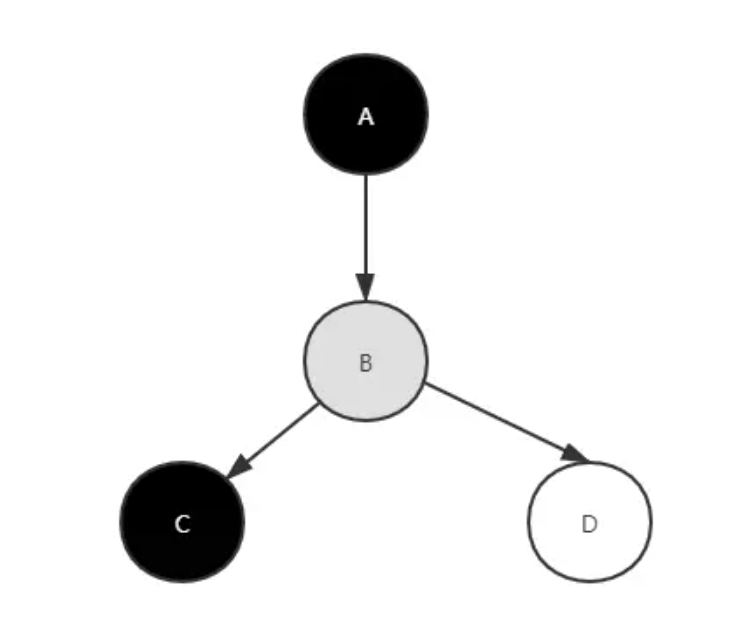
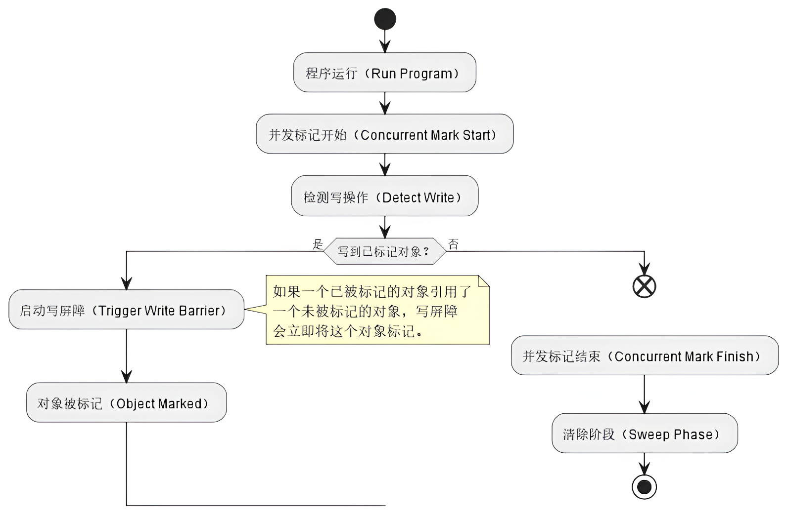

# Go 基础篇

本文档不会介绍 Golang 的基础语法或特性，文中的代码示例均通过验证，但理论方面部分摘自网络，可能需要考证。

## 语言的优缺点

### 优点

- 是一种语法简单、性能出色且支持快速编译的高级编程语言，由专家程序员打造
- 编译器能够输出直观的警告和错误提示
- 具有稳健的包管理机制
- 具有跨平台特性（通过交叉编译）
- 支持泛型（从 1.18 版本开始）
- 支持并发编程
- 支持反射
- 支持自动 GC，不需要手动处理内存分配和释放问题
- 提供丰富的基础库，便于开发各种应用，如 HTTP、JSON 等
- 默认使用静态链接，编译成功即可运行
- 丰富的生态：包含常用第三方工具或 sdk。如各种数据库、消息队列、缓存等的 SDK
- 成名项目：K8s/Docker/Prometheus/Istio/Nsq 等

因为 Google 为其背书，Go 语言得以快速发展，如今已经是市场就业的热门语言。

### 缺点

- 不直接支持面向对象编程，但可以通过结构体模拟
- 错误处理机制过于原始，导致代码中充斥着大量的`if err != nil`

## 内部机制

### 垃圾收集（GC）

垃圾回收就是对程序中不再使用的内存资源进行回收的操作。常见的 GC 算法有：

- 引用计数：每个对象维护一个引用计数，当被引用对象被创建或被赋值给其他对象时引用计数自动加 +1；如果这个对象被销毁，则计数 -1
  ，当计数为 0 时，回收该对象。
    - 优点：对象可以很快被回收，不会出现内存耗尽或到达阀值才回收。
    - 缺点：不能很好的处理循环引用
- 标记-清除：从根变量开始遍历所有引用的对象，引用的对象标记“被引用”，没有被标记的则进行回收。
    - 优点：解决了引用计数的缺点。
    - 缺点：整个过程需要 STW（stop the world），暂时停止程序运行，这会导致短暂延迟。
- 分代收集：按照对象生命周期长短划分不同的代空间，生命周期长的放入老年代，短的放入新生代，不同代有不同的回收算法和回收频率。
    - 优点：回收性能好
    - 缺点：算法复杂

Go 从 1.5 版本开始使用三色标记-清除法是对标记-清除算法的改进，旨在减少 GC 导致的延迟。

> [!NOTE]
> 这里所说的对象是指内存中已分配的空间块，而不是代码中的变量。

#### 标记-清除法

此法分为两阶段：标记阶段和清除阶段。

- （stop the world）
- 标记阶段：从根对象（堆或栈变量）开始，通过可达性分析遍历整个对象图，标记所有能够被直接或间接访问到的对象为“活动”状态
- 清除阶段：后清除所有未被标记的对象。部分实现会通过延迟清除来减少产生的延迟。
- （start the world）

此法的缺点是整个阶段执行“stop the world”，这会导致较大延迟。另外，此法没有处理内存碎片，
会导致内存分配效率低。

> [!NOTE]
> 此法又可以叫做双色标记-清除法，即黑色表示活动状态，白色为非活动状态。

#### 三色标记-清除法

<div>

</div>

此法是对标记-清除法的改进。它引入了**并发标记和清扫**、**三色替换双色**以及**写屏障**技术。

**并发标记和清扫**

又叫增量式标记。相比之前的标记-清除法需要在整个阶段中执行一次完整的 STW，此法允许在标记过程中，程序仍然可以执行，
也就是 GC 线程与用户线程交替执行，逐步完成标记任务。这种方式将原本时间较长的暂停时间切分成多个更小的 GC
时间片。当然，伴随的一个小缺点是总的 GC 时间变长了。
总的来说，利大于弊。

**三色替换双色**

引入并发标记后，会存在一个问题。在双色标记算法中，一个黑色的对象可能会在标记后指向一个尚未扫描的白色对象，
由于黑色对象这条链已经扫描过就不会再次扫描，最终导致白色对象被遗漏。引入三色标记后，如果黑色对象指向一个白色对象，
则将该白色对象标记为灰色，表示需要再次扫描，这样就实现了 GC 的暂停和恢复。

三色如下：

- 白色：表示需要 GC 的对象（不可达）
- 灰色：表示正在进行标记的对象，其引用链还未标记（等会需要标记为黑色）
- 黑色：表示不需要 GC 的对象（正在被引用）

具体过程如下：

1. 初始时，默认所有对象都是白色（表示尚未被 GC 线程扫描过）
2. 从根节点开始遍历（非递归），所有根节点直达的对象（如全局变量或栈中的变量）被标记为灰色
    - 从此刻开始， 剩余的那些白色对象将不再被跟踪，最终都会被清除
3. 递归遍历所有灰色对象，将其引用链上的对象标记为灰色
4. 将所有灰色对象标记为黑色
5. 异步清除所有白色对象

可见扫描结束后只剩下白色和黑色两种对象。
此法仍然存在内存碎片的问题，所以很多 GC 算法仍然会在此法之上添加**内存整理**的算法。

> [!NOTE]
> “扫描”可以称作“标记”，因为扫描结束后，最终只剩下白色和黑色两种对象，而根节点可达对象都会被标记为黑色，
> 不可达对象则本身就是白色无需标记。

**FAQ**

- 灰色对象会被重新标记为白色吗？
    - 不会。因为灰色对象是可达的，它们可能在稍后被引用。
- 扫描完成后，什么对象才是白色的？
    - 那些完全不可达的对象。比如`a="x1";a="x2"`这段代码中`a`被重新赋值后，"x1"就没有用途，完全不可达。而"x2"通过根节点变量直达。
- 清除过程具体是怎样的？
    - 调度器会启动两个协程，一个负责清除与合并空闲页，一个负责向操作系统归还内存。

**直接取消 STW 会发生什么？**

存在一种情况，在**时刻 1**中一个灰色对象与白色对象之间存在引用链，在**时刻 2**中灰色与白色断开引用，同时白色被另一个黑色引用。
此时根据前面的标记规则：<u>黑色对象引用链上只有灰色会被标黑</u>，而白色最终会称为弃子（垃圾）。

所以要想在标记阶段取消 STW，必须要解决引用链变化导致的漏标问题。而写屏障技术就是为了解决这个问题。

#### 写屏障

<div>

</div>

写屏障是一种编程技术，常用于垃圾回收的实现中。在垃圾回收的并发标记阶段，**如果引用链发生变化就会触发写屏障**
（比如变量指向了其他对象或被设置为 nil）。

在 Go 语言的 GC 算法中，写屏障技术主要分为三种：插入屏障&删除屏障（已废弃）和混合写屏障。

#### Go 1.5 的插入屏障和删除屏障

- 插入屏障：指针修改时，指向的新对象要标灰（无论新对象是灰是白）。
    - 这样可以确保白色对象不会被误清除。
- 删除屏障：指针置空时，修改前指向的对象要标灰（无论该对象是灰是白）。
    - 为灰色说明其引用链还没有完成标记
    - 为白色说明还没有标记到此对象。若不标记为灰色，则此对象将一直是白色，并最终被清除。

引用链变化情况无法就是插入和删除两种，所以只要确保这两种情况下不发生漏标即可。此外，屏障技术都在并发标记过程中针对 **堆空间
**使用，而不会对栈空间使用。写屏障通过一个全局开关（`runtime.writeBarrier.enabled`）启用，启用后，
所有堆空间中针对变量（或成员字段）的写操作（引用链变化）都会触发写屏障（一种 Hook 机制）。

> [!NOTE]
> 不对栈空间触发的原因是栈的管理通常比堆更简单、更高效，并且程序可能正在运行大量的 goroutine，
> 此时在栈上实施屏障机制会增加额外的开销。

> [!NOTE]
> 插入屏障技术由 Dijkstra 提出，删除屏障技术由 Yuasa 提出。

##### 上述屏障机制的缺点

由于屏障机制不对**栈空间**中的对象使用，
所以当第一轮三色标记阶段完成后，在垃圾回收前还会再针对栈空间进行**重新扫描**（并发进行），并且期间需要触发 STW。

此外，删除屏障是一种保守的做法，即保护了那些被删除稍后又被其他对象引用的对象，但这种做法同时也保护了实际上已经没有任何引用的对象。
这就导致了回收精度低。

示例：

```cgo
# 创建引用关系：c->b->a
a := 1
b := a
c := b

# 删除引用关系: c->1  b->a
# 此刻b和a已没有任何用途
c = 1
print(c)
```

#### Go 1.8 的混合写屏障

1.8 版本更新了标记算法，并引入了混合写屏障技术，但仍然只对堆空间使用。
混合写屏障结合了删除屏障和插入屏障两种写屏障技术，避免了对栈的重扫需求。

具体步骤如下:

- 默认全白色
- 先设置所有栈上可达对象为黑色（不可达对象仍然是白色）
- 栈上的新对象也直接设为黑色（默认可能被引用）
- 堆中新增/删除对象标记为灰色，继续跟踪其可达情况（混合写屏障）

这个算法不会重新扫描栈空间，因此减少了 STW 的时间，但栈空间被删除的对象仍然会存活到下一轮 GC。

### defer 关键字

`defer`会在当前函数返回前执行传入的函数，它会经常被用于关闭文件描述符、关闭数据库连接以及解锁资源。

#### 多次调用时执行顺序是如何确定的

参考代码：

```shell
func main() {
	for i := 0; i < 5; i++ {
		defer fmt.Println(i)
	}
}

$ go run main.go
4
3
...
```

请把 defer 调用当做是一个入栈操作，每次调用 defer 时，它会把函数放入栈中，最终执行时首先执行最后入栈的函数。
直接展开 for 循环：

```shell
func main() {
	defer fmt.Println(0)
	defer fmt.Println(1)
	defer fmt.Println(2)
	...
}
```

#### 预计算参数

参考代码：

```shell
func main() {
	startedAt := time.Now()
	defer fmt.Println(time.Since(startedAt))
	
	time.Sleep(time.Second)
}

$ go run main.go
0s
```

这段代码用于计算函数耗时，但结果不符合预期。原因是 Go 的参数传值是值类型，`fmt.Println`的参数在注册 defer 时就已经计算完毕了。
通过传入一个匿名函数，可以解决这个问题：

```shell
func main() {
	startedAt := time.Now()
	defer func() { fmt.Println(time.Since(startedAt)) }()
	
	time.Sleep(time.Second)
}

$ go run main.go
1s
```

在这个修复版本中，`fmt.Println`函数将作为匿名函数的参数，那么函数在作为参数时，实际传的是函数指针。

### 什么是内联函数

内联函数（inline function）是一种编译器优化技术，通常用于告诉编译器在编译时将函数调用直接替换为函数体，而不是像普通函数一样生成一个调用。
这种替换可以减少函数调用的开销，提高程序的执行效率。通常在函数比较小且频繁调用的情况下会自动进行内联优化

> [!NOTE]
> 调用一个函数时的开销主要在于函数栈空间的开辟和回收。

不需要内联的情况：

- 有时候，为了分析代码行为，我们希望函数调用时能够看到函数的调用栈，此时不能进行内联优化。
- 对于调用位置较多的函数，内敛会增加二进制大小。

Go 支持在函数上添加 `//go:noinline` 注释告诉编译不要对它进行内联优化。

### 什么是内存逃逸

是指在编译器无法确定一个变量的生命周期时，会将其分配在堆上而不是栈上。
变量的生命周期指的是变量在程序运行期间的有效范围，包括了变量被声明后到被释放前的整个时间段。

一般来说，一个函数内的变量在函数内声明时，会分配在栈上，如果函数返回时，栈上变量会被回收。但是发生以下情况时，
变量会被分配在堆上。

- 返回指针：函数返回了一个局部变量的指针。
- 闭包引用：闭包函数引用了外部函数的局部变量。
- 发送指针或带有指针的值到 channel 中。
- 在一个切片上存储指针或带指针的值。
- 对局部变量使用反射：例如`reflect.ValueOf(v)`或`reflect.TypeOf(v)`。
    - `fmt.Print*` 系列函数内部都使用了反射。

> [!NOTE]
> 使用`go build -gcflags -m`可对代码进行逃逸分析。

## 基本数据类型

### 数组的缺点

数组长度一旦确定无法修改。此外，数组是值类型，作为函数参数时，会进行完整拷贝，性能开销较大。

### 切片的优点

切片可以动态调整长度，并且作为函数参数时，只进行拷贝其指针。定义切片时可不用指定长度，其内部会维护一个数组指针。

使用时注意:

- 一个未初始化的切片的三个组成部分都是零值：指针是 nil，长度和容量都是 0。
- 可以通过 make 函数、字面量或现有数组或切片下标范围来初始化切片。
- 多个切片可以指向同一个数组。对一个切片的修改可能会影响其他指向同一个数组的切片。除非你确定不会再使用旧的切片，否则应该使用
  copy 函数创建副本。
- 避免对一个大切片进行拷贝

示例：

```shell
// 多个切片共享一个数组
func TestSliceShareArr(t *testing.T) {
	var s1 = []int{1, 2, 3}
	var s2 = s1[1:] // 2,3
	s1[1] = 22
	println(s2[0] == 22) // true
}
```

> [!Warning]
> 不要依赖这种共享数组的行为，因为切片扩容时会分配新的底层数组。

### 遍历切片要注意什么

遍历切片有两种方式：

- 直接遍历元素：`for k,v := range slice {}`
- 遍历索引：`for k := range slice {}`

第一种方式更常用，但它的问题是会对切片元素进行拷贝，所以修改切片元素不会影响原切片。
参考示例 [TestIterateSlice][TestIterateSlice]。

[TestIterateSlice]: https://github.com/chaseSpace/interview/blob/849b05cc1298042d4c889fc358a220b0b3f58f89/tests/slice_test.go#L38

### nil 切片与空切片的区别

- nil 切片的内存地址是 0，空切片则是一个非 0 地址
- nil 切片不可以作为 copy 参数的`dst`参数（语法正确，但无法填入数据）
    - 因为 copy 不负责对`dst`进行扩容
    - nil 切片可以 append

### new 和 make 的区别

- new 用于创建一个指定类型的零值，并返回指向该类型零值的指针，包括容器类型。
- make 用于创建一些特定类型的数据结构，例如切片、映射和通道，返回的是值本身。

### map 中的 key 符合什么要求

必须是可以比较的。不能直接比较的：切片类型、map 类型、函数型 func。

### 什么是 no copy 机制

有些结构体内含指针类型的成员，定义来就是不希望被复制的。因为当该对象被拷贝时，会使得两个对象中的指针字段变得不再安全。
所以为了安全性需要提供保护机制防止对象复制。

Go 语言中提供了两种 copy 机制，一种是在运行时检查，一种是静态检查。Go 官方目前只提供了`strings.Builder`和`sync.Cond`
的 runtime 拷贝检查机制，对于其他需要 nocopy 对象类型来说，使用 go vet 工具来做静态编译检查。

具体的用法就是在结构体内嵌入`noCopy`字段，参考 [nocopy 示例](tests/nocopy_test.go) 。

### chan 在什么时候触发 panic

- 重复关闭 channel
- 往已经关闭的 channel 发送数据
- 关闭 nil channel

> [!NOTE]
> 可以读取一个 nil channel，不过这会永久阻塞。如果（除了 nil-chan 所在的 goroutine）没有其他正在运行的
> goroutine，那么程序会因为死锁而崩溃。

> [!NOTE]
> 可以读取一个关闭的 channel，会直接读出剩余所有数据。若无数据，则无阻塞直接返回。

## 字符串

### rune

rune 是一个 int32 类型，也表示一个 Unicode 码点。可以将字符串视为一个 rune 集合。rune 的字面量是一个单引号字符。

> [!NOTE]
> 任何一个 Unicode 码点都是一个四字节字符，所以 rune 类型能表示一个 Unicode 码点。

示例：

```shell
func TestRune(t *testing.T) {
	var runeLiteral rune = 'a'
	println(runeLiteral)            // 97
	fmt.Printf("%x\n", runeLiteral) // 61（16进制）
	fmt.Printf("%v\n", runeLiteral) // 值的默认格式（万能）
	fmt.Printf("%c\n", runeLiteral) // 将rune转换为Unicode码点所表示的字符
	
	println(len("a菜"), len([]rune("a菜"))) // 4  2
}
```

### strings

关于 strings.Trim 系列函数：

```shell
func TestTrim(t *testing.T)  {
	var s = strings.Trim("-Hell-o-", "-")
	fmt.Println(s, len(s)) // Hell-o 6

	s = strings.Trim("-Love-o-", "-o")
	fmt.Println(s, len(s)) // Love 4
}

func TestTrimLeft(t *testing.T) {
	var s = strings.TrimLeft("-Hell-o-", "-o")
	fmt.Println(s, len(s)) // Hell-o- 7
}

func TestTrimRight(t *testing.T) {
	var s = strings.TrimRight("-Hell-o-", "-o")
	fmt.Println(s, len(s)) // -Hell 5
}

func TestTrimSpace(t *testing.T) {
	// 清除两侧的空白符
	var s = strings.TrimSpace(" - -\t\n\v\f\r ")
	fmt.Println(s, len(s)) // - -  3
}
```

## Channel 介绍

### 目标

Channel 设计出来的目标就是践行 “通过通信的方式共享内存” 的思想。这有一个前提，那就是编程语言实现了用户态可调度的协程，
因为这样才能避免线程切换的上下文开销。Go 语言的 GPM 调度机制实现了可调度协程，这样即使 Channel 内部有锁，也是一种低开销的任务切换模型。

Channel 内部虽然使用了一把互斥锁，但该锁是一把基于 CAS 和自旋算法的乐观锁，能最大程度降低 goroutine 的切换次数。

### 优势

这里的优势是相比传统锁机制而言，Channel 简化了并发编程，同时使用了乐观锁来提高性能。同时 Channel 提供了一个队列结构，支持先进先出。

### 基本特性

Channel 支持带缓冲和不带缓冲的读写模式。不管哪种模式，当消费者来不及消费数据时，生产者都无法继续发送数据（阻塞），
直到消费者消费完 Channel 内的数据或 Channel 内的数据量小于缓冲区大小。

### 实现原理

#### 数据结构

Channel 内部是一个**有锁循环队列**实现，`hchan`是 Channel 运行时使用的数据结构。

```go
package runtime

type hchan struct {
	qcount   uint           // 队列中元素个数
	dataqsiz uint           // 队列长度（固定）
	buf      unsafe.Pointer // 缓冲区数据指针
	elemsize uint16         // 收发的元素size
	closed   uint32         // chan是否关闭
	elemtype *_type         // 收发的元素类型
	sendx    uint           // 发送操作处理到的位置
	recvx    uint           // 接收操作处理到的位置
	recvq    waitq          // 存储了等待的消费者goroutine列表
	sendq    waitq          // 存储了等待的发送者goroutine列表

	lock mutex // 保护 hchan 中的所有字段以及在该channel上阻塞的 recvq/sendq 中的sudogs中的几个字段
}
```

其中的`recvq`和`sendq`都是`waitq`类型，该类型是一个**双向链表**，用来存储等待的协程。`waitq`结构如下：

```go
package runtime

// 链表中所有的元素都是 runtime.sudog 结构
type waitq struct {
	first *sudog
	last  *sudog
}
```

链表中所有的元素都是 [`runtime.sudog`][sudog] 结构，`runtime.sudog` 表示一个在等待列表中的 Goroutine。

[sudog]: https://github.com/golang/go/blob/41d8e61a6b9d8f9db912626eb2bbc535e929fefc/src/runtime/runtime2.go#L345

#### 创建管道

Channel 只能通过`make`函数创建，创建时需要指定类型，大小可选，默认为 0 表示无缓冲区。

编译阶段，会根据缓冲大小来决定使用 [`runtime.makechan`][runtime.makechan] 或者 [`runtime.makechan64`][runtime.makechan64]
函数来创建 Channel，当缓冲区大小大于 2 的 32 次方时使用后者，很少见，这里只需要关注前者即可。

[runtime.makechan]: https://github.com/golang/go/blob/41d8e61a6b9d8f9db912626eb2bbc535e929fefc/src/runtime/chan.go#L71

[runtime.makechan64]: https://github.com/golang/go/blob/41d8e61a6b9d8f9db912626eb2bbc535e929fefc/src/runtime/chan.go#L63

`makechan`函数逻辑如下：

```go
package runtime

import (
	"runtime/internal/math"
	"unsafe"
)

func makechan(t *chantype, size int) *hchan {
	elem := t.elem
	mem, _ := math.MulUintptr(elem.size, uintptr(size)) // 元素大小 * 容量

	var c *hchan
	switch {
	case mem == 0: // 容量为0，即无缓冲区时，则仅创建chan，不创建缓冲区buf
		c = (*hchan)(mallocgc(hchanSize, nil, true))
		c.buf = c.raceaddr()
	case elem.kind&kindNoPointers != 0: // 元素非指针类型，为 Channel 和底层的数组分配一块连续的内存空间
		c = (*hchan)(mallocgc(hchanSize+mem, nil, true))
		c.buf = add(unsafe.Pointer(c), hchanSize)
	default: // 默认情况，先创建chan，然后再单独分配buf
		c = new(hchan)
		c.buf = mallocgc(mem, elem, true)
	}
	c.elemsize = uint16(elem.size)
	c.elemtype = elem
	c.dataqsiz = uint(size)
	return c
}

```

#### 发送数据

使用 `ch <- i` 语句发送数据到 Channel，运行时的函数调用逻辑是`runtime.chansend1` -> `runtime.chansend`，后者包含了全部发送逻辑。

```go
package runtime

import "unsafe"

func chansend(c *hchan, ep unsafe.Pointer, block bool, callerpc uintptr) bool {
	// ...

	// 先为当前 Channel 加锁, 防止并发修改channel
	lock(&c.lock)

	if c.closed != 0 {
		unlock(&c.lock)
		panic(plainError("send on closed channel"))
	}
	// ... 后面还有很多逻辑
}

```

因为 `runtime.chansend` 函数的实现比较复杂，所以我们这里将该函数的执行过程分成以下的三个部分：

- 当存在等待的接收者时，通过 runtime.send 直接将数据发送给阻塞的接收者；
- 当缓冲区存在空余空间时，将发送的数据写入 Channel 的缓冲区；
- 当不存在缓冲区或者缓冲区已满时，等待其他 Goroutine 从 Channel 接收数据；

##### 1. 直接发送

如果目标 Channel 没有被关闭并且已经有处于读等待的 Goroutine，那么 `runtime.chansend` 会从接收队列 `recvq` 中取出最先陷入等待的
Goroutine 并直接向它发送数据：

```plain
if sg := c.recvq.dequeue(); sg != nil {
  send(c, sg, ep, func() { unlock(&c.lock) }, 3)
  return true
}
```

发送数据时调用的是 [`runtime.send`][runtime.send] 函数，该函数的执行可以分成两个部分：

- 调用 `runtime.sendDirect` 将发送的数据直接拷贝到 x = <-c 表达式中变量 x 所在的内存地址上；
- 调用 `runtime.goready` 将等待接收数据的 Goroutine 标记成可运行状态 `Grunnable` 并把该 Goroutine 放到发送方所在的处理器的
  `runnext` 上等待执行，该处理器在下一次调度时会立刻唤醒数据的接收方；

[runtime.send]: https://github.com/golang/go/blob/41d8e61a6b9d8f9db912626eb2bbc535e929fefc/src/runtime/chan.go#L292

##### 2. 缓冲区有空余

如果创建的 Channel 包含缓冲区并且 Channel 中的数据没有装满，会执行下面这段代码：

```plain
func chansend(c *hchan, ep unsafe.Pointer, block bool, callerpc uintptr) bool {
	...
	if c.qcount < c.dataqsiz {
		qp := chanbuf(c, c.sendx)
		typedmemmove(c.elemtype, qp, ep)
		c.sendx++
		if c.sendx == c.dataqsiz {
			c.sendx = 0
		}
		c.qcount++
		unlock(&c.lock)
		return true
	}
	...
}
```

在这里我们首先会使用 `runtime.chanbuf` 计算出下一个可以存储数据的位置，然后通过 `runtime.typedmemmove` 将发送的数据**拷贝到
**缓冲区中，然后增加
`sendx` 索引和 `qcount` 计数器。这里本质上是将发送的数据拷贝到缓冲区中，而不是直接发送到接收方。

> [!NOTE]
> 注意 channel 的 buf 是一个数组实现的循环队列，所以当 `sendx` 等于 `dataqsiz` 时会重新回到数组开始的位置。

##### 3. 阻塞发送

当 Channel 没有接收者能够处理数据时，向 Channel 发送数据会被下游阻塞。当然，我们可以使用 select 非阻塞地往 Channel 发送数据。
阻塞发送数据会执行下面的代码，简单梳理一下这段代码的逻辑：

```plain
func chansend(c *hchan, ep unsafe.Pointer, block bool, callerpc uintptr) bool {
	...
	if !block {
		unlock(&c.lock)
		return false
	}

	gp := getg()
	mysg := acquireSudog()
	mysg.elem = ep
	mysg.g = gp
	mysg.c = c
	gp.waiting = mysg
	c.sendq.enqueue(mysg)
	goparkunlock(&c.lock, waitReasonChanSend, traceEvGoBlockSend, 3)

	gp.waiting = nil
	gp.param = nil
	mysg.c = nil
	releaseSudog(mysg)
	return true
}
```

1. 调用 `runtime.getg` 获取发送数据使用的 Goroutine；
2. 执行 `runtime.acquireSudog` 获取 `runtime.sudog` 结构并设置这一次阻塞发送的相关信息，例如发送的 Channel、是否在 select
   中和待发送数据的内存地址等；
3. 将刚刚创建并初始化的 `runtime.sudog` 加入发送等待队列，并设置到当前 Goroutine 的 `waiting` 上，表示 Goroutine 正在等待该
   `sudog` 准备就绪；
4. 调用 `runtime.goparkunlock` 将当前的 Goroutine 挂起等待唤醒（让出 P 和 M）；
5. 被调度器唤醒后会执行一些收尾工作，将一些属性置零并且释放 `runtime.sudog` 结构体；

函数在最后会返回 true 表示这次我们已经成功向 Channel 发送了数据。

##### 4. 小结

简单梳理和总结一下使用 `ch <- i` 表达式向 Channel 发送数据时遇到的几种情况：

- 如果当前 Channel 的 `recvq` 上存在已经被阻塞的 Goroutine，那么会直接将数据发送给当前 Goroutine 并将其设置成下一个运行的
  Goroutine；
- 如果没有等待接收者，且 Channel 存在缓冲区并且其中还有空闲的容量，我们会直接将数据存储到缓冲区 sendx 所在的位置上；
- 如果不满足上面的两种情况，会创建一个 `runtime.sudog` 结构并将其加入 Channel 的 `sendq` 队列中，当前 Goroutine
  也会陷入阻塞等待其他的协程从 Channel 接收数据；

Goroutine 挂起时触发 Goroutine 调度，关键函数是`runtime.goparkunlock`。

#### 接收数据

我们可以通过 2 种方式接收数据：

```plain
i <- ch
i, ok <- ch
```

分别对应 `runtime.chanrecv1` 和 `runtime.chanrecv2`
两种不同函数的调用，但最终都会调用 [`runtime.chanrecv`][runtime.chanrecv] 函数。

[runtime.chanrecv]: https://github.com/golang/go/blob/41d8e61a6b9d8f9db912626eb2bbc535e929fefc/src/runtime/chan.go#L454

接收数据分为 2 种特殊情况和 3 种常规情况，2 种特殊情况是：

1. 从一个空 Channel 接收数据时会直接调用 `runtime.gopark` 让出处理器的使用权
2. 如果当前 Channel 已经被关闭并且缓冲区中不存在任何数据，那么会清除 ep 指针中的数据并立刻返回。

第一种情况对应的代码如下：

```plain
var cc chan int
<- cc
```

其余 3 种情况如下：

1. 当存在等待的发送者时，通过 `runtime.recv` 从阻塞的发送者或者缓冲区中获取数据；
2. 当缓冲区存在数据时，从 Channel 的缓冲区中接收数据；
3. 当缓冲区中不存在数据时，等待其他 Goroutine 向 Channel 发送数据；

##### 直接接收

当 Channel 的 `sendq` 队列中包含处于等待状态的 Goroutine 时，该函数会取出队列头等待的 Goroutine，处理的逻辑和发送时相差无几，
只是发送数据时调用的是 `runtime.send` 函数，而接收数据时使用 `runtime.recv`。

```plain
if sg := c.sendq.dequeue(); sg != nil {
		recv(c, sg, ep, func() { unlock(&c.lock) }, 3)
		return true, true
	}
```

`runtime.recv`实现如下：

```plain
func recv(c *hchan, sg *sudog, ep unsafe.Pointer, unlockf func(), skip int) {
    // 如果channel没有缓冲区，调用 runtime.recvDirect 将 Channel 发送队列中 Goroutine 存储的 elem 数据拷贝到目标内存地址中；
	if c.dataqsiz == 0 {
		if ep != nil {
			recvDirect(c.elemtype, sg, ep)
		}
	} else {
	    // 如果 Channel 存在缓冲区
	    //  1. 将队列中的数据拷贝到接收方的内存地址；
	    //  2. 将发送队列头的数据拷贝到缓冲区中，释放一个阻塞的发送方；
		qp := chanbuf(c, c.recvx)
		if ep != nil {
			typedmemmove(c.elemtype, ep, qp)
		}
		typedmemmove(c.elemtype, qp, sg.elem)
		c.recvx++
		c.sendx = c.recvx // c.sendx = (c.sendx+1) % c.dataqsiz
	}
	gp := sg.g
	gp.param = unsafe.Pointer(sg)
	goready(gp, skip+1)
}
```

无论发生哪种情况，运行时都会调用 `runtime.goready` 将当前处理器的 runnext 设置成发送数据的 Goroutine，在调度器下一次调度时将阻塞的发送方唤醒。


> [!NOTE]
> 你可能已经发现了，【直接接收】也包含了【缓冲区接收】的逻辑，但前提条件是存在阻塞的发送者。

##### 从缓冲区接收

当 Channel 的缓冲区中已经包含数据时，从 Channel 中接收数据会直接从缓冲区中 `recvx` 的索引位置中取出数据进行处理：

```plain
func chanrecv(c *hchan, ep unsafe.Pointer, block bool) (selected, received bool) {
	...
	if c.qcount > 0 {
	    // 将队列中的元素拷贝到接收变量中
		qp := chanbuf(c, c.recvx)
		if ep != nil {
			typedmemmove(c.elemtype, ep, qp)
		}
		// 重置队列元素
		typedmemclr(c.elemtype, qp)
		// 接收下标偏移
		c.recvx++
		// 偏移量达到channel容量时，重置下标为0（循环）
		if c.recvx == c.dataqsiz {
			c.recvx = 0
		}
		// 队列长度减1
		c.qcount--
		return true, true
	}
	...
}
```

##### 阻塞接收

当 Channel 的发送队列中不存在等待的 Goroutine 并且缓冲区中也不存在任何数据时，从管道中接收数据的操作会变成阻塞的。

```plain
func chanrecv(c *hchan, ep unsafe.Pointer, block bool) (selected, received bool) {
	...
	if !block {
		unlock(&c.lock)
		return false, false
	}

	gp := getg()
	mysg := acquireSudog()
	mysg.elem = ep
	gp.waiting = mysg
	mysg.g = gp
	mysg.c = c
	c.recvq.enqueue(mysg)
	goparkunlock(&c.lock, waitReasonChanReceive, traceEvGoBlockRecv, 3)

	gp.waiting = nil
	closed := gp.param == nil
	gp.param = nil
	releaseSudog(mysg)
	return true, !closed
}
```

在正常的接收场景中，我们会使用 runtime.sudog 将当前 Goroutine 包装成一个处于等待状态的 Goroutine 并将其加入到接收队列中。
入队后，会调用 `runtime.goparkunlock` 将当前 Goroutine 挂起，并等待其他 Goroutine 向 Channel 发送数据。

> [!NOTE]
> 不是所有的接收操作都是阻塞的，与 select 语句结合使用时就可能会使用到非阻塞的接收操作。

#### 关闭管道

对应调用的是 [`runtime.closechan`][runtime.closechan] 函数。当 Channel 是一个空指针或者已经被关闭时，运行时会直接崩溃并抛出异常：

```plain
func closechan(c *hchan) {
	if c == nil {
		panic(plainError("close of nil channel"))
	}

	lock(&c.lock)
	if c.closed != 0 {
		unlock(&c.lock)
		panic(plainError("close of closed channel"))
	}
	...
}
```

然后开始执行关闭 channel 的逻辑：

```plain
func closechan(c *hchan) {
    ...
	c.closed = 1

	var glist gList
	for {
		sg := c.recvq.dequeue()
		if sg == nil {
			break
		}
		if sg.elem != nil {
			typedmemclr(c.elemtype, sg.elem)
			sg.elem = nil
		}
		gp := sg.g
		gp.param = nil
		glist.push(gp)
	}

	for {
		sg := c.sendq.dequeue()
		...
	}
	for !glist.empty() {
		gp := glist.pop()
		gp.schedlink = 0
		goready(gp, 3)
	}
}
```

大致步骤：

- 将 `recvq` 和 `sendq` 两个队列中的 goroutine 加入 `gList` 临时链表
- 然后遍历链表，调用`goready`函数将 goroutine 唤醒。

> [!NOTE]
> `goready`函数实际只是触发了 goroutine 的调度，并没有立即执行该 goroutine。

[runtime.closechan]: https://github.com/golang/go/blob/41d8e61a6b9d8f9db912626eb2bbc535e929fefc/src/runtime/chan.go#L355

#### gopark 函数

前面我们提到的`gopark`函数，其作用是让出当前协程的控制权，并阻塞当前协程，等待其他协程唤醒。下面通过一个情景来说明。

```plain
goparkunlock(&c.lock, "chan send", traceEvGoBlockSend, 3)
```

发送数据到 channel 时，当队列已满时，会调用 `goparkunlock` 函数将当前协程挂起，并等待接收者读取数据。该函数的内部逻辑如下：

```plain
func goparkunlock(lock *mutex, reason string, traceEv byte, traceskip int) {
	gopark(parkunlock_c, unsafe.Pointer(lock), reason, traceEv, traceskip)
}
```

最终会调用`gopark`函数，其内部逻辑如下：

```plain
func gopark(unlockf func(*g, unsafe.Pointer) bool, lock unsafe.Pointer, reason string, traceEv byte, traceskip int) {
	mp := acquirem()
	gp := mp.curg
	status := readgstatus(gp)
	if status != _Grunning && status != _Gscanrunning {
		throw("gopark: bad g status")
	}
	mp.waitlock = lock
	mp.waitunlockf = *(*unsafe.Pointer)(unsafe.Pointer(&unlockf))
	gp.waitreason = reason
	mp.waittraceev = traceEv
	mp.waittraceskip = traceskip
	releasem(mp)
	// can't do anything that might move the G between Ms here.
	mcall(park_m)
}
```

`gopark`函数的大致逻辑是获取当前协程 G 和线程 M，在判断 G 的状态正常后，开始设置 M 的相关属性，然后调用`releasem(mp)`
使得当前 G 允许被强占。

然后调用`mcall(park_m)`，内部逻辑是将当前 G 挂起，并取消当前 G 和 M 的关联关系，去寻找并运行下一个可运行的 goroutine。

```plain
func park_m(gp *g) {
	_g_ := getg()

	if trace.enabled {
		traceGoPark(_g_.m.waittraceev, _g_.m.waittraceskip)
	}

	casgstatus(gp, _Grunning, _Gwaiting)
	dropg()

	if _g_.m.waitunlockf != nil {
		fn := *(*func(*g, unsafe.Pointer) bool)(unsafe.Pointer(&_g_.m.waitunlockf))
		ok := fn(gp, _g_.m.waitlock)
		_g_.m.waitunlockf = nil
		_g_.m.waitlock = nil
		if !ok {
			if trace.enabled {
				traceGoUnpark(gp, 2)
			}
			casgstatus(gp, _Gwaiting, _Grunnable)
			execute(gp, true) // Schedule it back, never returns.
		}
	}
	schedule()
}
```

注意其中有一个 `if _g_.m.waitunlockf != nil` 的分支，即要处理 M 上处理可能存在的解锁函数，如果当前 M
有一个等待解锁函数（`waitunlockf`），则调用该函数尝试解锁。若解锁失败，需要恢复当前 G 的状态，并继续执行当前 G。

### 总结

Channel 内部使用了以下技术点来完成：

- 缓冲区使用循环队列
- 发送&接收队列使用双向链表
- 需要阻塞时使用`gopark`函数挂起协程，调度其他可运行的协程
- 发送数据和接收数据都需要 Channel 级别的**互斥锁**保护
    - 锁是一个乐观锁实现，内部先使用 CAS 操作来尝试获取锁，如果获取失败则使用自旋等待
    - 若自旋几次仍然获取失败，则通过操作系统提供的异步事件通知系统调用来阻塞 G，等待其他协程（释放锁时）调用系统调用通知，避免空耗
      CPU
    - Go 将这些系统调用封装在了几个跨平台的函数中：semacreate/semasleep/semawakeup
    - 在 windows 上的异步事件通知系统调用接口是:
        - _CreateEventA: 创建事件，对应 semacreate
        - _WaitForSingleObject: 等待事件信号，对应 semasleep
        - _SetEvent：设置事件信号，对应 semawakeup

### 参考

- [draveness-Channel 实现原理](https://draveness.me/golang/docs/part3-runtime/ch06-concurrency/golang-channel/)

## Go 调度实现

### Go 调度器

Go 调度器是 Go 语言运行时的一个核心组件，负责管理协程的生命周期以及操作系统线程的创建和分配，还有 CPU 时间片的分配。
协程是 Go 的并发单元，实现它是为了替换掉操作系统的线程模型。Go 调度为协程实现了一种轻量化的自动伸缩栈，其初始大小为
2KB，远小于线程的 2MB，并根据需要调整大小。

Go 调度器的原理大致是将用户创建的协程分配到具体的线程上执行， 其中线程需要绑定一个 CPU 核心。
并在协程发生阻塞时迫使其让出 CPU 控制权给其他协程，阻塞协程将被重新放入队列中等待调度。其次当线程不够用时，
调度器还负责向操作系统申请新的线程使用。

Go 调度器的线程模型是 M:N，指的是 M 个协程运行在 N 个线程上。由于协程栈足够小，所以 M:N的比例可能非常大，
所以 Go 能轻松实现百万级并发。

协程在阻塞时会让出 CPU 控制权进入挂起状态，所以非常适用于 IO 密集型应用，比如 Web 服务器/数据库应用/内容服务器等。
但相应地，针对于 CPU 密集型应用，则采用其他非 GC 类语言更合适，例如 C/C++/Rust 等。

### GPM 模型

GPM（goroutine、processor、machine）模型指的是 Go 语言的并发模型，它使用一个全局调度器来管理多个协程的调度和执行。
其中：

- **Goroutine**：Go 语言中的协程，是 Go 语言并发编程的基本单元，一个协程的初始栈大小为 2KB（远小于线程的 2MB）。
- **Processor**：逻辑上的 CPU 核心，调度实体，负责将 Goroutine 分配给可用的 Machine 执行。
    - 每个 P 维护一个本地 G 队列，调度器维护一个全局 G 队列，都用于保存等待执行的 Goroutine。
    - 当某个 P 的本地队列为空时，会尝试从其他 P 的队列中获取 G 执行，这叫做工作窃取（work-stealing）。
    - 每个 P 会定期从全局队列中窃取 G 来执行，避免其中的 G 被饿死。
    - （最开始没有本地队列，它的引入是一种分段锁的思想）
- **Machine**：代表操作系统层面的线程，是真正执行 Goroutine 的实体。
    - 当 Goroutine 进行系统调用或 channel/IO 阻塞操作时，它会被 P 挂起，然后调度下一个 G 执行。
    - 当挂起的 G 被唤醒（通常是阻塞结束）时，M 会重新分配给 P，然后继续执行。

简单来说，P 调度 M 来执行 G。

### 抢占式调度

抢占式调度是一种操作系统中常用的调度策略，它允许调度器在任何时候中断正在执行的任务，将其挂起，并切换到另一个任务执行。
这种调度方式主要用于确保系统的响应性和资源的公平分配。Go 调度器在 1.13 以前支持基于协作的抢占式调度，从 1.14 开始支持基于信号的
**真** 抢占式调度。

- 基于协作的抢占式调度：通过编译器在函数调用时插入抢占检查指令，在函数调用时检查当前 Goroutine
  是否发起了抢占请求，若是就让控制权给调度器，否则继续执行；
- 基于信号的抢占式调度：调度器会根据情况给正在执行 Goroutine 的 M 发送系统信号，迫使 Goroutine 让出控制权，使得 M 可以执行其他
  Goroutine。

> [!NOTE]
> 在 Go 1.14 以前，Go 实现的是协作式的抢占调度，它依赖于协程自己决定在合适的时机（比如系统调用或 IO 阻塞时）让出 CPU 控制权。
> 这样的问题是，如果协程不会运行系统调用或进入 IO 阻塞，那么它将一直占用 CPU 资源，导致其他协程无法运行。

## 并发编程

### 进程、线程和协程

- **进程（Process）**
    - 进程是操作系统分配资源和调度的基本单位。它是一个独立的执行实体，拥有自己的内存空间、数据栈和一组寄存器。
- **线程（Thread）**
    - 线程是进程中的一个实体，被包含在进程之中，是 CPU 调度和执行的基本单位。
    - 一个进程可以包含多个线程，它们共享进程的内存空间和资源，但每个线程有自己的执行堆栈和程序计数器。
    - 多线程可以实现并行处理，提高程序的执行效率。线程间的通信可以直接通过读写共享数据的方式进行，但需要同步机制来避免竞态条件。
- **协程（Coroutine）**
    - 协程是一种用户态的**轻量级线程**，不依赖于操作系统的内核进行调度，而是通过协程库或运行时系统进行调度和管理。
    - 协程在执行过程中可以**挂起和恢复**，这种挂起是用户态的操作，通常不会涉及操作系统的上下文切换，因此开销较小。
    - 协程通常用于简化异步编程模型，提高并发程序的可读性和可维护性。在 Go 语言中，协程被称为 goroutine。

### 并发与并行

- **并发（Concurrency）**
    - 并发是指系统能够在**宏观上**同时处理多个任务的能力。在并发模型中，一个处理器可以在单个核心上通过 **任务切换**
      来模拟同时执行的效果，即使在任何给定的微观瞬间只有一个任务在执行。
    - 并发的主要目标是提高程序的响应性和资源利用率，通常用于处理**IO 密集型**任务，如网络通信、数据库查询等。
    - 并发不一定需要多个处理器；它可以通过时间分片或多任务处理在单个处理器上实现。
- **并行（Parallelism）**
    - 并行是指多个任务或计算在同一时刻真正同时进行，这通常需要多个处理器或多核处理器。
    - 并行处理可以显著加快程序的执行速度，因为多个处理器可以同时执行不同的任务或同时执行一个大型任务的不同部分。
    - 并行计算通常用于处理**计算密集型**任务，如科学模拟、数据分析和图形渲染等。

### CSP 并发模型

CSP（Communicating Sequential Process）并发模型，最初由计算机科学家 Tony Hoare 在 1978 年提出。CSP
模型的核心概念是通过通信来协调并发执行的进程或线程，而不是共享内存。CSP 是 Go 的并发哲学。

通俗来说，CSP 鼓励在线程（或协程）通过消息传递来实现同步访问，而不是通过锁机制。CSP 模型的优点如下：

- **简化并发编程**：CSP 模型通过 channel 来进行 Goroutine 之间的通信，避免了复杂的锁操作和同步机制，使得并发编程更加简单直观。
- **提高可读性和可维护性**：CSP 模型的代码通常更加清晰，因为它强调的是数据流和通信，而不是状态的同步和互斥。
- **更轻量**：编程语言在内部实现中对 channel 进行优化，使得 channel 性能高于互斥锁。

### 竞态条件

当多个 Goroutine 同时读写同一个共享资源时，就会出现竞态条件。如果不对竞态条件进行同步处理，程序可能会出现不可预测的结果。

Go 使用`-race`选项来检测并发程序中的竞态条件。

```plain
go test -race mypkg
go run -race mysrc.go
go build -race mycmd
go install -race mypkg
```

当存在竞态条件时，Go 会在标准错误中输出警告信息，这个参数通常会用在测试和 CI 脚本中。

### 并发原语

Go 提供传统的并发原语，以便开发人员实现常规并发编程中不同场景下的同步访问。

- sync.Mutex：互斥锁，用于保护共享资源的并发访问。
- sync.RWMutex：读写锁，是 sync.Mutex 的升级版本，用于保护共享资源的并发读写访问（支持多读单写）。
- sync.Map：并发安全的 Map，用于存储并发安全的键值对。
- sync.Cond：允许一个或多个 Goroutine 在满足特定条件时进行等待，并在条件变量发生变化时通知等待的 Goroutine。
    - [syncCond 示例](tests/sync.cond_test.go)
- sync.WaitGroup：它提供了一个计数器，可以在多个 Goroutine 之间进行增加和减少，主要用于等待一组 Goroutine 的执行完成。
- sync.Once：用于确保某个函数或代码块在（并发）调用多次时也只执行一次。
- atomic：用于在并发场景下进行原子操作。
    - [atomic 示例](tests/atomic_test.go)

### 内存泄漏

内存泄漏（memory leak）指的是程序中已经不再需要的内存却没有被正确释放的情况。在 Go 中主要指的是 Goroutine 在用完后没有及时退出的情况。

#### 如何避免

主要是指那些包含退出条件的 goroutine（一般是等待 channel），确保经过充分的测试。
此外，对于那些执行耗时任务的 goroutine，应该接收`context.Context`参数来允许外部控制 goroutine 的退出。

#### http 包的内存泄漏

```go
package main

import (
	"fmt"
	"io/ioutil"
	"net/http"
	"runtime"
)

func main() {
	num := 6
	for index := 0; index < num; index++ {
		resp, _ := http.Get("https://www.baidu.com")
		_, _ = ioutil.ReadAll(resp.Body)
	}
	fmt.Printf("此时goroutine个数= %d\n", runtime.NumGoroutine())
}
```

请问这段代码中打印的 goroutine 个数是？

**答案**：3

**分析**：由于每次 Get 后都没有调用 resp.Body.Close()，导致 http 包内部的`readLoop()`和`writeLoop()`函数没有及时释放。
但是，由于是访问同一个域名，所以连接会被复用，即使循环 6 次，最终 http 包也只泄漏了 2 个 goroutine，剩余的一个则是 Main 函数。

## 内置分析工具

### -gcflags

主要是 `go build`提供的`-gcflags`选项用于设置编译参数。支持的参数有：

- `-N` 选项指示禁止优化
- `-l` 选项指示禁止内联
- `-S` 选项指示打印出汇编代码
- `-m` 选项指示打印出变量变量逃逸信息，`-m -m`可以打印出更丰富的变量逃逸信息

-gcflags 支持只在编译特定包时候才传递编译参数，此时的`-gcflags`参数格式为`包名=参数`列表。如下：

```shell
go build -gcflags="log=-N -l" main.go // 只对log包进行禁止优化，禁止内联操作
```

### go-tool-compile

go tool compile 命令用于汇编处理 Go 程序文件。

```shell
go tool compile -N -l -S main.go # 打印出main.go对应的汇编代码
```

### go-tool-nm

go tool nm 命令用来查看 Go 二进制文件中符号表信息。

```shell
go tool nm ./main | grep "runtime.zerobase"
```

### go-tool-objdump

`go tool objdump`命令用来根据目标文件或二进制文件反编译出汇编代码。该命令支持两个选项：

- -S 选项指示打印汇编代码
- -s 选项指示搜索相关的汇编代码

```shell
go tool compile -N -l main.go # 生成main.o
go tool objdump main.o # 打印所有汇编代码
go tool objdump -s "main.(main|add)" ./test # objdump支持搜索特定字符串
```

### go-tool-trace

用于性能分析和跟踪的工具，它可以用来分析程序的执行时间、Goroutine 的调度情况、阻塞情况等。
参考[掘金文章](https://juejin.cn/post/6844903887757901831)。

## 使用 Delve 调试

Delve 是使用 Go 语言实现的，专门用来调试 Go 程序的工具。

安装：

```shell
# 安装最新版本
go get -u github.com/go-delve/delve/cmd/dlv
# 查看版本
dlv version
```

开始调试，dlv 使用 debug 命令进入调试界面：

```shell
# 如果当前目录是 main 文件所在目录，可省略最后的main.go参数
dlv debug main.go

# 或者调试二进制文件，编译时最好设置选项 -gcflags="-N -l" 关闭优化，否则可能断点失败
dlv exec ./main

#对于需要命令行参数才能启动的程序，我们可以通过--来传递命令行参数
dlv debug github.com/me/foo/cmd/foo -- -arg1 value
dlv exec /mypath/binary -- --config=config.toml

# 对于已经运行的程序，可以使用 attach 命令，进行跟踪调试指定 pid 的Go应用：
dlv attach $PID

# 调试test文件
dlv test github.com/me/foo/pkg/baz -- -run=xxx
```

进入 dlv 调试后，可以输入 help 查看帮助信息：

```shell
(dlv) help
The following commands are available:

Running the program:
    call ------------------------ 继续进程，注入函数调用（实验！！！）
    continue (alias: c) --------- 运行直到断点或程序终止。
    next (alias: n) ------------- 运行至下一行。
    rebuild --------------------- 重新生成可执行文件，若可执行文件不是delve生成的，则不能使用。
    restart (alias: r) ---------- 重新启动进程。
    step (alias: s) ------------- 单步执行程序。
    step-instruction (alias: si)  单步执行单个cpu指令。
    stepout (alias: so) --------- 跳出当前函数。

Manipulating breakpoints:
    break (alias: b) ------- 设置断点。
    breakpoints (alias: bp)  查看所有断点信息。
    clear ------------------ 删除断点。
    clearall --------------- 删除多个断点。
    condition (alias: cond)  设置断点条件。
    on --------------------- 命中断点时执行命令。
    toggle ----------------- 打开或关闭断点。
    trace (alias: t) ------- 设置跟踪点。
    watch ------------------ 设置观察点。

Viewing program variables and memory:
    args ----------------- 打印函数参数。
    display -------------- 每次程序停止时打印表达式的值。
    examinemem (alias: x)  检查给定地址的原始内存。
    locals --------------- 打印局部变量。
    print (alias: p) ----- 对表达式求值。
    regs ----------------- 打印CPU寄存器的内容。
    set ------------------ 更改变量的值。
    vars ----------------- 打印包变量。
    whatis --------------- 打印表达式的类型。

Listing and switching between threads and goroutines:
    goroutine (alias: gr) -- 显示或更改当前goroutine。
    goroutines (alias: grs)  列出程序所有goroutine。
    thread (alias: tr) ----- 切换到指定的线程。
    threads ---------------- 打印每个跟踪线程的信息。

Viewing the call stack and selecting frames:
    deferred --------- 在延迟调用的上下文中执行命令。
    down ------------- 向下移动当前帧。
    frame ------------ 设置当前帧，或在其他帧上执行命令。
    stack (alias: bt)  打印堆栈跟踪。
    up --------------- 向上移动当前帧。

Other commands:
    config --------------------- 更改配置参数。
    disassemble (alias: disass)  反汇编程序。
    dump ----------------------- 从当前进程状态创建核心转储
    edit (alias: ed) ----------- 自己指定编辑器编辑，读的环境变量 $DELVE_EDITOR 或者 $EDITOR
    exit (alias: quit | q) ----- 退出调试器。
    funcs ---------------------- 打印函数列表。
    help (alias: h) ------------ 打印帮助消息。
    libraries ------------------ 列出加载的动态库
    list (alias: ls | l) ------- 显示源代码。
    source --------------------- 执行包含 delve 命令的文件
    sources -------------------- 打印源文件列表。
    transcript ----------------- 将命令输出追加到文件。
    types ---------------------- 打印类型列表

Type help followed by a command for full documentation.
```