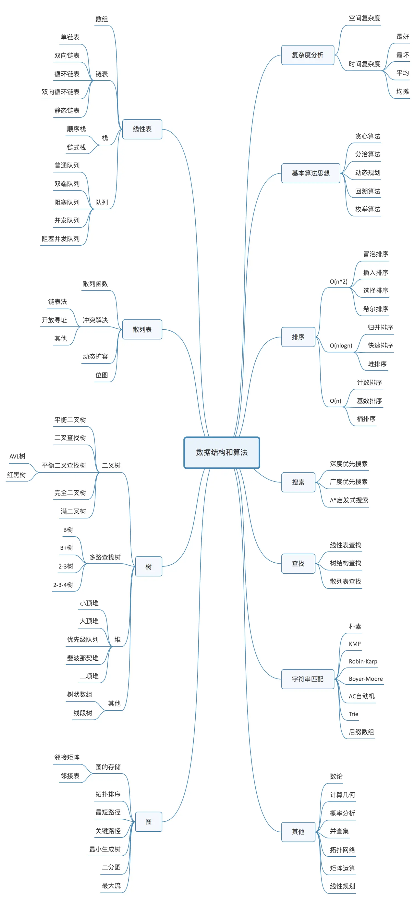
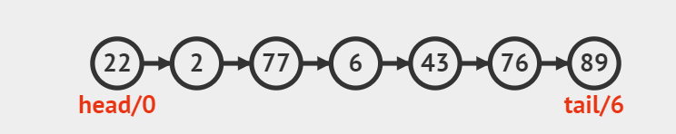
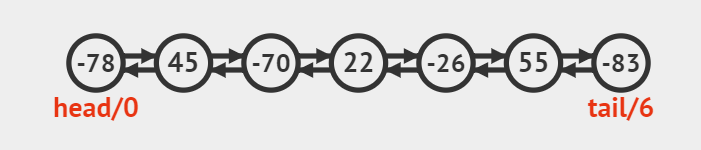

# Go 数据结构篇

数据结构是计算机科学中一个重要的概念，它描述了数据元素的存储和访问方式。

数据结构按照排列方式分为两类：线性结构（数组、链表、栈、队列）、非线性结构（树、图等）。
线性结构强调元素之间的一对一线性关系，而非线性结构则允许元素之间存在多对多的关联关系。

> [!NOTE]
> 所有数据结构中，只有数组是最符合内存布局方式的数据结构，其他数据结构则需要使用一定逻辑来实现。

## 抽象数据类型（ADT）

ADT 是一种把数据类型的逻辑功能与物理实现分离开来的编程概念。
比如数组和链表可以用来实现列表、队列和栈。那这里的数组和链表都可以叫做 ADT。

> [!NOTE]
> **列表**（List）是一种有序数据集合 ADT，支持丰富的操作接口，比如索引访问、插入、删除、自动扩容等。
> 列表是一种实践中经常使用的集合类型。

## 全景导图

点击展开

## 存储方式

按照存储方式分类：

- 顺序存储：一组地址连续的存储单元依次存储线性表的各个数据元素，如数组。
    - 好处是支持快速随机存取表中元素，缺点是插入和删除操作需要移动元素。
- 链式存储：用一组任意的存储单元存储线性表的数据元素，这组存储单元可以是连续的，也可以是不连续的
    - 比顺序存储结构的存储密度小，逻辑上相邻的节点物理上不必相邻。
    - 插入、删除灵活 (不必移动节点，只要改变节点中的指针)，查找慢。
    - 如链表、树和图等。
- 索引存储：除建立存储结点信息外，还建立附加的索引表来标识结点的地址
    - 解决了链式存储查找慢的问题，缺点是附加的索引表会增加存储空间开销。
    - 如 B 树、B+树、图等。
- 哈希存储：通过哈希函数将键（Key）映射到存储位置的方式
    - 支持 O(1) 查找/增加/删除元素，缺点是不支持排序、存在哈希冲突问题，需要通过链地址法或开放地址法解决。
    - 如哈希表。

每种存储方式都有其优势和局限性，选择合适的存储方式取决于具体的应用需求，如数据的访问模式、插入和删除操作的频率、存储空间的利用率等因素。

## 线性结构

线性结构又叫线性表，是一个有序的数据元素集合，其中数据元素之间的关系是一对一的关系，即除了第一个和最后一个数据元素之外，其它数据元素都是首尾相接的。

**常见的线性结构有**：数组（顺序表）、链表、栈（堆栈）和队列。

### 数组

数组，又叫顺序表，是在连续的内存空间中存储同一数据类型的元素集合。可以通过索引快速访问任意元素。

**用途**：存储有序数据，快速查找，插入和删除元素。

数组实现：

- [ds_array.go](tests/ds_array.go)
- [ds_array_test.go](tests/ds_array_test.go)

> [!NOTE]
> 使用顺序存储的方式实现数组的缺点是插入和删除元素需要移动元素，时间复杂度 O(n)。

### 链表

链表是由一系列节点组成的线性数据结构，每个节点包含数据和指向下一个节点的指针。链表及其变体被用作实现列表，堆栈，队列和双端队列的底层数据结构。

链表的具体存储形式可以是一组<u>连续或不连续</u>的存储单元。

#### 单链表

单链表是一种线性数据结构，由一系列节点组成，每个节点包含两个域：**数据域**和**指针域**。
每个节点的指针都指向相邻的下一个节点。有两个特殊节点：**头节点**和**尾节点**。
没有任何节点的指针域指向头节点，而尾节点的指针域为空。

> [!IMPORTANT]
> 由于不支持随机访问，单链表的**删查改**操作都需要按序遍历集合，所以时间复杂度是 O(n)。即它适合只增不改和顺序访问的场景。

应用：单链表常用于实现栈、队列、哈希表和图。

#### 双向链表

和单链表非常相似，唯一的区别是每个节点多了一个指向前一个节点的指针域。每个节点的两种指针又叫做前驱指针和后继指针。

优点

- 支持双向遍历
- 可以在链表中间插入和删除元素

示例

- [linked_list.go](tests/linked_list.go)
- [linked_list_test.go](tests/linked_list_test.go)

应用：双向队列、LRU 算法、实现浏览器的前进后退功能。

#### 单向循环链表

在单链表的基础上，将尾节点的指针域指向头节点，形成一个环状结构。所以它的优势也是相对单链表而言，
即可以从任何一个节点开始遍历整个链表。

#### 双向循环链表

在双向链表的基础上，将头尾节点的前后指针互连，形成一个环状结构。所以它的优势也是相对单链表而言，
即可以从任何一个节点开始从前/后遍历整个链表。

#### 静态链表

是在数组的基础上实现的一种链式存储结构。它的出现是为了解决动态链表在内存分配上的碎片问题。
前面说的单/双向链表都是动态链表，即链表的节点是在程序运行期间动态分配内存的，而静态链表的节点是在程序编译期间就分配好内存的。

静态链表的实现原理是：在内存中划分出一块连续的存储单元，将存储单元中的每个存储单元都赋予一个编号，
每个存储单元中存储一个数据元素和一个指向下一个节点下标的编号。

静态链表的优点是：

- 存储密度高，空间利用率高，不产生内存碎片
- 插入和删除操作不需要移动元素，只需修改下标即可

缺点是**不支持扩容**，且随机访问仍然慢。

### 栈

栈，又叫堆栈（Stack），是一种后进先出(LIFO)的线性数据结构。只能在栈顶添加或删除元素。

### 队列

队列是一种先进先出(FIFO)的线性数据结构。队列可以使用数组或链表实现。

#### 单向队列

一般提到的队列指的是单向队列或者普通队列，新元素只能从队尾插入，已有元素只能从队头删除。
> [!IMPORTANT]
> 若使用数组实现，则队列长度一般固定。而链表实现的队列不限制长度。

#### 双向队列

又叫双端队列。与（单向）队列不同的是，双端队列的两端都可以插入或移出元素，但仍然保持 FIFO 的原则。

#### 单向循环队列

循环队列是队列的一种特殊形式，即队列的尾指针连接队头，形成一个环状结构。

循环队列可以解决基于数组实现的队列中“假溢出”的问题。所谓假溢出指的是，普通顺序队列使用一个固定大小的数组来存储队列元素。
当队列满时，即使数组还有空闲空间，也无法继续入队，这种现象称为"假溢出"。

#### 双向循环队列

在循环队列的基础上，将每个元素的前后指针互连。

## 非线性结构

非线性结构中各个数据元素不再保持在一个线性序列中，每个数据元素可能与零个或多个其他数据元素发生关联。

**常见的非线性结构有**：树、哈希表、图等。所有的非线性结构都是**抽象概念**，需要编码实现。

### 树

#### 二叉树

二叉树是一种树形数据结构，每个节点最多只有两个子节点，分别称为左子树和右子树。
二叉树有五种基本形态:空树、只有一个根节点、根节点+左子树、根节点+右子树、根节点+左右子树。

##### 二叉搜索树

又叫排序二叉树、二叉搜索树、有序二叉树。二叉搜索树是一种特殊的二叉树，对于每个节点，
它的值大于其左子树中任意节点的值，小于其右子树中任意节点的值。

查找、插入、删除操作在平均情况下时间复杂度为 O(logN)，最坏情况下(数据有序)时间复杂度为 O(N)。

遍历二叉树

- 深度优先遍历：
    - 前序遍历：根结点 ---> 左子树 ---> 右子树
    - 中序遍历：左子树---> 根结点 ---> 右子树
    - 后序遍历：左子树 ---> 右子树 ---> 根结点
- 广度优先遍历：
    - 层次遍历：从根节点开始，从左到右访问所有节点

##### 平衡二叉树（AVL 树）

是一种改进的二叉搜索树，它在满足二叉搜索树的有序性的同时，还要求任何一个节点的左右子树的高度差不超过 1。

优点:

- 查找、插入、删除在平均和最坏情况下都是 O(logn)级别的时间复杂度。
- 有利于维护数据有序性。

缺点:

- 调整操作相对复杂，对于插入和删除操作需要付出代价。
- 不适合数据频繁修改的场景。

##### 平衡二叉查找树

##### 完全二叉树

##### 满二叉树

##### 霍夫曼树

#### 多路查找树

##### B 树

##### B+ 树

#### 堆

##### 小顶堆

##### 大顶堆

##### 二项堆

### 散列表

散列表，又叫哈希表，是一种键值对集合结构，通过键快速查找值。

### 图

## 使用 container 包

TODO