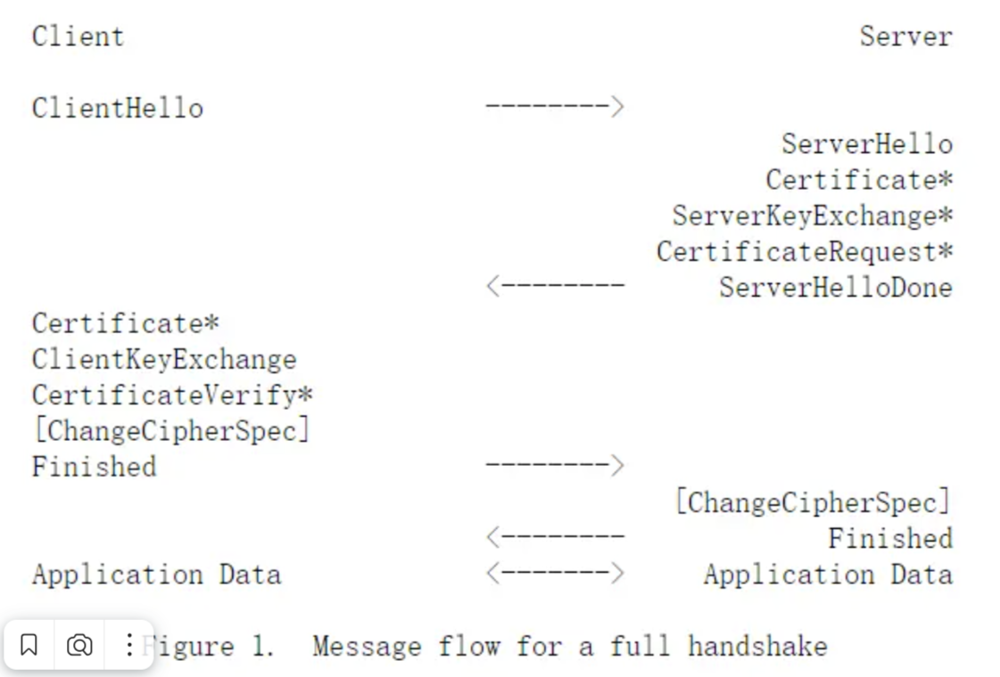

## HTTPS 抓包分析

首先安装wireshark。

[IETF文档](https://datatracker.ietf.org/doc/html/rfc5246#section-7.4.1.4)

### 抓包

网站提供：

- https://www.topgoer.cn （tls 1.3）
- https://go.cyub.vip （tls 1.2）
- 首先确定分析的tls版本，再选择对应的网站，这里选择第二个

    - 浏览器访问网站查看地址栏起始处的小锁可知服务器（与浏览器协商）使用的TLS版本
- 打开cmd，执行`ping go.cyub.vip`获得网站ip
- 启动wireshark，选择上网网卡，开始抓包，在软件过滤器中输入`ip.addr eq $IP and tls`
- **通过curl访问**网站，观察wireshark抓包结果，命令：`curl https://go.cyub.vip -I`
    - 第一次抓包不要使用浏览器访问，因为很有可能抓到**恢复会话**的握手过程，而不是首次握手

### 截图

 </img> 

### 分析

跟随IETF中描述的握手过程来分析

 </img> 

#### 1. ClientHello

客户端发送Hello消息，Hello消息是TLS 1.0版本，其ContentType是Handshake，表示这个是一个握手消息，
则TLS记录层将消息的帧部分解析为握手消息。在握手消息中包含：

- 握手类型：ClientHello
    - 其他还有hello_request、server_hello、certificate、server_key_exchange、certificate_request、server_hello_done、
      certificate_verify、client_key_exchange、finished
- 长度：x
- 握手消息版本：TLS 1.2
- 支持的TLS版本（通过Extension部分列出）
    - 但Extension的support_versions部分并不总是会发送（如使用curl），当没有发送时，服务器应将握手消息版本认定为客户端支持的版本
- 32位客户端随机数
- Session ID长度：0
    - 非0时说明恢复一个之前的session
- Session ID：无
    - 但ID长度非0时此字段非空，说明正在恢复一个已存在的session，否则是一个新的TCP连接
- 支持的密码套件列表长度：32（共16个，每个占2字节）
- 支持的密码套件列表
    - 以 TLS_ECDHE_RSA_WITH_AES_128_GCM_SHA256 为例
        - ECDHE：使用椭圆曲线Diffie-Hellman密钥交换算法
        - RSA：使用RSA验证服务器身份
        - AES_128_GCM：使用128位AES加密算法，GCM模式
        - SHA256：使用SHA256哈希算法验证数据完整性
- 支持的压缩方法列表：null（那么ServerHello消息也无从选择）
- Extension字段：可选，用来实现扩展功能
    - 例如通过扩展字段`supported_signature_algorithms`来表示客户端希望用于签名和哈希的算法组合

> 握手过程中的每个消息都是（基于TCP的）TLS消息，而不是TCP消息。

 </img> 

#### 2. ServerHello

 </img> 

Server回复一条ServerHello类型的TLS握手消息。
理解了ClientHello，ServerHello就很好理解了，其仍然是一条ContentType为`Handshake`的TLS消息，其中的帧部分解析为握手消息：

- 握手类型：ServerHello
- 长度：93
- 握手消息版本：TLS 1.2
- 服务器生成的32位随机数
- Session ID长度：32
- Session ID：xxx
    - 当ClientHello中的Session ID长度为0时，ServerHello会生成一个Session ID，否则复用客户端的Session ID
- 选择的密码套件：TLS_*
- 压缩方法：null
- Extension长度：21
- Extension列表：。。。
    - ServerHello中的扩展类型必需在ClientHello的Extensions列表中存在，否则客户端应该中断握手（使用alert消息）

#### 3. Certificate/ServerKeyExchange/ServerHelloDone

 </img> 

Server继续回复三条类型不同的TLS握手消息，它们可能横跨了不限于3条TCP消息，下面的截图中表示它们横跨了4条TCP数据段。

- Certificate：向客户端提供服务器的公钥证书链，包含服务器证书、中间证书（如果有）和CA证书（如果有），其中服务器证书在首位
    - 客户端将验证这些证书的合法性，例如证书是否过期、证书的签名是否正确、证书的CA是否可信等。
    - 此消息总是紧跟ServerHello消息
- ServerKeyExchange：当使用非RSA、DH_DSS和DH_RSA这些密钥交换算法时，服务器将发送该消息，其中包含密钥交换算法的公钥
    - 不需要此消息的情况：
        - 当之前协商的密码套件中的密钥交换算法已经有足够的信息来生成预主密钥时，不需要发送此消息
        - 比如在RSA密钥交换算法中，客户端已经可以通过服务器发送的证书公钥来生成预主密钥，因此不需要发送ServerKeyExchange消息
    - 对于其他密钥交换算法，例如对于DHE_DSS、DHE_RSA和DH_anon这些密钥交换方法，需要发送此消息
    - 对于椭圆曲线（ECC）算法（如ECDHE），则可发可不发（发了更安全），本例中就发了（ECDHE算法的公钥）。
- ServerHelloDone：表示ServerHello消息的结束
    - 此消息意味着ServerHello消息的所有信息都已发送完毕，也象征着第一次RTT完成。
    - ServerHelloDone消息本身不包含任何数据，它只是一个通知。

> [!NOTE]
> 根据前面的IETF流程图，可以观察到第一次RTT中Server回复貌似应该包含 `Certificate Request` 消息。然而这是由服务器决定的，
> 只有在服务器需要对客户端进行身份验证（双向TLS）时才会发送此消息，大部分公共服务都不需要对客户端进行身份验证，因此不会发送此消息。

#### 4. ClientKeyExchange/CipherChange/Finished

 </img> 

TODO