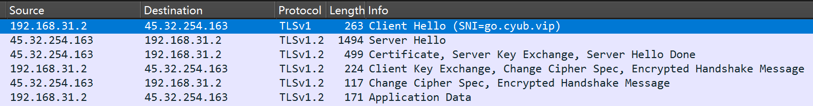
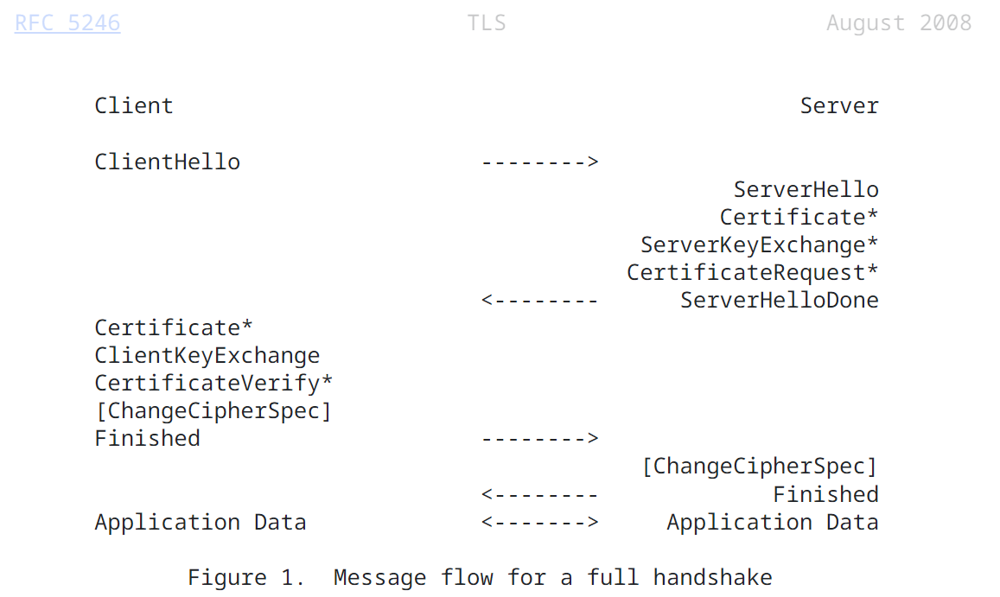
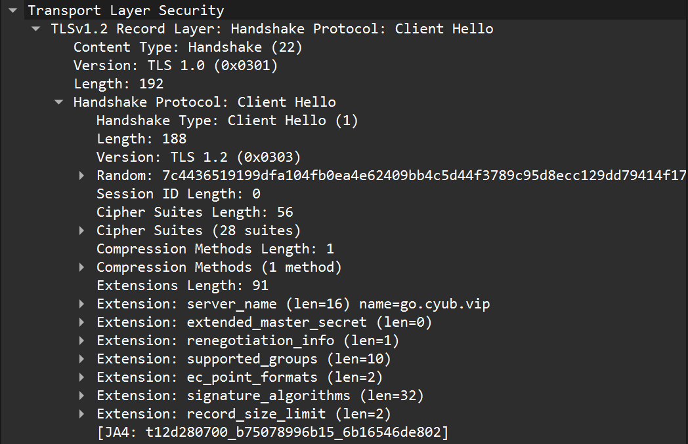
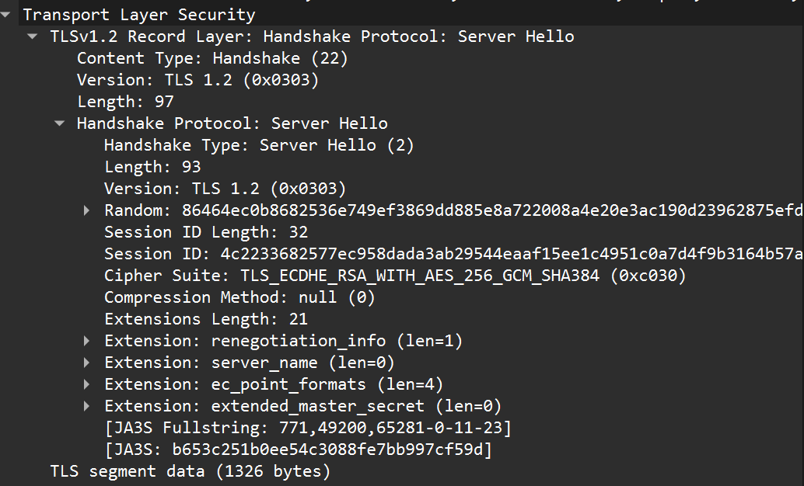
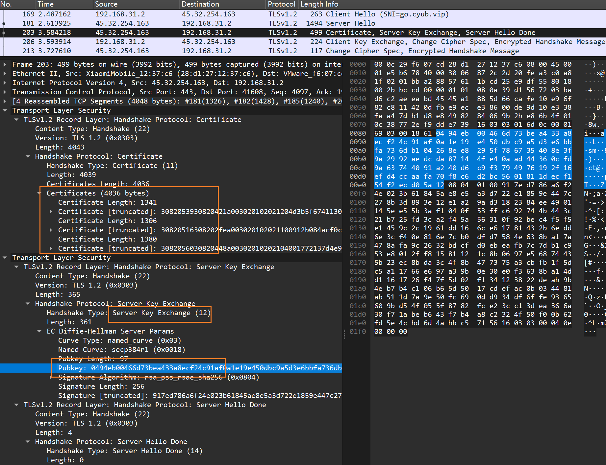
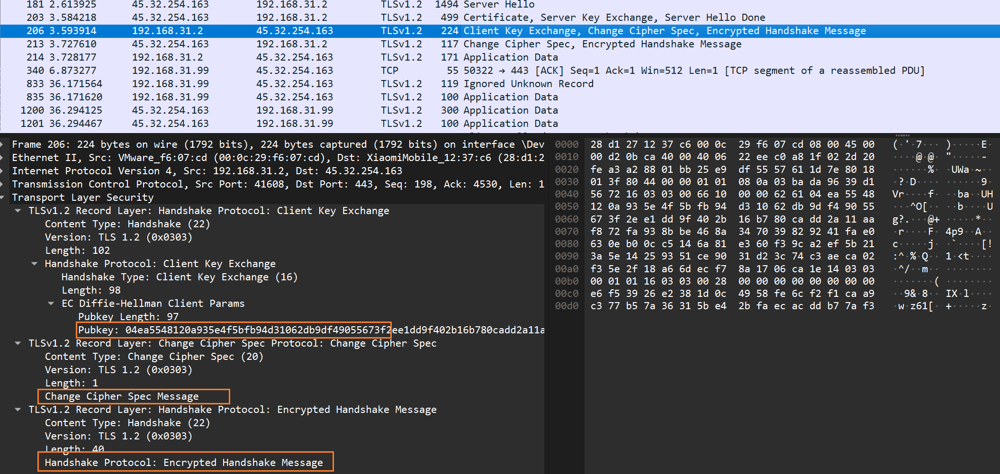
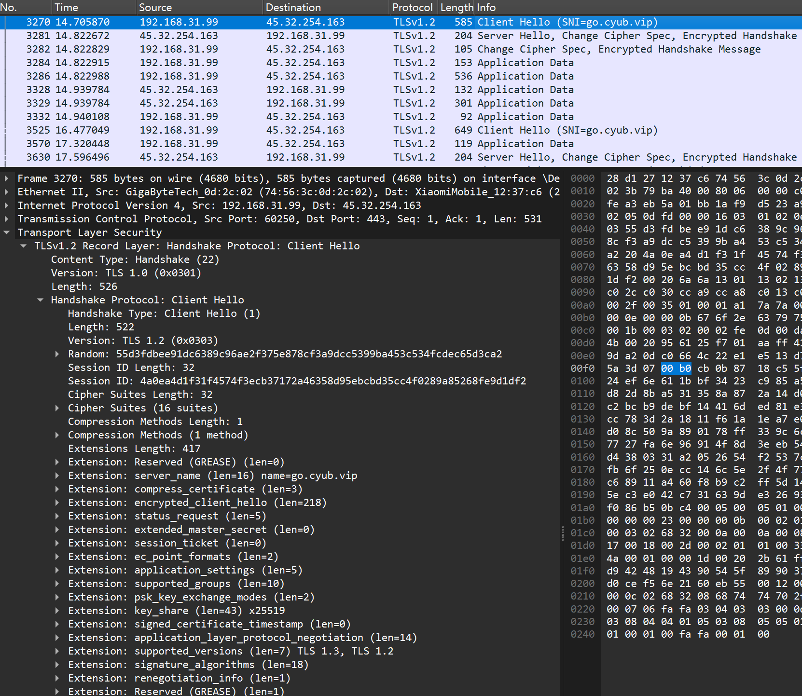

## HTTPS 抓包分析

首先安装 wireshark。本文抓包分析过程完全按实际抓包结果和 IETF 文档进行，不涉及任何猜测。

- [RFC 5246 - TLS 1.2](https://datatracker.ietf.org/doc/html/rfc5246)

### 抓包

网站提供：

- https://go.cyub.vip （tls 1.2）
    - 浏览器访问网站查看地址栏起始处的小锁可知服务器（与浏览器协商）使用的 TLS 版本
- 打开 cmd，执行`ping go.cyub.vip`获得网站 ip，例如: 45.32.254.163
- 启动 wireshark，选择上网网卡，开始抓包，在软件过滤器中输入`ip.addr eq 45.32.254.163 and tls`
- **通过 linux 系统内置的 curl 访问**网站，观察 wireshark 抓包结果，命令：`curl https://go.cyub.vip -I`
    - 第一次抓包不要使用浏览器访问，因为很有可能抓到**恢复会话**的握手过程，而不是首次握手
    - 经笔者测试，PowerShell 下的 curl 是有保持会话的功能的，所以抓取首次握手时，请使用 linux 系统内置的 curl。

### 截图

<div align="left">
 </img> 
</div>

### 分析

跟随 RFC 中描述的握手过程来分析

<div align="left">
 </img> 
</div>

#### 1. C->ClientHello

<div align="left">
 </img> 
</div>

开始前需要先了解 TLS 记录层协议。TLS 记录层是 TLS 协议的一个关键组成部分，它负责在两个通信实体之间安全地传输 TLS 数据。TLS
记录层**将数据分割成多个记录**，每个记录都包含 ContentType、Version、Length 字段和 Fragment 部分，Fragment 部分将在密钥协商完成后加密传输。
一个 TLS 记录层消息的类型包括：change_cipher_spec/alert/handshake/application_data，
在 wireshark 抓包 TLS 时，会看到一个 TLS 记录层承载了多个记录消息。

下面开始分析。

截图中的 TLS 记录层包只包含一种子类型消息，即握手消息（`Handshake`
）。而握手消息又细分多个类型（下面说明），这里是`Client Hello`。
在握手消息中包含：

- 握手类型：ClientHello
    - 其他还有 hello_request、server_hello、certificate、server_key_exchange、certificate_request、server_hello_done、
      certificate_verify、client_key_exchange、finished
- 长度：192
- 客户端支持的最高 TLS 版本：TLS 1.2，这也是客户端希望的握手 TLS 版本
    - 服务器若不支持这个版本，也可选择较低的版本，否则应该回复一个 alert 消息提示握手失败。
- 仅支持的 TLS 版本列表：通过`supported_versions`扩展字段提供，服务器只能从中选择一个版本进行握手，若都不支持则回复警报消息。
    - 但此字段并不总是会发送，当没有发送时，服务器可以选择小于等于`Version`字段指定的版本
- Random：32 位客户端随机数
- Session ID 长度：0
    - 非 0 时说明恢复一个之前的 session，并且 Session ID 字段非空
- 支持的密码套件列表长度：32（共 16 个，每个占 2 字节）
- 支持的密码套件列表
    - 以 TLS_ECDHE_RSA_WITH_AES_128_GCM_SHA256 为例
        - ECDHE：使用基于椭圆曲线的 Diffie-Hellman 密钥交换算法（用于交换预主密钥）
        - RSA：使用 RSA 作为签名算法验证服务器身份
        - AES_128_GCM：使用 128 位 AES 对称加密算法，GCM 模式
        - SHA256：使用 SHA256 哈希算法对消息进行哈希，验证其完整性
- 支持的压缩方法列表：此处列表为空，Server 也只能是空
- Extensions 列表：可选，用来实现扩展功能
    - 例如通过扩展字段`supported_signature_algorithms`来表示客户端希望用于签名和哈希的算法组合

#### 2. S->ServerHello

<div align="left">
 </img> 
</div>

Server 回复一条 ServerHello 类型的 TLS 握手消息。理解了 ClientHello，ServerHello 就很好理解了，其仍然是一条 ContentType
为`Handshake`的 TLS 消息，其中的帧部分解析为握手消息：

- 握手类型：ServerHello
- 长度：93
- 握手消息版本：TLS 1.2
- 服务器生成的 32 位随机数
- Session ID 长度：32
- Session ID：xxx
    - 当 ClientHello 中的 Session ID 长度为 0 时，ServerHello 会生成一个 Session ID，否则复用客户端的 Session ID
- 选择的密码套件：TLS_*
- 压缩方法：null
- Extension 长度：21
- Extension 列表：。。。
    - ServerHello 中的扩展类型必需在 ClientHello 的 Extensions 列表中存在，否则客户端应该中断握手（使用 alert 消息）

#### 3. S->Certificate/

<div align="left">
 </img> 
</div>

Server 继续回复三条类型不同的 TLS 握手消息，根据消息长度，它们可能横跨多条 TCP 数据段，下面的截图中表示它们横跨了 4 条 TCP
数据段。

- Certificate：向客户端提供服务器的公钥证书链，包含服务器证书、中间证书（如果有）和 CA 证书（如果有），其中服务器证书在首位
    - 客户端将验证这些证书的合法性，例如证书是否过期、证书的签名是否正确、证书的 CA 是否可信等。
    - 此消息总是紧跟 ServerHello 消息
- ServerKeyExchange：**可选，本例含**。当使用非 RSA、DH_DSS、DH_RSA 和 ECDHE
  这些密钥交换算法时，服务器将发送该消息，其中包含密钥交换算法需要的公钥（用于双方计算出一致的预主密钥）
    - 不需要此消息的情况：
        - 当之前协商的密码套件中的密钥交换算法已经有足够的信息来生成预主密钥时，不需要发送此消息
        - 比如在 RSA 密钥交换算法中，客户端已经可以通过服务器发送的证书公钥来生成预主密钥，因此不需要发送
          ServerKeyExchange 消息
    - 对于其他密钥交换算法，例如对于 DHE_DSS、DHE_RSA 和 DH_anon 这些基于 Diffie-Hellman 密钥交换原理的密钥交换方法，需要发送此消息
    - 对于本例中的椭圆曲线（EC）算法（如 ECDHE），也是基于 Diffie-Hellman 原理，所以也会发送一个临时公钥。
- _CertificateRequest_：**可选，本例中不含**。仅当服务器要求客户端提供用于身份验证的证书时才会发送此消息
    - 此消息结构包含服务器可接受的：证书类型、签名和哈希算法列表、CA 机构
    - 客户端收到此消息后，**必须**回复一个 Certificate 消息
- ServerHelloDone：表示 ServerHello 消息的结束
    - 此消息意味着 ServerHello 消息的所有信息都已发送完毕，也象征着第一次 RTT 完成。
    - ServerHelloDone 消息本身不包含任何数据，它只是一个通知。

#### 4. C->Certificate/

<div align="left">
 </img> 
</div>

第一次 RTT 结束后，Client 应收到 ServerHelloDone 消息，然后 Client 应根据服务器响应情况来开启第二次 RTT 握手，以下消息按顺序发送：

- _Certificate_：**可选消息，本例中不发**。仅当 Server 要求客户端进行身份验证时才会发送此消息，大部分公共服务器不需要。
- ClientKeyExchange：客户端根据之前协商的密钥交换算法，作出如下决定：
    - 若密钥交换算法不需要交换临时公钥（如 RSA），则 Client 将生成一个随机 46 字节的预主密钥，然后使用服务器的公钥对其进行
      RSA 加密，并发送给 Server
    - 若~是需要交换临时公钥的算法（本例情况），则 Client 将生成并发送算法所需的**临时公钥**给 Server，以便双端协商出相同的预主密钥
- _CertificateVerify_：**可选消息，本例中不发**。
    - 仅当客户端之前发送了`CertificateRequest`消息**且**其中的客户端证书包含可用于签名的密钥时，才会发送此消息
- CipherChangeSpec：客户端发送此消息通知服务器，**随后的数据将使用新协商的密码规范和密钥进行保护**。（稍后服务器也会回复此消息）
    - 发送此消息意味着双端已经完成安全参数的协商，**后续的消息可能采用加密传输**。
    - 这一步就可以计算出用于后续通信的会话密钥了，算法在后面介绍
- Finished：此消息必须在 CipherChangeSpec 之后发送，它是第一个使用新协商的密码规范和密钥进行加密的消息（所以抓包显示为
  Encrypted Handshake Message）
    - 此消息会包含`verify_data`字段，该字段是一个伪随机函数的计算结果，该函数的输入包括【会话密钥、finish 标签、此前所有握手消息的哈希】
    - 握手消息的哈希指的是从 ClientHello 开始到当前消息之前的所有握手消息的哈希值。

**详解 CertificateVerify 消息**

- 此消息包含数字签名结构，该结构是对此前的所有握手消息的哈希值进行签名后的结果。
    - 服务器收到并使用之前收到的客户端证书中的公钥进行解密，然后验证握手哈希是否正确，以**证明客户端确实拥有该证书的私钥**
    - 签名步骤：从第一条 ClientHello 消息开始，包含发送和接收的所有握手消息（不含当前的 CertificateVerify 消息），
      提取它们的消息类型和长度字段计算出哈希值，然后使用客户端证书中的私钥进行签名。
- 关于签名算法：
    - 用于签名的哈希和签名算法必须是服务器在 CertificateRequest 消息中指定的 supported_signature_algorithms 字段中列出的算法之一。
    - 此外，所使用的哈希和签名算法必须与客户端证书中的密钥类型兼容。RSA 密钥可以与任何允许的哈希算法一起使用，除非证书中有限制。

#### 5. S->CipherChangeSpec/

服务器会在收到客户端的 Finish 消息后回复 CipherChangeSpec 和 Finished 消息，它的作用与客户端的 CipherChangeSpec 和
Finished 消息相同。

### 计算会话密钥

为了开始保护连接，TLS 记录协议需要指定一组算法、一个主密钥（master secret），以及客户端和服务器的随机值。其中：

- 算法套件：TLS 使用的认证、加密和消息认证码（MAC）算法由服务器选择，并通过 ServerHello 消息告知 Client。
    - 本例中依次是 RSA、AES_128_GCM、SHA256
- 主密钥（又叫会话密钥）：由一个 PRF（伪随机函数）生成，函数的输入包含预主密钥、字符串`master secret`、双端随机值，输出结果固定长度
  48 字节。
- 随机值：双端在 Hello 消息中已完成交换。

前文说过，在 Hello 阶段协商出的密钥交换算法主要有两种：RSA 和 DH（Diffie-Hellman）家族，
这两种交换算法对应的**预主密钥生成方法是不同的**。

#### 对于 RSA 密钥交换算法

如果双端在 Hello 消息协商使用 RSA 密钥交换算法，由客户端生成一个 46 字节的随机值作为预主密钥，并通过服务器证书公钥将其加密后发送给服务器，
后者使用私钥解密即可得到预主密钥。后续再按照与客户端相同的方式计算出主密钥。

#### 关于 DH 家族密钥交换算法

DH（Diffie-Hellman）是一个安全的密钥交换协议，他可以让双方在完全没有对方任何预先信息的条件下通过不安全的信道安全地协商出一个密钥，
该密钥可用于后续的通信中用作对称密钥来加密内容。该算法由 Diffie 和 Hellman 在 1976 年发明。
虽然 DH 密钥交换本身是一个匿名（无认证）的密钥交换协议，它却是很多认证协议的基础。

DHE（Diffie-Hellman Ephemeral）和 ECDHE（Elliptic Curve Diffie-Hellman Ephemeral）是两种用于安全通信的密钥交换算法。
它们都属于 Diffie-Hellman 密钥交换家族，但使用了不同的数学基础和参数。其中 DHE 是早期系统中使用较多的密钥交换算法，ECDHE
则是后起之秀，
在相同安全性的前提下，ECDHE 在性能和资源消耗方面都优于 DHE。
TLS 1.2 和 TLS 1.3 两种算法都支持。

DH 家族算法的基本原理都是相同的，下面以 ECDHE 为例来解释其工作原理。

假定 A 和 B 要协商一个共享密钥，他们事先不知道对方任何信息：

- A 和 B 分别随机生成椭圆曲线上的点（随机整数）作为私钥，这些私钥将用于计算共享密钥；
- A 选择一条椭圆曲线，并结合该曲线公开的 G 点计算出自己的 DH 公钥，将曲线名称和公钥发送给 B；
    - 每条曲线都有一个全世界已知的 G 点
- B 同样在该曲线中选择一个随机数作为私钥，并结合 G 点计算出自己的 DH 公钥，将公钥发送给 A；
- 此时 A 和 B 都拥有对方的 DH 公钥和自己的私钥，随后通过椭圆曲线算法计算出共享密钥（Shared_Key）

共享密钥通常作为其他加密算法的密钥，用于后续通信的加密和认证。

> 在 DH 算法发明后不久出现了 RSA，是另一个用于密钥交换的算法，它使用了非对称加密算法，但它的安全性不如 ECDHE。

### 会话恢复抓包

<div align="left">
 </img> 
</div>

当客户端（如浏览器）内存中保存了之前与服务器建立的 TLS 连接，并且该连接的会话 ID 仍然有效，
此时客户端会在发送的 ClientHello 消息中直接填充 SessionID 字段，若服务器接收恢复之前这个 SessionID，
则 ServerHello 消息中的 SessionID 字段也会保持一致，并随后发送 CipherChangeSpec 和 Finish 消息，表示立即开始加密通信；
当然，客户端也需要回复 CipherChangeSpec 消息，表示同意立即开始加密通信。

会话恢复相比首次握手，少了密钥交换和证书验证步骤，从 2-RTT 减少到了 1.5-RTT。

### 关于握手消息结构

```cgo
enum {
  hello_request(0), client_hello(1), server_hello(2),
  certificate(11), server_key_exchange (12),
  certificate_request(13), server_hello_done(14),
  certificate_verify(15), client_key_exchange(16),
  finished(20), (255)
} HandshakeType;

struct {
  HandshakeType msg_type;    /* handshake type */
  uint24 length;             /* bytes in message */
  select (HandshakeType) {
      case hello_request:       HelloRequest;
      case client_hello:        ClientHello;
      case server_hello:        ServerHello;
      case certificate:         Certificate;
      case server_key_exchange: ServerKeyExchange;
      case certificate_request: CertificateRequest;
      case server_hello_done:   ServerHelloDone;
      case certificate_verify:  CertificateVerify;
      case client_key_exchange: ClientKeyExchange;
      case finished:            Finished;
  } body;
} Handshake;
```

### 关于 Alert 消息

TLS 记录层消息的 ContentType 之一是 Alert 消息。在 TLS 的握手和数据传输过程中，Alert 消息用于通知对方**发生了错误**
。此消息里面包含一个枚举类型，具体结构如下：

```cgo
// fatal级别表示遇到致命错误，连接将立即终止！同时SessionID作废，不可恢复
enum { warning(1), fatal(2), (255) } AlertLevel;

enum {
  close_notify(0),
  unexpected_message(10),
  bad_record_mac(20),
  decryption_failed_RESERVED(21),
  record_overflow(22),
  decompression_failure(30),
  handshake_failure(40),
  no_certificate_RESERVED(41),
  bad_certificate(42),
  unsupported_certificate(43),
  certificate_revoked(44),
  certificate_expired(45),
  certificate_unknown(46),
  illegal_parameter(47),
  unknown_ca(48),
  access_denied(49),
  decode_error(50),
  decrypt_error(51),
  export_restriction_RESERVED(60),
  protocol_version(70),
  insufficient_security(71),
  internal_error(80),
  user_canceled(90),
  no_renegotiation(100),
  unsupported_extension(110),
  (255)
} AlertDescription;

struct {
  AlertLevel level;
  AlertDescription description;
} Alert;
```