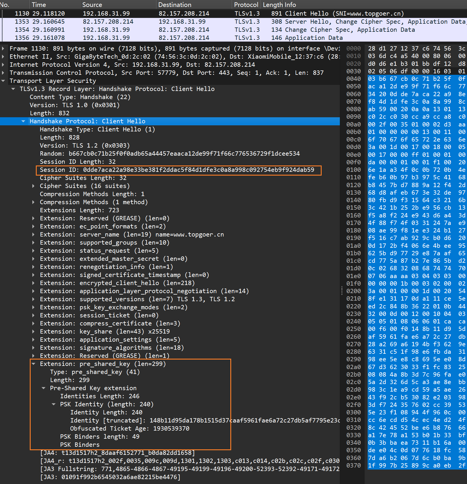
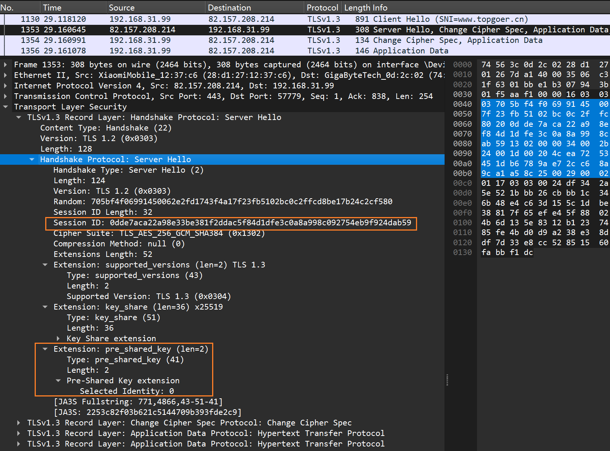

## HTTPS 抓包分析

首先安装 wireshark。本文抓包分析过程完全按实际抓包结果和 IETF 文档进行，不涉及任何猜测。

- [RFC 8446 - TLS 1.3](https://datatracker.ietf.org/doc/html/rfc8446)

### 抓包

网站提供：

- https://www.topgoer.cn （tls 1.3）
    - 浏览器访问网站查看地址栏起始处的小锁可知服务器（与浏览器协商）使用的 TLS 版本
- 打开 cmd，执行`ping www.topgoer.cn`获得网站 ip，例如：82.157.208.214
- 启动 wireshark，选择上网网卡，开始抓包，在软件过滤器中输入`ip.addr eq 82.157.208.214 and tls`
- **通过 linux 系统内置的 curl 访问**网站，观察 wireshark 抓包结果，命令：`curl https://www.topgoer.cn -I`
    - 第一次抓包不要使用浏览器访问，因为很有可能抓到**恢复会话**的握手过程，而不是首次握手
    - 经笔者测试，PowerShell 下的 curl 是有保持会话的功能的，所以抓取首次握手时，请使用 linux 系统内置的 curl。

### 截图

<div align="left">
 </img> 
</div>

### 分析

跟随 RFC 中描述的握手过程来分析

<div align="left">
 </img> 
</div>

#### 1. C->ClientHello

<div align="left">
 </img> 
</div>

关于 TLS 记录层协议这里不解释了，它在[https_tls1.2_capture.md](https_tls1.2_capture.md) 已经说明，下面直接开始分析。

截图中的 TLS 记录层协议版本是 1.3，但这并不要紧，它是向下兼容的。记录层只包含一个子类型单元，即握手消息（`Handshake`），
握手消息的子类型是`Client Hello`，下面是握手消息的明细：

- 握手类型：ClientHello
- 长度：192
- Version：客户端在 Client Hello 消息中指定它希望使用的 TLS 协议版本。在 TLS 1.3 中，这通常是`0x0304`，表示 TLS 1.3。
    - 服务器若不支持这个版本，也可选择较低的版本；7
    - TLS1.3 要求客户端必须发送`supported_versions`扩展字段，来指定客户端支持的版本列表（按照偏好高到低排序）
    - 服务器必需从该列表中选择一个支持的版本，若都不支持，则应该回复一个警报消息，告知客户端握手失败。
        - 如果不存在这个扩展字段，则服务器应该当做 TLS 1.2 及以下版本进行协商。
- Random：32 位客户端随机数
- Session ID 长度：0
    - 非 0 时说明恢复一个之前的 session，并且 Session ID 字段非空
- 支持的密码套件列表长度：6（共 3 个，每个占 2 字节）
- 支持的密码套件列表（显示 3 个，最多 5 个）
    - TLS 1.3 抛弃了许多存在缺陷的密码套件，只保留了 5 个
    - 例如：TLS_AES_128_GCM_SHA256
        - **注意**：TLS 1.3 中的密码套件标识中不再包含密钥交换算法，因为在 TLS 1.3 中，默认通过 ECDHE 或 PSK
          两种密钥交换算法，它们通过扩展字段进行协商。
- 支持的压缩方法列表：此处列表为空，Server 也只能是空
- Extension 字段：用来实现扩展功能
    - `server_name`（SNI）：**必需**。客户端通过该扩展字段来指定自己想访问的域名，服务器根据该字段来选择合适的证书
    - `supported_groups`：**必需**。客户端支持的用于密钥交换算法的椭圆曲线或有限域命名群组，按偏好顺序高到低排序
        - 密钥交换算法分两类：椭圆曲线类（如 ECDHE）和 DHE，前者计算时需要指定一个椭圆曲线名称，后者需要一个有限域名称
        - 从命名群组名称上就可以区分它是 ECDHE 还是 DHE 算法的参数，所以 TLS 1.3 没有约定一个字段用来表示密钥交换算法
    - `supported_signature_algorithms`：**必需**。客户端希望用于签名和哈希的算法组合
        - 这些签名算法用于验证证书的有效性（在客户端和服务器的身份验证过程中）以及验证握手消息的完整性（在 Finished 消息中）
    - `psk_key_exchange_modes`：**必需**。指示客户端支持的预共享密钥（PSK）密钥交换模式列表
        - 在 TLS 1.3 中，一共支持三种密钥交换算法：(EC)DHE、PSK 和前两者组合版本
        - 此扩展字段一共支持两种 PSK 密钥交换模式：
            - psk_ke：表示仅使用 PSK 进行密钥交换，不使用任何基于证书或 ECDHE 的密钥交换。
            - psk_dhe_ke：表示 PSK 与 (EC)DHE 密钥交换一起使用。这意味着即使使用 PSK，也会进行 (EC)DHE 密钥交换以提供前向保密。
                - 此模式要求双端使用`key_share`扩展字段协商密钥交换算法的参数
        - 本例中客户端仅列出了`psk_dhe_ke`模式
    - `key_share`：**可选**。客户端预先准备好的密钥交换参数和命名群组列表
        - TLS 1.3 中，客户端会猜测服务器会选择的命名群组（密钥协商参数之一），然后通过此字段将命名群组名称以及对应计算出的公钥发给服务器
        - 在 TLS 1.2 中，服务器在 ServerKeyExchange 消息中才开始进行密钥交换参数协商，而 TLS 1.3 中从第一个 Hello 包就开始协商
        - （服务器收到后从中选择一组，然后在 ServerHello 中的 `key_share` 字段回复自己选择的命名群组以及对应生成的密钥交换参数）
        - <u>这两个元素将会用于双端计算用于握手和传输数据的各种密钥</u>
    - `record_size_limit`；指示客户端最大能接收的单个 TLS 记录层消息大小（单位：字节）
        - 重温 TLS 记录层协议：
            - TLS 记录层用来承载 TLS 握手消息和应用数据等消息类型，主要用来传输 TLS 数据（在 TCP 连接建立后），可以确保这些消息的安全性和完整性
            - TLS 记录层将数据分割成多个记录，每个记录都包含 ContentType、Version、Length 字段和 Fragment 部分，Fragment
              部分将在密钥协商完成后加密传输
        - TLS 1.3 中使用此字段取代了旧版本中的`max_fragment_length`，后者在设计上存在一些问题和局限性

#### 2. S->ServerHello

<div align="left">
 </img> 
</div>

Server 回复一条 ServerHello 类型的 TLS 握手消息。
理解了 ClientHello，ServerHello 就很好理解了，其仍然是一条 ContentType 为`Handshake`的 TLS 记录层消息，其中的帧部分解析为握手消息：

- 握手类型：ServerHello
- 长度：86
- 握手消息版本：TLS 1.2
- Random：服务器生成的 32bit 随机数
    - 关于 TLS 1.3 服务器的向后兼容性
        - 当 TLS 1.3 服务器与客户端协商 TLS 1.2 或更低版本时，它们必须在 ServerHello 消息的随机数字段的最后 8
          个字节中设置特定的值。如果协商的是 TLS
          1.2，则设置为 `44 4F 57 4E 47 52 44 01`；如果是 TLS 1.1 或更低版本，则设置为 `44 4F 57 4E 47 52 44 00`。
        - TLS 1.3 客户端在收到 ServerHello 消息时，必须检查随机数的最后 8 个字节是否与上述值匹配。如果匹配，
          客户端必须使用"illegal_parameter"警报终止握手。这是一种保护机制，用于防止攻击者降级到较弱的 TLS 版本。
- Session ID 长度：0
    - 笔者注：TLS 1.3 没有明确说明废弃此字段，但首次握手过程中 ServerHello 消息中的 SessionID 长度始终是 0，暂不得而知。
    - 在 0-RTT 的会话恢复阶段中，此字段非空，同 TLS 1.2，双端 Hello 消息包含一致的 SessionID
- 选择的密码套件：TLS_AES_256_GCM_SHA384
- 压缩方法：null
    - TLS 1.3 中此字段废弃但保留，不再压缩消息。
    - TLS 1.3 中移除压缩功能是基于安全性的考虑。以前的 TLS 版本中使用的压缩算法被发现可能允许攻击者利用压缩数据中的模式来破解加密，因此
      TLS 1.3 中完全废弃了 TLS 层的压缩。
- Extension 长度：46
- Extension 列表：
    - `supported_versions`扩展：表示服务器同意使用 TLS 1.3 版本进行通信
    - `key_share`扩展：表示服务器从 ClientHello 中选择的密钥交换参数
    - 注意：服务器回复的扩展字段必需在 ClientHello 中的扩展字段列表中存在

#### 3. 剩下的握手消息

不同于 TLS 1.2，在 TLS 1.3 中，ServerHello 消息之后，双端即可计算出各种加密密钥，并开始进行加密通信。
所以后续的握手消息全部加密传输（如服务器证书和 Finish 消息），我们只能看到`ApplicationData`类型的消息。

> [!IMPORTANT]
> 注意：剩余握手消息的加密与应用数据的加密使用不同的密钥，整个握手过程会产生多个密钥，具体在后面的**计算密钥**章节中说明。

根据 RFC 文档，在 ServerHello 消息之后，还有以下握手步骤：

- 服务器回复：
    - EncryptedExtensions 消息：**必需**。
        - 这是第一个被加密的消息，使用从`server_handshake_traffic_secret`派生的密钥。EncryptedExtensions 消息包含在握手过程中需要保护的扩展
        - 其中可能包括服务器选择的会话 ID、支持的应用层协议协商（ALPN）协议、服务器首选的密码套件等
        - 如果服务器在 EncryptedExtensions 中发送了`early_data`扩展，那么客户端在接收到服务器的 Finished 消息后，必须发送一个
          EndOfEarlyData 消息。
            - 这表示所有的 0-RTT 应用数据消息（如果有的话）已经传输完毕，接下来的记录将受到握手流量密钥的保护。
    - CertificateRequest 消息：可选。当服务器需要客户端证书时发送。
    - Certificate 消息：**必需**。传输服务器的证书链。
        - 说明：在前面提供的 RFC 流程图中，此消息标注了`*`
          ，个人认为这应该是 RFC 标注失误，因为在[rfc-certificate][rfc-certificate]章节中的描述是
          **MUST**。
        - 服务器提供的证书类型必须是 X.509v3，除非客户端通过扩展明确协商了其他类型。
        - 服务器的终端证书的公钥必须与客户端在`signature_algorithms`扩展中指定的签名算法兼容。
        - 服务器会根据客户端提供的`server_name`扩展和`certificate_authorities`扩展（可选字段）来指导证书的选择。
            - 客户端可以在 ClientHello 消息中包含`certificate_authorities`扩展，列出它信任的 CA
              的名称或标识符。这有助于服务器选择一个客户端将接受的证书。
    - CertificateVerify 消息：**必需**。此消息紧跟 Certificate 消息，用于验证服务器证书签名的有效性。这个消息包含一个根据转录哈希计算得到的数字签名。
        - 转录哈希（Transcript Hash）：等同于 TLS 1.2 中提到的前面所有握手消息组合后的摘要。
    - Finished 消息：**必需**。Server 握手认证阶段中的最后一条消息。它为握手提供了最终的认证，确保了握手的完整性和密钥的确认。
        - 其中包含一个基于转录哈希计算得到的 MAC（消息认证码），使用从握手流量密钥派生出来的密钥进行计算，接收方需要进行验证。
        - Finished 消息是认证块中的最后一条消息，它对于提供握手和计算密钥的认证至关重要。
        - 接收到 Finished 消息的接收者必须验证其内容是否正确，如果不正确，则必须使用"decrypt_error"警报终止连接。
        - 在 Finished 消息之后的任何记录都必须使用对应的应用程序流量密钥进行加密。
- 客户端回复：
    - Certificate 消息：可选。传输客户端的证书链，当服务器需要客户端提供证书时发送。
    - CertificateVerify 消息：可选。原理同上。
    - Finished 消息：**必需**。原理同上。
    - EndOfEarlyData 消息。**可选**。响应服务器在 EncryptedExtensions 消息中发送的`early_data`扩展。
        - 此消息使用从`client_early_traffic_secret`派生的密钥进行加密。
        - 此消息也标志着 0-RTT 数据阶段的结束，后续消息必须应用程序流量密钥保护数据，而不是早期或握手密钥。

总的来说，TLS 1.3 的握手过程只需要 1.5 RTT，但一般没有这个说法，所以对外总是说 1-RTT。

#### 4. 握手后的消息

握手完成后，除了应用数据消息，TLS 1.3 还规定了其他几种消息：

- NewSessionTicket：在握手完成后的任意时刻，服务器可以使用此消息向客户端提供一个加密的会话票证，该票证可以用来快速恢复之前建立的
  TLS 会话。
    - 其中包含`ticket_lifetime`、`ticket_age_add`、`ticket_nonce`、`ticket`和`extensions`。
    - 计算 PSK：客户端收到该票证后可以使用`ticket`、`ticket_nonce`和`resumption_master_secret`计算出用于会话恢复的 PSK。
    - 该消息可以包含一个或多个扩展，目前仅定义了一个扩展`early_data`，它指示票证是否可用于发送 0-RTT 数据。
    - 票证寿命：一个 32 位的无符号整数，表示从票证颁发时间开始会话的有效期，以秒为单位。服务器必须确保票证寿命不超过 7
      天（604800 秒）。
    - 票证年龄增加值：一个随机生成的 32 位值，用于混淆客户端票证的年龄。
    - 会话票证：一个包含会话恢复信息的密文值，可以用来快速恢复之前建立的 TLS 会话。
- CertificateRequest：如果客户端在 ClientHello 消息中发送了`post_handshake_auth`扩展，说明客户端希望在握手完成后进行认证
    - 那么服务器可以在握手完成后对客户端发送此消息，要求对客户端进行认证
    - 客户端收到此消息后，可以选择是否同意认证：
        - 若同意认证，客户端必须连续发送 Certificate、CertificateVerify 和 Finished 消息；
        - 若拒绝认证：客户端必须发送一个空的 Certificate 消息和 Finish 消息；
        - 如果客户端在之前握手时没有发送`post_handshake_auth`扩展，又在握手后收到了 CertificateRequest
          消息，则回复`unexpected_message`警报消息，中断连接
- KeyUpdate：用于客户端或服务器在握手完成后更新自己的密钥材料，用于减少密钥被破解后的风险，也是 TLS 1.3 提供前向保密性的一种方式
    - 该消息如果在握手阶段发送，接收方应该立即终止握手
    - 发送方在发送 KeyUpdate 消息后，必须使用新密钥来发送后续消息；接收方也必须在收到 KeyUpdate 消息后，使用新密钥来解密后续消息

这些消息都已经加密，抓包不可见。

### 计算各种密钥

TLS 1.3 的握手过程已经进行重构，重构后的版本不再使用预主密钥，详细过程如下。

在 RFC 8446 文档的 7.1 节中，详细介绍了 TLS 1.3 中的密钥调度（Key Schedule）。密钥调度是指从输入密钥材料（input
secrets）生成 TLS 握手和数据传输所需的各种密钥和密钥相关值的过程。

- 密钥派生函数：TLS 1.3 使用 HKDF（HMAC-based Extract-and-Expand Key Derivation Function）作为密钥派生的主要机制。
  HKDF 结合了输入密钥材料和握手转录（包含随机值和其他相关信息）来生成所需的密钥。
- HKDF-Extract 和 HKDF-Expand：密钥调度使用 HKDF 的两个主要函数，HKDF-Extract 用于从现有的密钥材料中提取密钥，
  而 HKDF-Expand 用于根据提取的密钥生成新的密钥或密钥相关值。
- 输入密钥材料：输入密钥材料可能包括预共享密钥（PSK）、客户端和服务器的随机值、ECDHE 共享秘密等。这些密钥材料与握手转录结合使用，生成一系列派生密钥。
- **密钥生成**：文档描述了如何生成各种密钥，包括：
    - 密钥绑定（Key Derivation）
        - binder_key：用于生成 PSK 绑定值，这些值在握手过程中用于验证 PSK 的有效性。
    - 早期流量密钥（early traffic keys）
        - client_early_traffic_secret：用于加密客户端在 0-RTT 阶段发送的应用数据。
    - 早期导出主密钥
        - early_exporter_master_secret：一种中间密钥，用于 0-RTT 阶段导出主密钥。
    - 握手流量密钥（handshake traffic keys）
        - client_handshake_traffic_secret：用于加密客户端在 Hello 消息完成后的握手阶段数据。
        - server_handshake_traffic_secret：用于加密服务器在 Hello 消息完成后的握手阶段数据。
    - 应用程序流量密钥（application traffic keys）
        - client_application_traffic_secret_0：用于加密客户端在建立安全层后发送的应用数据。
        - server_application_traffic_secret_0：用于加密服务器在建立安全层后发送的应用数据。
    - 导出器主密钥
        - exporter_master_secret：一种中间密钥，可以生成用于特定目的的密钥，例如用于会话恢复的 PSK。
    - 重协商密钥（Resumption Master Secret）
        - resumption_master_secret：用于生成新会话票证（NewSessionTicket）时的密钥和绑定值，这些票证可以在后续的 TLS
          握手中用于会话恢复。

每个生成的密钥都有一个特定的名称，这些名称用于标识密钥的用途和它们在密钥调度过程中的角色。

#### 密钥计算过程

首先准备两个基本参数：PSK 和 (EC)DHE 共享密钥。PSK 要么是 0 值（1-RTT 阶段），要么是非 0 值（0-RTT 阶段），
而(EC)DHE 共享密钥可以 Hello 消息中交换计算得出。

**计算早期流量密钥**

会话恢复即 0-RTT 阶段，此时客户端已经可以通过之前的会话计算出 PSK，将 PSK 作为 HKDF-Extract 的参数即可计算出 Early Secret，
后者再结合不同参数传入 Derive-Secret 函数派生出 binder_key、client_early_traffic_secret、early_exporter_master_secret 三个密钥。
在首次握手的 1-RTT 阶段，这几个密钥可能没有任何用途；仅 Early Secret 用作下一步骤的输入。

**计算握手流量密钥**

**Early Secret**和(EC)DHE 共享密钥作为 HKDF-Extract 参数计算出 Handshake Secret，后者再结合不同参数传入 Derive-Secret 函数派生出
client_handshake_traffic_secret、server_handshake_traffic_secret。

**计算应用流量密钥**

**Handshake Secret**和 0 作为 HKDF-Extract 参数计算出 Master Secret，后者再结合不同参数传入 Derive-Secret 函数派生出
client_application_traffic_secret_0、server_application_traffic_secret_0、exporter_master_secret、resumption_master_secret。

[RFC 文档][rfc8446-70]中提供了使用 HKDF-Expand-Label 函数派生各种流量密钥的示例，包括握手流量密钥和应用程序流量密钥。

#### 计算(EC)DHE 共享密钥

根据`supported_groups`字段中指定的椭圆曲线或有限域群组名称，使用相应的 Diffie-Hellman 算法计算出共享密钥。

- 对于有限域群（如 DHE 或 FFDHE），执行传统的 Diffie-Hellman 计算。
- 对于椭圆曲线，如 secp256r1、secp384r1 和 secp521r1，使用 IEEE 1363 标准中的 ECKAS-DH1 方案和恒等映射作为密钥派生函数（KDF），
  共享秘密是椭圆曲线上的 x 坐标，表示为一个字节串。
- 对于 X25519 和 X448 曲线，执行 ECDH 密钥交换。公钥是将私钥与标准公共基点相乘的结果。

最后，任何一端必须检查计算出的 Diffie-Hellman 共享密钥是否为全零值，若是则需要中止连接。

#### Exporter（导出器）

TLS 1.3 中新增一个导出器的概念，它是一种密钥派生机制（或者说计算方式），用于从 TLS 握手期间协商的密钥材料生成特定目的的密钥。
这些导出密钥可以用于多种用途，如会话恢复、应用层协议协商（ALPN）或其他需要安全导出密钥的场景。

### 会话恢复抓包

<div align="left">

 
</div>

### 关于握手消息结构

```cgo
enum {
    client_hello(1),
    server_hello(2),
    new_session_ticket(4),
    end_of_early_data(5),
    encrypted_extensions(8),
    certificate(11),
    certificate_request(13),
    certificate_verify(15),
    finished(20),
    key_update(24),
    message_hash(254),
    (255)
} HandshakeType;

struct {
  HandshakeType msg_type;    /* handshake type */
  uint24 length;             /* remaining bytes in message */
  select (Handshake.msg_type) {
      case client_hello:          ClientHello;
      case server_hello:          ServerHello;
      case end_of_early_data:     EndOfEarlyData;
      case encrypted_extensions:  EncryptedExtensions;
      case certificate_request:   CertificateRequest;
      case certificate:           Certificate;
      case certificate_verify:    CertificateVerify;
      case finished:              Finished;
      case new_session_ticket:    NewSessionTicket;
      case key_update:            KeyUpdate;
  };
} Handshake;
```

### 关于 Alert 消息

TLS 记录层消息的 ContentType 之一是 Alert 消息。在 TLS 的握手和数据传输过程中，Alert 消息用于通知对方**发生了错误**
。此消息里面包含一个枚举类型，具体结构如下：

```cgo
// fatal级别表示遇到致命错误，连接将立即终止！同时SessionID作废，不可恢复
enum { warning(1), fatal(2), (255) } AlertLevel;

enum {
  close_notify(0),
  unexpected_message(10),
  bad_record_mac(20),
  decryption_failed_RESERVED(21),
  record_overflow(22),
  decompression_failure(30),
  handshake_failure(40),
  no_certificate_RESERVED(41),
  bad_certificate(42),
  unsupported_certificate(43),
  certificate_revoked(44),
  certificate_expired(45),
  certificate_unknown(46),
  illegal_parameter(47),
  unknown_ca(48),
  access_denied(49),
  decode_error(50),
  decrypt_error(51),
  export_restriction_RESERVED(60),
  protocol_version(70),
  insufficient_security(71),
  internal_error(80),
  user_canceled(90),
  no_renegotiation(100),
  unsupported_extension(110),
  (255)
} AlertDescription;

struct {
  AlertLevel level;
  AlertDescription description;
} Alert;
```

### 关于加密协商

客户端通过 ClientHello 消息向服务器发送加密协商参数，其中包含以下字段：

- CipherSuites（加密套件列表）：指示客户端支持的 AEAD 算法/HKDF 哈希对。
- `supported_groups`扩展：指示客户端支持的(EC)DHE 的命名群组，与`key_share`扩展关联。
    - `key_share`扩展：其中包含客户端预选参数列表，每个参数都包含一个命名群组（来自`supported_groups`列表）和对应计算出的公钥。
- `signature_algorithms`扩展：指示客户端可以接受的签名&哈希算法，用于验证服务器证书有效性。
- `pre_shared_key`扩展：包含客户端已知的**对称密钥标识**的列表，与`psk_key_exchange_modes`扩展关联。
    - `psk_key_exchange_modes`扩展，指示可以与 PSK 一起使用的密钥交换模式。

在首次握手过程中，服务器根据

### 关于 HelloRetryRequest 消息

这是一个握手消息子类型。如果客户端在 ClientHello 中没有通过`key_share`扩展提供足够数量的或服务器无法接受的 DHE 或 ECDHE
命名群组，服务器将无法与客户端协商出一个共同支持的群组。在这种情况下，服务器会发送一个 HelloRetryRequest
消息来更正这个不匹配，并要求客户端重新开始握手过程。

HelloRetryRequest 消息使用与 ServerHello 相同的结构，但具有一些特定的变化。最重要的是，它的随机数（Random）字段被设置为一个预定义的特殊值，
即"HelloRetryRequest"字符串的 SHA-256 哈希值。

### 关于会话恢复和 PSK

TLS 1.3 通过会话恢复机制允许客户端和服务器在不需要完整的握手过程的情况下重新建立安全连接。
这可以通过使用**预共享密钥（PSK）**来实现，从而节省时间和资源。

> 这也是所谓的 0-RTT 握手。

这个 PreShareKeyPSK 可以在之前的连接中通过握手建立，并且可以在后续的握手中使用。服务器可以发送一个包含 PSK
身份的新会话票据（NewSessionTicket），客户端可以在未来的握手中使用这个 PSK 身份来请求会话恢复。

当客户端在握手中提供 PSK 身份时，服务器会检查该身份是否与其持有的 PSK 匹配。如果匹配，服务器将使用该 PSK 来建立安全连接。
即使客户端提供了一个或多个 PSK 身份，服务器也可以选择不使用它们，而是进行完整的握手过程。这允许服务器根据需要灵活地控制会话恢复的使用。

使用 PSK 时，必须确保 PSK 的安全性，避免泄露给未授权的第三方。此外，服务器应该只在确信客户端是预期的通信方时才接受 PSK。

**PSK 与(EC)DHE 的结合使用**

TLS 1.3 允许将 PSK 与(EC)DHE 密钥交换结合使用，以提供完美的前向保密性（PFS）。这种模式下，即使长期密钥（如证书中的私钥）被泄露，之前的会话仍然是安全的。

**PSK 相关的扩展字段**

包括 `pre_shared_key`、`early_data`、`psk_key_exchange_modes` 和 `cookie`，这些扩展用于在握手过程中协商和验证 PSK 的使用。

### 关于 0-RTT 和重放攻击

0-RTT（握手） 是 TLS 1.3 提供的一种机制，它允许客户端在握手过程中发送**应用数据**。这使得客户端可以在握手完成之前开始发送数据，从而提高效率，
尤其是在延迟敏感的应用场景中。

- **安全性弱**：0-RTT 数据的安全性比标准的 TLS 1-RTT 数据弱，因为它不是前向保密的（forward secret）。此外，无法保证 0-RTT
  数据在不同连接之间不会重放
- **PSK 保护**：客户端使用预共享密钥（PSK）来加密 0-RTT 中发送的应用数据
- **数据处理**：服务器必须检查 0-RTT 数据的完整性，并确保它与客户端提供的 PSK 相关联。如果服务器无法验证 0-RTT
  数据，它应该拒绝这些数据并继续执行正常的握手过程。
- **early_data 扩展字段**：

#### 防范重放攻击

**什么是 0-RTT 中的重放攻击**
由于 TLS 1.3 没有提供 0-RTT 阶段中的服务器保护措施，因此服务器会面临两类重放攻击威胁:

- 网络攻击者发起的重放攻击： 攻击者通过简单地复制 0-RTT 数据包来实施重放攻击。
- 利用客户端重试行为的网络攻击者： 攻击者利用客户端重试行为，安排服务器接收多个应用消息的多个副本。

重放攻击会导致服务器接收来自攻击者客户端的大量重复消息，导致服务器创建大量 TCP 连接和内存资源，进而导致服务器无法正常响应其他客户端请求。

**RFC 文档中列举的防范措施**

- 单次使用票据（Single-Use Tickets）
    - 服务器可以通过仅允许每个会话票据（session ticket）使用一次来防止重放攻击。这通常通过维护一个数据库来实现，记录所有有效的票据，并在票据被使用后从数据库中删除。
- 客户端 Hello 记录（Client Hello Recording）
    - 服务器记录从客户端接收到的唯一值（通常是随机值或 PSK binder），并拒绝重复的客户端 Hello 消息。
      服务器可以在给定的时间窗口内记录客户端 Hello，并使用“obfuscated_ticket_age”来确保票据不会被重用。
- 新鲜度检查（Freshness Checks）
    - 服务器可以通过检查客户端 Hello 中的“expected_arrival_time”来有效确定客户端 Hello 是否是最近发送的，并仅接受这样的客户端
      Hello 进行 0-RTT。
    - 如果“expected_arrival_time”与当前服务器时间相差太大，则拒绝 0-RTT 数据，但可以允许 1-RTT 握手完成。

[rfc8446-70]: https://datatracker.ietf.org/doc/html/rfc8446#autoid-70

[rfc-certificate]: https://datatracker.ietf.org/doc/html/rfc8446#autoid-46
