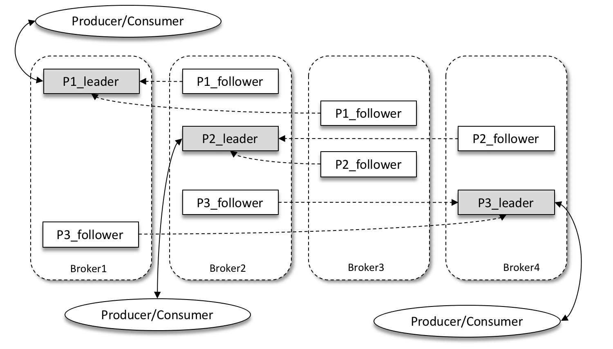
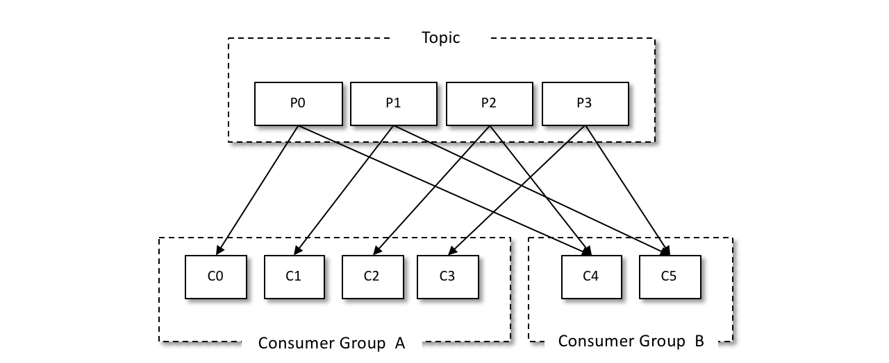

# Kafka 相关

本文内容摘自网络，请读者自行确认内容严谨性。

## 简述 kafka

kafka 是一个基于发布订阅模式的消息队列中间件，分为 producer 和 consumer，通过 topic 进行消息分类，
producer 生产的消息可以根据消息类型发布到不同的 topic，由不同的 consumer 订阅进行消费，这
样就组成了一个基本可用的消息队列中间件。

<div align="left">

</div>

---


<div align="left">

</div>

---

<div align="left">

</div>

## 基本架构

- 多 broker 组成集群，zookeeper 用于主从选举
- leader/follower：leader 负责输入输出数据，follower 负责保存数据副本
- topic：位于集群中的逻辑消息主题
    - 一个主题可有多个分区，分区存储可提高消费效率
  - 每个分区在物理上是一个目录，存储着日志文件
    - 同一个分区的多个副本一定位于不同节点上，避免单点故障
    - 每个分区是一个 leader 或 follower
- CG（consumer group）：消费组，一个主题可被多个消费组订阅，同一个消费组内的消费者不能消费同一个主题的相同分区

## 分区的作用

- 提供水平扩展能力：一个 topic 可以拆成多个 partition，每个 partition 被分布到不同 broker 上。
    - 分区的数量可以超过broker数量，一个broker承载多个分区。
- 实现并行消费：Kafka 的消费是 partition 为最小并行单位。
    - 一个 partition 一次只能被一个消费者（在同一 consumer group）独享
    - 分区数决定了最大消费并行度
- 分区内的顺序性：Kafka 只保证 partition 内消息的顺序，不保证 topic 全局顺序。

**分区数量越多越好？**

不是。

1. 每个 partition 都有自己的文件句柄、内存、索引等元数据，太多会压垮 broker。
2. controller 管理的元数据线性增加，Zookeeper/KRaft 压力上升。
3. 分区越多，重平衡越慢。consumer group rebalance 直接加剧延迟。
4. leader 选举变慢。分区越多，HA 操作越重。

## 迭代历史

| 版本区间               | 发布年份        | 元数据存储/协调方式                    | 生产/消费端连接路径                             | 关键特点（一句话提炼）                                                     |
|--------------------|-------------|-------------------------------|----------------------------------------|-----------------------------------------------------------------|
| **≤ 0.8.x**        | 2012 - 2014 | 完全依赖 ZooKeeper                | Producer/Consumer → ZooKeeper → Broker | “ZooKeeper 是必经之路”：Topic、Broker、Consumer-Offset 全在 ZK；性能、扩展瓶颈明显。 |
| **0.9.0.0**        | 2015        | 元数据仍在 ZK，但通信链路简化              | Producer/Consumer ↔ Broker（直连）         | “甩掉 ZK 流量”：引入新版 Kafka 协议，客户端直接与 Broker 通信，ZooKeeper 退居幕后。       |
| **0.10.x - 2.7.x** | 2016 - 2021 | 元数据与 Controller 选举仍用 ZK       | 同上                                     | “ZK 继续兜底”：Kafka 功能持续增强（事务、幂等、Exactly-Once），但运维仍需维护 ZK 集群。       |
| **2.8.0 早期预览**     | 2021        | **KRaft（Kafka Raft）模式** 实验性登场 | 无 ZooKeeper                            | “预览无 ZK”：可用 KRaft 跑测试/准生产，但功能不完整，官方不建议上生产。                      |
| **3.0 - 3.4**      | 2021 - 2023 | KRaft 功能逐步补齐；ZK 仍并存           | 可选 KRaft 或 ZK                          | “双轨并行”：KRaft 支持 SCRAM、ACL、JBOD 等特性，逐步逼近生产就绪。                    |
| **3.5**            | 2023        | ZooKeeper **被标记弃用**           | 同上                                     | “ZK 进入倒计时”：新部署官方推荐 KRaft；ZK 仅做向后兼容。                             |
| **4.x**            | 2024+       | **完全移除 ZooKeeper**，仅支持 KRaft  | 仅 KRaft                                | “ZK 时代终结”：架构更简、扩展性 >1000 Broker、故障恢复更快。                         |

## 为什么高性能

### 写入快

- 顺序写：每个分区都是一个独立文件，kafka 使用 Append 方式写入，写入效率堪比内存。
    - 这种方式无法删除数据，所以 kafka 保存了所有消息，通过 offset 记录读取位置。
- 页缓存：利用 OS 的页缓存机制，将文件直接映射到内存（mmap），做到写内存即写文件，避免了数据从用户态到内核态的拷贝。
    - 缺点是不可靠。因为写入的数据还在页缓存中，需要 flush 才能写入磁盘，kafka 提供对应参数来控制刷盘策略。
- 批量压缩：kafka 消费者将消息集合（batch）进行压缩后传输，存储到服务器（在消费时由消费者解压），减少了网络传输和磁盘占用。

### 读快

- OS页缓存：利用 OS 的页缓存机制，将文件直接映射到内存（mmap）进行读取。
- 零拷贝：基于`sendfile`系统调用实现。kafka 可以直接将数据从页缓存拷贝到 socket 缓冲区，过程仅在内核态，避免了绕走用户态的 2
  次拷贝。
    - `sendfile`：在Linux等操作系统中，允许直接将文件描述符（如磁盘文件）的内容传输到另一个描述符（如网络套接字），在内核空间完成数据传输。
- 顺序读：数据按顺序读取，无需进行扫描。
- 批量拉取：消费者一次拉取多条消息。
- reactor模型：采用基于事件驱动的Reactor I/O模型，高效处理大量并发连接，无需为每个连接创建线程。
- 分区和索引：数据分散到多个分区并行存储和处理，支持并行消费。通过偏移量和时间索引，快速定位到文件中的具体消息位置，避免全盘扫描。

## 分区扩容需要注意什么

- 扩后无法保证旧消息顺序：Kafka 只有 单分区内有序。扩容后，会破坏旧消息的有序性。
- 副本自动迁移可能导致短暂负载不均。
- 扩分区不可逆：无法缩小分区数量。

## Rebalance是什么

Kafka中的Rebalance有两种：Broker Rebalance 和 消费组 Rebalance，一般是指后者。

**消费组 Rebalance**

当消费者数量变化时（加入/退出）或分区数变化时，消费组需要重新分配分区给消费者。rebalance 时：

- Coordinator检测到成员变化，通知所有消费者停止数据消费
- coordinator（协调者）重新分配 partition → consumer
- 分配完成后恢复消费

消费者数量变化的可能原因：

1. 消费者宕机导致心跳超时
2. 消费者处理消息超时，超过了`max.poll.interval.ms`的配置时间。
3. 消费者正常加入/退出。

## 避免重复消费

### 原因

消息重复消费的根本原因都在于：已经消费了数据，但是 offset 没有成功提交。

- 消费者宕机、重启等。导致消息已经消费但是没有提交 offset（伴随`session.timeout.ms`超时）。
- 消费者提交 offset 前，有消费者加入/移除，导致 kafka 针对一个 topic 进行 re-balance。
- 消息处理耗时，或者消费者拉取的消息量太多，处理耗时超过了`max.poll.interval.ms` 的配置时间，导致kafka认为当前消费者已经死掉，触发再均衡。
    - 该参数指定两次拉取消息的间隔，默认 5 分钟。若超过这个时间间隔没有发起 poll 操作，则消费组认为该消费者已离开了消费组，将进行再均衡操作。

### 解决方案

由于网络问题，重复消费不可避免，因此，消费者需要实现消费幂等。一般是通过数据库建立包含唯一消息 ID 的消费表来保证幂等性。

对于 poll 超时问题，建议降低`max.poll.records`或增大`max.poll.interval.ms`。不建议通过异步消费解决，这会导致消息丢失。

## 避免丢失

### 生产者

- 通过合理设置 Kafka 客户端的 `request.required.acks` 参数来避免消息丢失。
    - `0`： Producer 不等待来自 Leader 的 ACK 确认，直接发送下一条消息。（若此刻 Leader 挂了，消息就丢失了）
    - `1`：与`0`相反。
    - `-1`： Producer 等待来自 Leader 和所有 Follower 的 ACK 确认之后，才发送下一条消息。（最安全，但写入效率最差）

### Kafka 服务器

当 Kafka 服务器接收到消息后，其并不直接写入磁盘，而是先写入内存中。随后，Kafka 服务端会根据
不同设置参数，选择不同的刷盘过程，这里有两个参数控制着这个刷盘过程：

```plain
# 数据达到多少条就将消息刷到磁盘
#log.flush.interval.messages=10000
# 多久将累积的消息刷到磁盘，任何一个达到指定值就触发写入
#log.flush.interval.ms=100
```

若将 `log.flush.interval.messages` 设置为 1，则叫做同步刷盘，反之叫做异步刷盘。但要注意的是，Kafka 服务端返回确认之后，仅仅表示该消息已经写入到
Kafka 服务器的 PageCache 中，并不代表其已经写入磁盘了。这时候如果 Kafka 所在机器断电或宕机，那么消息也是丢失了。而
如果只是 Kafka 服务崩溃，那么消息并不会丢失。

### 消费者

如果消费者配置了**自动提交**，那么当消费者 pull 一批消息后，无论消费者有没有消费完，Kafka 都认为已经消费了这批消息。
所以建议设置`enable.auto.commit`为`false`，然后手动提交 offset。

具体编码时，可以按照如下伪代码实现：

```plain
batch_msgs = pull_from_kafka(numbers)
offset = -1
try:
   for m in batch_msgs:
     done = do_consume(m)
     if done:
        offset = m.offset
     else:
        commit(offset)
finally:
   if offset != -1:
      commit(offset)
```

### 怎么实现 exactly once

Kafka 通过两种机制来实现 Exactly Once 语义:幂等性(Idempotence)和事务(Transaction)。

**幂等性(Idempotence)**

生产者通过为每条消息分配一个序列号(Sequence Number),并在 Broker 端对该序列号进行去重,从而实现单分区级别的 Exactly
Once。

幂等性的工作原理很简单，每条消息都有一个「主键」，这个主键由 <PID, Partition, SeqNumber> 组成，他们分别是：

- PID：ProducerID，每个生产者启动时，Kafka 都会给它分配一个 ID，ProducerID 是生产者的唯一标识，需要注意的是，Kafka 重启也会重新分配
  PID
- Partition：消息需要发往的分区号
- SeqNumber：生产者，他会记录自己所发送的消息，给他们分配一个自增的 ID，这个 ID 就是 SeqNumber，是该消息的唯一标识

幂等性的局限性:

- 只能实现单分区级别的 Exactly Once，无法跨分区。
- 只能实现单会话内的 Exactly Once，重启生产者后会丢失序列号状态。

幂等性可以通过生产者配置项 `enable.idempotence` 关闭。

**事务(Transaction)**

生产者通过对消息生产的原子性控制，实现Topic级别、跨分区的 Exactly Once。Kafka 引入 TC（事务协调者）来实现事务。

- 事务初始化
    - 生产者自定义一个唯一的事务 ID(TransactionId)，并向 TC 申请一个 PID。
- 发送消息
    - 生产者可以给一个或多个 Topic 发送一条或多条消息（它们是属于事务消息）。
    - Broker 收到消息后进行持久化。
- 提交事务
    - 在所有消息发送成功后，生产者向 Kafka 提交事务。
- 事务持久化
    - TC 收到事务提交请求，会先将提交信息先持久化到事务 topic，然后立即发送成功响应给生产者。
    - 然后找到该事务涉及到的所有分区，为每个分区生成事务提交请求，存到队列里等待发送。
    - 后台线程轮询队列，将事务提交请求发送到每个分区。
  - 每个分区将事务结果保存，并返回成功响应给 TC。
    - TC 收到所有分区的成功响应后，将持久化一条事务完成的消息到事务 topic，即`__transaction_state`。

事务机制会带来一定的性能开销，在实际使用时需要权衡。此外，Kafka 建议在 Consumer 端也进行去重，以防范意外情况下的重复消费。

> [!NOTE]
> Kafka 集群中运行着多个 TC 服务，每个 TC 服务负责事务 topic 的一个leader分区读写。Producer 根据
> transaction id 的哈希值，来决定该事务属于事务 topic 的哪个分区，最后找到这个分区的 leader 位置。

## 发送指定分区

kafka 发送分区设置：

- 如果在发送消息的时候指定了分区，则消息投递到指定分区
- 如果没有指定分区，但是消息的 key 不为空，则基于 key 的哈希值来选择一个分区
- 如果既没有指定分区，且消息的 key 也是空，则用轮询的方式选择一个分区；

kafka 的分区作用是提供负载均衡的能力，实现系统的高伸缩性。分区之后，不同的分区能够放在不同的
物理设备上，而数据的读写操作也都是针对分区去进行，这样就可以使用每个分区都可以独立的处理自
己分区的读写请求，而且，我们还可以通过添加新的节点机器来提高整个系统的吞吐量。

**分区策略**

- 指定分区
- 轮询策略
- key-ordering：kafka 允许为每条消息定义消息键，简称 key，他是一个有着明确业务含义的字符串，也
  可以用来表征消息元数据，一旦消息被定义了 key，那么就可以保证同一个 key 地所有消息都进入到相同
  地分区里面，由于每个分区下地消息处理都是顺序地，故这个策略被称为按消息键保序策略。
