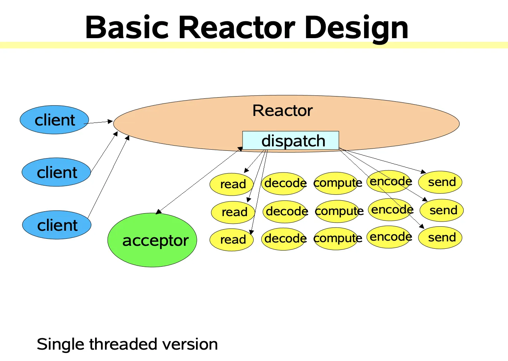
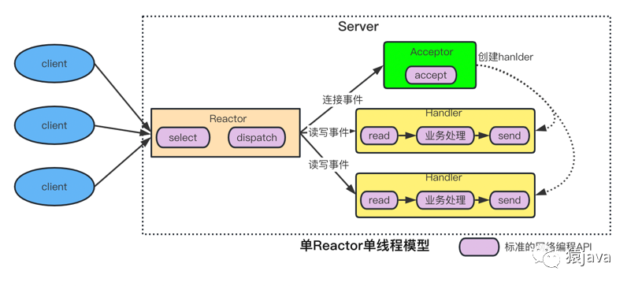
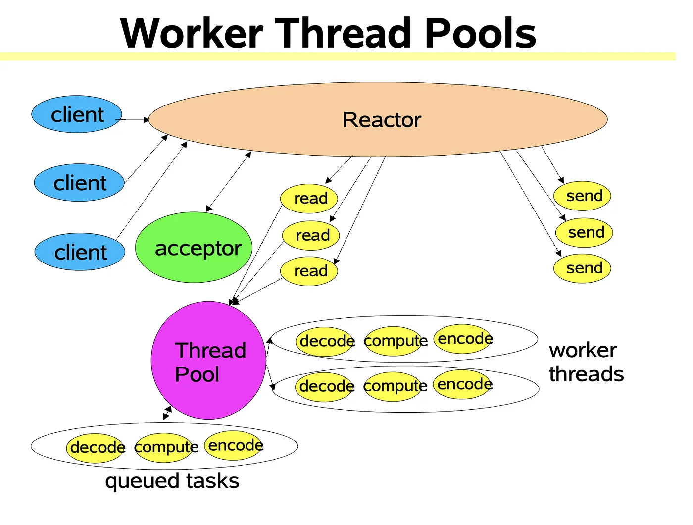
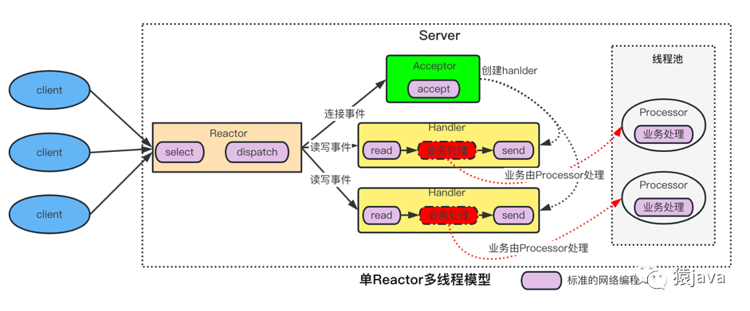
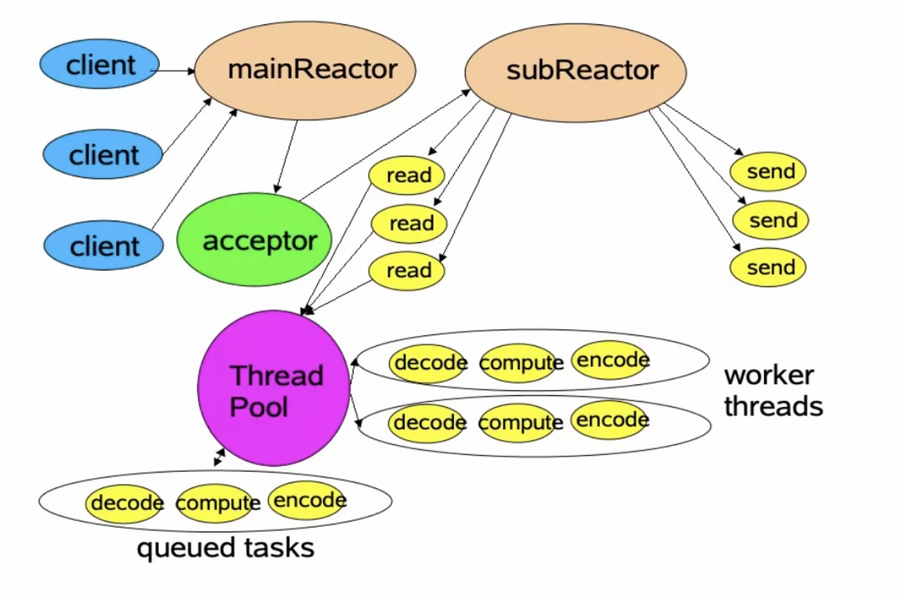
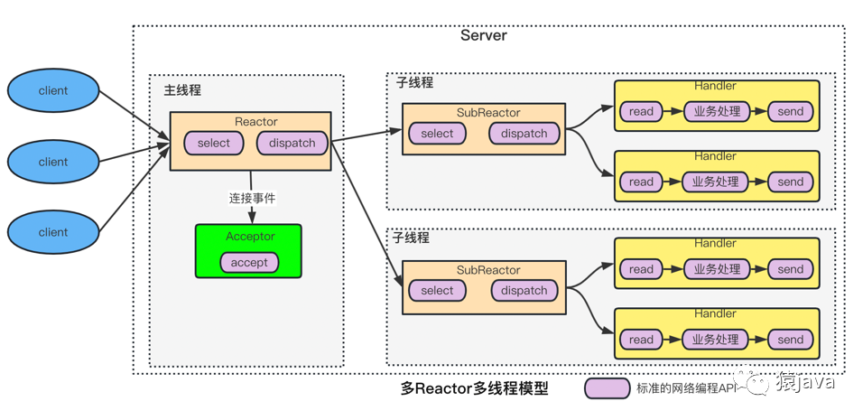

# 高性能服务器中的设计模式 Reactor/Proactor

在设计高性能服务器的请求处理模型时，通常会使用 Reactor 和 Proactor 两种设计模式。

## 背景

在网络编程中，服务器通常需要处理多个客户端的（并发）请求，而每个请求最耗时的部分就是 I/O 操作，包括数据库 I/O 和网络 I/O。
而高效处理多个请求中的 I/O 操作，正是高性能服务器需要解决的关键问题。

### 两类处理网络请求的并发模式

在处理请求时，服务器通常有两类并发模式：

- 基于线程(进程)的 Thread(Process)-per-connection，也就是每个请求一个线程(进程)
- 基于事件驱动的 Reactor 模式，也就是反应器模式。

在高并发场景下，第一种模式是非常低效的，因为线程(进程)的创建和销毁都是非常昂贵的操作，并且每个线程(进程)都需要占用一定系统资源。
只有在早期的低并发场景中，这种模式才有使用之地。

随着时代的发展，人们对服务器的处理性能要求越来越高，如果使用第一种模式，想要增加服务器的处理性能，
就得不断增加内存和 CPU 资源，这显然是一种低性价比的做法。所以人们就开发出了第二种模式，也就是 Reactor 模式。

### 一个请求的处理流程

**建立连接**

- 客户端发起连接，服务器定义 Acceptor 函数来处理新连接事件；
    - Acceptor 函数负责创建连接对象，并绑定一个 Handler 方法；
    - Acceptor 函数负责将连接对象添加到事件循环中，以便监听连接上的读写事件；

**监听连接上的读事件**

读事件通常在客户端给服务器发送请求数据时触发。

- 客户端从已有的连接上发送请求数据，服务器找到并调用连接对象绑定的 Handler 方法来处理读事件；
- Handler 方法处理完业务逻辑后，将结果交给连接对象，这将会触发连接上的写事件。

**监听连接上的写事件**

写事件通常在服务器处理完请求后，将结果发送给客户端时触发。

- 服务器找到并调用连接对象绑定的 Handler 方法来处理写事件；
- 处理写的过程本质上是通过系统调用将数据写入到网络管道（Socket）中。

> [!NOTE]
> 不管哪种模式，服务器都会为每个客户端连接在内存中创建一个连接对象用于保存其上下文，而连接对象通常会绑定一个 Handler
> 函数用于处理业务逻辑。

## Reactor 模式

### 定义

Reactor，中文翻译为”反应器”，它是一个被动过程，可以理解为”当接收到客户端事件后，Reactor 会根据事件类型来调用相应的代码进行处理”。Reactor
模型也叫 Dispatcher 模式，底层是 I/O 多路复用结合线程池，主要是用于服务器端处理高并发网络 IO 请求。Reactor
模型的核心思想可以总结成 2 个”3 种”：

- 3 种事件：连接事件、读事件、写事件；
- 3 种角色：reactor、acceptor、handler；

#### 3 种事件

- 客户端向服务器端发送连接请求，该请求对应了服务器的一个连接事件；
- 连接建立后，客户端给服务器端发送写请求，服务器端收到请求，需要从请求中读取内容，这就对应了服务器的读事件；
- 服务器经过处理后，把结果值返回给客户端，这就对应了服务器的写事件；

#### 3 种角色

- Reactor：负责监听和分配事件。（通常一个单独的线程来完成）
- Acceptor：处理客户端新连接的函数，并添加新连接的 fd 到事件循环中。（通常合并在 Reactor 线程中完成）
- Handler：执行具体的读/写任务的方法，以及其他逻辑。（通常由单独的线程池来完成）

### Reactor 的演进

随着时代的发展，为了适用日益剧增的高并发需求，Reactor 模式已经演进出多个版本：

- 单 Reactor 单线程模型:
  - Reactor 线程负责监听连接和 I/O 事件、分发事件到 Acceptor 和对应的 Handler 处理。
  - 所有的操作都在同一个线程中执行，存在性能瓶颈，也无法充分利用硬件资源。
  - **优点**：单线程没有竞争条件和上下文切换，不需要加锁，实现简单。
  - **缺点**：
    - 单线程无法充分利用多核 CPU 资源，并且容易成为性能瓶颈。
    - I/O 操作和事件处理的阻塞会导致整个系统性能下降。
  - **应用**：适合业务处理时间较短的场景，比如 Redis。
- 单 Reactor 多线程模型:
  - Reactor 线程负责监听和处理 I/O 事件（不含业务逻辑），将新连接事件分派给 Acceptor 函数处理；
  - 对于读事件，Reactor 将数据读出来后，通过队列把数据当做 Task 传递给 Worker 线程池处理具体业务逻辑，线程池处理完后将结果发送出去（触发写事件）。
  - 对于写事件，Reactor 负责将数据写入到网络管道（Socket）中。
  - **优点**：可以并行处理多个事件的业务逻辑，充分利用多核处理器的能力。
  - **缺点**：线程管理增加复杂性；需要线程同步机制来避免竞态条件。
- 主从 Reactor 多线程模型:
  - 引入了主 Reactor 和从 Reactor 两个线程角色，从 Reactor 线程可以有多个。
  - 主 Reactor 负责监听和接受新连接，从 Reactor 负责 I/O 操作和事件的循环处理。
  - 从 Reactor 线程只负责监听和处理 I/O 事件，将业务逻辑部分交给 Worker 线程池执行。
  - **优点**：
    - 主 Reactor 和从 Reactor 分工明确，父线程只负责接收新连接，子线程负责完成后续的业务处理。
    - 父线程和子线程的交互简单，父线程只需要把新连接传给子线程，子线程无须返回数据；
  - **缺点**：实现更复杂；需要更细致的线程管理和资源分配。
  - **应用**：Nginx、Swoole、Netty 和 Memcache。

总的来说，Reactor 模型的演进过程是从单线程到多线程，再到主从多线程，目的都是为了提高并发处理能力，充分利用系统资源。主从
Reactor 多线程模型是目前应用最广泛的高性能网络编程模型。

> [!NOTE]
> Reactor 模式在 Redis、Nginx、Memcache、Node.js、Netty 中广泛应用。

### 单 Reactor 单线程

 
图1

 
图2

服务器会创建一个事件循环(Event Loop)，用于监听和处理与客户端相关的事件（包括新连接、可读、可写）。
之所以能够监听到这些事件，主要是利用了操作系统提供的 I/O 多路复用技术，典型的像 Linux 中的 select、poll、epoll。通过 IO
多路复用技术，
我们可以一次监控一堆的文件描述符，当这些文件描述符对应的 IO 事件发生时会收到操作系统的通知，这时我们获取到该 event 并交给相应的
handler 或者回调函数来处理。

Reactor 的**核心组成**部分就是 event loop + IO 多路复用 + 回调函数。

Reactor 模型中定义的三种角色：

- Reactor：负责监听和分配事件的线程，将 I/O 事件分派给对应的 Handler（回调函数）。新的事件包含新的连接、读就绪、写就绪等。
  - 首先，应用程序注册几种事件到事件循环中
  - 然后，Reactor 等待事件发生
  - 当事件发生时，Reactor 调用事件对应的 Handler
- Acceptor：处理客户端新连接的函数，并添加新连接的 fd 到事件循环中。
- Handler：执行具体的非阻塞读/写任务的函数，以及其他逻辑。

**缺点**

- 单点延迟：如果某个 Handler 执行时间过长，就会导致无法处理其他时间，可能引发大量客户端超时，导致系统性能下降。
- 单线程无法充分利用多核 CPU 资源。
- 单点故障：如果 Reactor 线程出现故障，整个系统都会不可用。

由此演进出单 Reactor 多线程模型。

### 单 Reactor 多线程

 
图1

 
图2

在单 Reactor 多线程模型中，仍然是 Reactor 线程负责监听和分配事件，对于业务逻辑部分，则传递给一个线程池来负责处理。

消息处理流程：

- Reactor 线程负责监听和分配事件
  - 将新连接事件分派给 Acceptor 函数去执行；
  - 对于读事件，Reactor 线程会负责读出数据，然后将数据通过队列传给 Worker 线程池去执行，执行完后将结果传递给 Reactor 线程发出去；
  - 对于写事件，Reactor 线程会负责将数据写入到网络管道（Socket）中。

与单 Reactor 单线程模型相比，多线程模型的不同之处在于：将 Handler 的逻辑计算部分放入线程池中执行，可以充分利用多核资源。

> [!NOTE]
> 这个模式中，Reactor 线程仍然负责所有读写事件的 I/O 部分（不含业务逻辑处理），这是因为多线程只能解决计算密集型任务。

**存在的问题**

- 多线程处理完业务后，需要将数据传递回 Reactor 线程发送出去，这里需要进行线程同步。
- 由于单个 Reactor 线程负责了三种事件的监听和响应，所以在面对**瞬间高并发**的场景时，「单 Reactor」容易成为性能瓶颈。

由此演进出主从 Reactor 多线程模型。

### 主从 Reactor 多线程

 
图1

 
图2

在主从 Reactor 多线程模型中，增加了<u>一个或多个</u> subReactor 线程来分担 mainReactor 线程的责任。
subReactor 负责已有连接上的读写事件，而 mainReactor 负责接受新连接（并将其分配给某个 subReactor）。

消息处理流程：

- 程序启动时，创建一个 mainReactor 线程和 N 个 subReactor 线程（N 通常与 CPU 核心数一致）。
  - mainReactor 线程负责监听新连接事件，并将新连接事件交给 Acceptor 函数处理。
  - Acceptor 函数负责创建连接对象，并为其绑定一个 Handler 方法。然后将连接对象通过队列传递给某个 subReactor 线程负责监听其读写事件。
  - 每个 subReactor 线程负责监听和处理连接对象上的读写事件，包含「read」-> 「handle」-> 「write」。不会将写数据返回给
    mainReactor 线程。
- 每个 subReactor 角色通常包含两个线程，一个负责监听和处理 I/O 事件，另一个负责监听新连接队列（将其添加到事件循环）。

## Proactor

Proactor 模式是对 Reactor 模式的进一步改进，但需要操作系统层支持**异步 IO**。目前仅 Windows 的 IOCP 支持完善的异步 IO，
所以大多网络服务器或框架主要应用 Reactor 模式，而不是 Proactor。

### Reactor 模式的同步非阻塞

Reactor 模式中的读写事件，都是通过 Socket 的系统调用 API 完成的，这里涉及到操作系统内核对用户态层面支持的 IO 模型了。
Linux 系统内核支持的 IO 模型：

- 阻塞 IO
- 非阻塞 IO
- 异步 IO（Linux 支持不完善，Windows 完全支持）
- I/O 复用（用于单线程监听多个 socket 上的事件）
- 信号驱动 IO（应用较少）

Reactor 模式使用的是非阻塞 IO，即当 OS 通知应用层某个 socket 上发生读写事件时，程序再去调用系统调用 API 去读写数据。
**非阻塞 IO 在用户态是有一个等待过程的**，即发起 read/write 调用后，等待数据在内核态和用户态之间完成拷贝。

而异步 IO 也是事件驱动式模型，但它比非阻塞更优秀的是，异步 IO 不需要用户手动发起 read/write 调用，
用户只需要在 socket 上注册读写事件对应的 Handler 函数，等待操作系统在读写完成后通知即可。

**举例**：非阻塞 IO 好比我从网上下单货物（注册读事件），快递小哥会帮我送到楼下（触发读事件），然后通知我下去取（拷贝数据）；
而异步 IO 好比我从网上下单货物（注册读事件），快递小哥直接帮我送到门口（触发读事件），然后通知我取货（此时可拆开使用货物了）。

## 参考

- https://mp.weixin.qq.com/s/Kirt5PQ0lZQbQpt5lyjsXg
- https://www.kancloud.cn/leonshi/server/1767371
- https://www.xiaolincoding.com/os/8_network_system/reactor.html