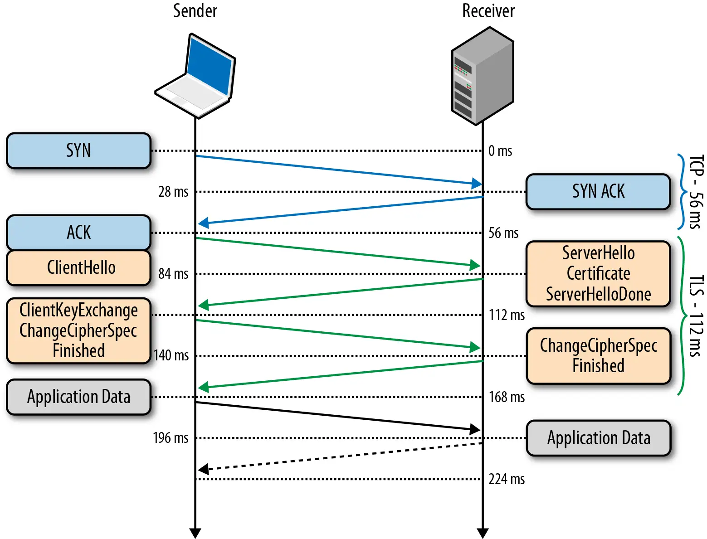
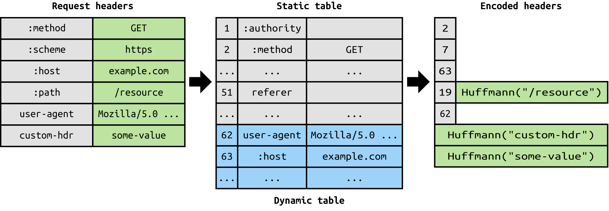

# HTTP 协议面试题

本文档中的内容主要摘自网络，内容可能不会十分严谨，请自行评估。

## 1. 简述 HTTP 协议

- HTTP 是一种无状态的、应用层的、基于请求-响应模式的超文本传输协议。
    - 无状态：每次请求都是独立的，服务器不会记录上一次请求的状态
    - **超文本**包含文本、图片、音频、视频等
- HTTP 协议使用 TCP 协议作为底层传输协议
- 一个 HTTP 请求包含：请求行、请求头、空行消息体
    - 其中**请求行**包含：请求方法、请求 URL、协议版本
- 一个 HTTP 响应包含：状态行、响应头、空行和消息体
    - 其中**状态行**包含：协议版本、状态码、状态码描述，例如: HTTP/1.1 200 OK

**请求方法**

英文叫 Method，又叫 HTTP 动作，HTTP 协议有 7 种请求方法：

- GET：请求服务器上的资源，不修改服务器数据
- POST：向服务器提交数据，创建或更新资源
- PUT：用于更新服务器上的现有资源或创建新资源
- HEAD：与 GET 方法类似，但服务器在响应 HEAD 请求时不应包含资源的主体内容，只返回头部信息
- DELETE：删除服务器资源
- OPTIONS：获取服务器支持的 HTTP 方法列表，常用于跨域资源共享（CORS）的预检请求
- TRACE：用于回显服务器收到的请求，服务器将原始请求报文作为响应返回给客户端，用于检查或调试请求的传输过程
    - 由于安全原因，大部分服务器禁用了 TRACE 方法
- CONNECT：主要用于代理服务器，用于建立到目标服务器的隧道。CONNECT 方法允许客户端通过代理服务器创建一个到目标服务器的加密连接。
- PATCH：用于对资源进行部分更新

> - HTTP/1.0 定义了三种请求方法： GET, POST 和 HEAD 方法
> - HTTP/1.1 新增了五种请求方法：OPTIONS, PUT, DELETE, TRACE 和 CONNECT 方法

### 1.2 HTTP 发展史

**HTTP/1/2 发展史**：

- 1991 年 HTTP/0.9 发布 （只接受 GET 方法，不支持 header）
- 1996 年 HTTP/1.0 发布 （基本成型，支持富文本，header，状态码，缓存等）
- 1999 年 6 月 HTTP/1.1 RFC2616 发布（使用了 20 多年的主流标准，支持连接复用，分块发送）
- 2009 年 Google 发布 SPDY 协议（HTTP/2 前身），后改进并作为 HTTP/2 标准
- 2014 年 12 月 HTTP/2 标准提交（头部压缩 HPACK、二进制分帧传输、服务器推送）
- 2015 年 2 月 HTTP/2 标准被批准
- 2015 年 5 月 HTTP/2 以 RFC7540 发布

**HTTP/3 发展史**：

- 2013 年 google 推出 QUIC（Quick UDP Internet Connections，目标替代 TCP）
- 2018 年 10 月提出将 HTTP-OVER-QUIC 更名为 HTTP/3 请求
- 2018 年 11 月同意此请求 2022 年 6 月 HTTP/3 以 RFC9114 发布（UDP/QUIC/QPACK）

### 1.3 常用请求头

- Host：指定请求的目的地，即服务器的域名和端口号
    - 示例：`Host: example.com:8080`，若端口是 80 则可省略显示
- Accept：指定客户端可接受的内容类型，用于告诉服务器客户端期望接收的资源类型
    - 示例：`Accept: text/html`
- Accept-Encoding：指定客户端可接受的内容编码方式，用于告诉服务器客户端支持的压缩算法
    - 示例：`Accept-Encoding: gzip,deflate`
- Accept-Language：指定客户端偏好的语言列表
    - 示例：`Accept-Language: en-US,en;q=0.5`
- Authorization：用于进行身份验证，通常与用户名和密码一起发送，以允许客户端访问受保护的资源
    - 示例：`Authorization: Basic YWRtaW46YWRtaW4=`（基本认证示例）
- User-Agent：标识客户端的软件类型、操作系统、浏览器等信息，服务器可以根据此信息进行内容适配
    - 示例：`User-Agent: Mozilla/5.0 (Windows NT 10.0; Win64; x64) Apple`
- Content-Type：指定请求或响应的实体主体的媒体类型（也称为 MIME 类型），用于告诉服务器请求或响应中包含的数据的格式
    - 示例：`Content-Type: application/x-www-form-urlencoded`
- Content-Length：指定请求或响应的实体主体的长度，以字节为单位
    - 示例：`Content-Length: 1337`
- Referer：指定从哪个 URL 链接过来的，用于告诉服务器请求的来源
    - 示例：`Referer: https://www.example.com/page.html`
- Cookie：包含了客户端的 Cookie 信息，用于在客户端和服务器之间传递状态信息
    - 示例：`Cookie: sessionId=abc123; username=johndoe`
- Cache-Control：指定缓存的行为，控制缓存的存储、过期等策略
    - 示例：`Cache-Control: no-cache`
- Connection：指定是否保持长连接，用于告诉服务器是否要保持 TCP 连接打开以进行多个请求
    - 示例：`Connection: keep-alive`（希望在完成请求/响应后保持连接），或者值为`close`（希望~关闭连接）
- If-Modified-Since：用于条件 GET 请求，告诉服务器只有在指定日期之后被修改过的资源才会被发送，用于缓存优化
    - 示例：`If-Modified-Since: Sat, 29 Oct 1994 19:43:31 GMT`（当服务器资源最后修改时间未变化时返回 304）
- If-None-Match：类似上个，用于缓存优化，包含资源的当前 ETag 值而不是最后修改时间，如果资源未更改，则服务器可以返回 304 状态码。
    - 示例：If-None-Match: "abcdefg"（当服务器资源 Etag 未变化时返回 304）

### 1.4 常见的 Content-Type

- text/html：HTML 格式的文本，通常用于网页内容。
- text/plain：纯文本格式，不包含任何格式化。
- application/json：JSON 格式的数据，常用于 Web 服务和 APIs。
- application/xml：XML 格式的数据，用于传输 XML 文档。
- application/x-www-form-urlencoded：表单数据被编码为键值对，用于提交表单。
- multipart/form-data：用于表单提交时上传文件。
- image/png：PNG 格式的图片。
- image/jpeg：JPEG 格式的图片。
- audio/mpeg：MP3 格式的音频文件。
- video/mp4：MP4 格式的视频文件。
- application/octet-stream：未知类型的二进制数据，通常用于传输文件或其他类型的数据，浏览器收到此类型数据会提示用户下载该文件而不会渲染。

### 1.5 常用状态码

状态码表示服务器对请求的处理结果。常用的 HTTP 状态码有 1xx、2xx、3xx、4xx、5xx。

#### 1.5.1 1xx 系列

1xx 是信息性状态码，用于传递一些信息，而不是表示请求成功或失败。

- 100 Continue：表示客户端可以继续发送请求的主体。这个状态码是用于客户端和服务器之间的交互，通常不会在浏览器中看到。
- 101 Switching Protocols：服务器同意切换协议。这通常用于升级协议，例如从 HTTP 切换到 HTTPS。
- 102 Processing：表示服务器已经接收到了请求，但尚未完成处理。用于长时间处理的请求，例如分块传输编码的数据或 WebDAV 中的锁定操作。
- 103 Early Hints：此状态代码主要用于与 Link 链接头一起使用，以允许用户代理在服务器准备响应阶段时开始预加载 preloading 资源。

#### 1.5.2 2xx 系列

2xx 系列的状态码表示请求成功，并返回了响应。

- 200 OK：请求成功。服务器已成功处理请求并返回了请求的资源。
- 201 Created：请求成功并且服务器创建了新的资源。通常用于 POST 请求。
- 202 Accepted：服务器已接受请求，但尚未处理完成。
- 204 No Content：服务器成功处理了请求，但没有返回任何内容。例如，对于 DELETE 请求。

#### 1.5.3 3xx 系列

3xx 系列的状态码表示请求需要进一步处理才能完成。

- 301 Moved Permanently：请求的资源已被永久移动到新位置，并返回新的 URL。
- 302 Found：请求的资源已被临时移动到新位置，并返回新的 URL。
- 303 See Other：类似于 302，但明确要求客户端使用 GET 方法获取资源。
- 304 Not Modified：表示请求的资源未修改，可以使用缓存的版本。

#### 1.5.4 4xx 系列

4xx 系列的状态码表示客户端发送的请求有错误。

- 400 Bad Request：请求格式错误，服务器无法理解。
- 401 Unauthorized：请求需要用户认证。
- 403 Forbidden：请求被禁止访问（服务器已知客户端身份，但仍禁止其访问）。
- 404 Not Found：请求的资源不存在。
- 405 Method Not Allowed：请求的方法不被允许。
- 413 Payload Too Large：请求的实体过大，服务器无法处理。
- 415 Unsupported Media Type：服务器不支持请求数据的媒体格式，因此服务器拒绝请求。
- 429 Too Many Requests：客户端发送的请求过多，服务器无法处理（限制请求速率）。
- 431 Request Header Fields Too Large：服务器不愿意处理请求，因为其头字段太大。在减小请求头字段的大小后，可以重新提交请求。

#### 1.5.5 5xx 系列

5xx 系列的状态码表示服务器在处理请求时发生错误。

- 500 Internal Server Error：服务器内部错误，无法处理请求。
- 501 Not Implemented：服务器不支持请求方法，因此无法处理
- 502 Bad Gateway：作为网关或者代理工作的服务器尝试执行请求时，从上游服务器收到无效的响应（上游错误）。
- 503 Service Unavailable：服务器暂时无法处理请求（由于超载或停机维护），一段时间后可能恢复正常。
- 504 Gateway Timeout：作为网关或者代理工作的服务器尝试执行请求时，未能及时从上游服务器收到响应。

### 1.6 缓存机制

客户端（通常是浏览器）可以将获取的资源保存在本地，下次请求相同的资源时可以直接从本地缓存中获取。
客户端缓存通过设置 HTTP 头部来控制缓存的行为，常用的头部包括：Cache-Control、Expires、ETag、Last-Modified 等。

- Expires：这个头部字段提供了一个日期/时间，之后响应被认为过时。这是 HTTP/1.0 的头部字段，在 HTTP/1.1 中已经被 Cache-Control 替代。
    - 如果 Cache-Control 头部字段存在，Expires 通常不会被使用。
- Cache-Control：这是最重要的缓存头部字段，它提供了关于如何缓存响应的指令。例如，`Cache-Control: max-age=3600`
  表示资源可以被 缓   存1小时。
    - 其支持的值包括：private、public、no-cache、max-age，no-store，默认为 private
    - private：客户端可以缓存响应，但只能在与原始服务器通信时使用该响应。
    - public：客户端和代理服务器都可以缓存响应。
    - no-cache：客户端可以缓存响应，但必须先与原始服务器验证其有效性。
        - 与 private/public 的区别在于它每次都要向原始服务器验证其有效性，而前者只在缓存过期时才验证。
    - no-store：客户端不能缓存响应，并且每次都要向原始服务器验证其有效性（**适用于极高隐私级别场景**）。
    - max-age：客户端可以缓存响应，但缓存的时间不能超过指定的秒数。
    - **如何验证缓存有效性？**
        - 使用 If-Modified-Since 或 If-None-Match 请求头来发出条件性请求
- Last-Modified：表示资源最后一次被修改的时间，通常与请求头 If-Modified-Since 配合使用
    - 客户端可以使用这个时间来发出条件性请求，即如果资源未更改，服务器可以返回 304 Not Modified。
- ETag：这是一个资源的特定版本的标识符，通常与请求头 If-None-Match 配合使用。
    - 客户端可以存储这个 ETag 值，并在后续的请求中使用 If-None-Match
头部字段来验证资源是否已更改，服务端仅在 Etag 不匹配的情况下返回完整的资源，否则返回 304 Not Modified。
    - 若客户端同时设置了 If-Modified-Since 和 If-None-Match 头部字段，则优先使用后者，且当后者有变化时不再判断前者。

**强制缓存与协商缓存**

- 强制缓存：指的是 Expires 和 Cache-Control，强制缓存表示在缓存有效时直接使用缓存数据，不请求服务器。
- 协商缓存：指的是 Last-Modified 和 ETag，协商缓存表示在缓存失效时向服务器发出请求以验证缓存有效性，服务器验证缓存的确失效时返回新的资源，
若缓存有效则返回 304 Not Modified。

### 1.7 长连接

#### 1.7.1 原理

如果一个 TCP 连接仅完成一次 HTTP 请求和响应，则称为短连接。但这样会存在效率问题，若一个 Web 页面需要发出多个请求来下载资源，
这需要客户端与服务器建立多次 TCP 连接来完成任务，这样会导致整体过程十分耗时且消耗双端资源。

长连接可以解决这一问题，它允许在同一个 TCP 连接中传输多个 HTTP 请求和响应，从而减少了建立和关闭连接的消耗和延迟。
HTTP 长连接允许客户端通过请求头 `Connection: keep-alive` 告知服务器，希望本次请求完成后不要断开 TCP 连接，从而继续复用。

> HTTP/1.0 需要手动配置请求头来开启长连接，HTTP/1.1 默认开启长连接（不用设置请求头）。

#### 1.7.2 队头阻塞

HTTP 1.1 的长连接机制存在队头阻塞问题。在长连接中，虽然客户端可发送多个 HTTP 请求，
但服务器只能按顺序处理这些请求，而不能并发处理。**队头阻塞**是指当 TCP 连接中某个请求发生阻塞时，后续的请求也必须等待，
直到阻塞的请求被处理完毕。

#### 1.7.3 服务器配置长连接

**Nginx 设置 HTTP 长连接**

<details><summary>点击展开</summary>

```shell
# nginx.conf

# 与客户端的长连接配置
http {
  keepalive_timeout 60s # default 75s;
  keepalive_requests 100 # default 100;
  keepalive_disable off;
}

location / {
  proxy_pass             http://your_upstream;
  proxy_read_timeout     300;
  proxy_connect_timeout  300;
  ...

  # 与上游服务器的长连接配置
  proxy_http_version 1.1;
  proxy_set_header Connection "";
}

# 与上游服务器的长连接配置
upstream backend {
    ip_hash;
    server backend1.example.com;
    server backend2.example.com;
    keepalive 32; # 配置每个worker进程中保留的空闲长连接的最大数量（不应过大，推荐为 QPS 的 10% ~ 20%）
    keepalive_timeout 60;
    keepalive_requests 200;
}
```

</details>

**清理空闲的长连接**

若客户端建立了长连接，但后续没有新的请求，则服务器会等待一段时间后主动关闭连接。这通过服务器代理提供的 `keepalive_timeout`
参数来设置。

**设置不当导致 Nginx 出现大量 TIME_WAIT**

两种情况：

- `keepalive_requests` 设置比较小，而 QPS 较大，导致 Nginx 频繁关闭与客户端的 TCP 连接
- `keepalive` 设置过小，而 QPS 较大，导致 Nginx 频繁关闭与上游的 TCP 连接

### 1.8 跨源资源共享

CORS（Cross-Origin Resource Sharing，跨源资源共享）是一种机制，它允许来自不同源（域名、协议或端口）的 Web 页面访问另一个源的资源。
CORS 的引入是为了解决浏览器同源策略（Same-Origin Policy）带来的限制，同时确保 Web 应用的安全性。

#### 1.8.1 背景

在 Web 开发中，同源策略是一种安全协议，它限制了一个源（origin）的文档或脚本如何与另一个源的资源进行交互。这意味着，
如果你的 Web 应用（例如 https://www.example.com ）尝试通过 JavaScript 发起请求来访问不同源的服务器（例如
https://api.different.com ），浏览器会出于安全考虑阻止这种跨源请求。这种限制对于保护用户数据和防止恶意操作是非常重要的。

然而，这种限制也给开发者带来了挑战，尤其是在构建需要与多个服务或 API 进行交互的复杂 Web 应用时。为了解决这个问题，
W3C 制定了 CORS 标准，允许服务器通过 HTTP 响应头来指定哪些源可以访问其资源。

#### 1.8.2 原理

CORS 的工作原理主要依赖于 HTTP 头部字段，服务器通过这些字段来告诉浏览器允许哪些跨源请求。以下是 CORS 工作原理的关键步骤：

- 预检请求（Preflight Request）：当浏览器检测到一个跨源请求时，首先会发送一个预检请求（`OPTIONS`请求），
  询问服务器是否允许跨源请求。预检请求中包含 `Origin` 头部字段，表明了实际请求的源。
- CORS 响应头：服务器在响应预检请求时，会设置一些 CORS 响应头，如 `Access-Control-Allow-Origin`，来指定允许访问的源。
  如果服务器允许跨源请求，它可能会返回 `*`（表示允许所有源）或者指定的源。
- 实际请求：如果服务器在预检响应中允许跨源请求，浏览器将发送实际的请求。如果服务器不允许，浏览器将阻止实际请求的发送。
- 处理响应：当浏览器接收到服务器的响应时，会检查响应头中的 CORS 字段，如 `Access-Control-Allow-Methods` 和
  `Access-Control-Allow-Headers`，确保这些字段允许实际请求中使用的方法和头部字段。

一共涉及的 HTTP 头部字段：

- 首先是预检请求中的头部字段：
    - `Origin`：表明请求的源。
    - `Access-Control-Request-Method`：表明实际请求使用的 HTTP 方法。
    - `Access-Control-Request-Headers`：表明实际请求中使用的头部字段。
- 然后是预检请求响应中的头部字段（将服务器的要求告知浏览器）：
    - `Access-Control-Allow-Origin`：指定允许访问的源。
    - `Access-Control-Allow-Methods`：指定允许的 HTTP 方法。
    - `Access-Control-Allow-Headers`：指定允许的头部字段。
    - `Access-Control-Allow-Credentials`：指定是否允许发送 Cookie。
    - `Access-Control-Expose-Headers`：指定允许暴露给浏览器的头部字段。
    - `Access-Control-Max-Age`：指定针对当前请求的预检请求的有效期，单位为秒。

> [!WARNING]
> **对于附带 Cookie 的跨源请求**:
>
> - 服务器需要在响应中设置 `Access-Control-Allow-Credentials` 字段为 `true`;
> - 同时，`Access-Control-Allow-Origin` 字段不能为 `*`，必须指定明确的、与请求网页一致的域名，否则浏览器会阻止请求发送。

#### 1.8.3 简单请求

在 CORS 中，不是所有跨域请求都需要发出预检请求。符合简单请求（Simple Request）条件的请求可以直接发送，而不需要预检请求。

简单请求的条件：

- 请求方法是以下三种方法之一：`GET`、`HEAD`、`POST`
- 请求头仅包含安全的字段，常见的安全字段如下：
    - `Accept`、`Accept-Language`、`Content-Language`、`Content-Type`（注意额外的限制）
    - `Content-Type` 标头值限定为下列三者之一：
        - `text/plain`
        - `multipart/form-data`
        - `application/x-www-form-urlencoded`
    - `Range`（只允许简单的范围标头值 如 `bytes=256-` 或 `bytes=127-255`）

请求过程：

- 浏览器直接发送携带`Origin`的简单请求给服务器，服务器检查是否允许`Origin`访问
    - 如果允许，则返回响应，其中包含`Access-Control-Allow-Origin`头部；
    - 如果拒绝，则仍然返回响应，但不会包含`Access-Control-Allow-Origin`头部，此时浏览器会阻止 JS 读取响应（**待求证**）；

### 1.9 HTTP/1.1 的优缺点

- 优点：简单、灵活和易于扩展、应用广泛和跨平台
- 缺点：
    - 明文传输导致内容可能被窃听和中间人攻击（将由 HTTPS 解决）
    - 不验证对方身份导致可能被伪装欺骗（将由 HTTPS 解决）
    - 不支持服务器主动推送，客户端无法获得实时更新（（将由 HTTP/2 解决））
    - 请求/响应头没有压缩机制
    - 长连接中，客户端请求只能串行发送，就可能队头阻塞
    - 没有请求优先级

## 2. 简述 HTTPS 协议

HTTPS 主要用于解决 HTTP 的安全问题，它在 TCP 和 HTTP 网络层之间加入了 SSL/TLS 安全协议，
使得报文能够加密传输的同时对通信双方进行身份认证。

**注意点**

- HTTP/1.1 默认端口是 80，HTTPS 默认端口是 443
- HTTPS 协议需要向 CA（证书权威机构）申请数字证书，来保证服务器的身份是可信的
    - 数字证书通常由 CA 机构颁发，如：`www.baidu.com` 的证书由 `GlobalSign` 颁发
    - 数字证书通常包含以下信息：证书持有者信息、证书生效日期、证书失效日期、公钥、证书签名算法等

### 2.1 简述 SSL/TLS 协议

#### 2.1.1 SSL 和 TLS

SSL/TLS 协议是一种支持加密和身份验证的安全通信协议，工作在传输层，主要基于 TCP 协议。

SSL 和 TLS 都是通信协议，用于加密服务器、应用程序、用户和系统之间的数据。这两种协议都会对通过网络连接的双方进行身份验证，
以便他们能安全交换数据。

SSL 是一种较老的通信协议，包含一些安全漏洞。传输层安全性协议（TLS）是 SSL 的升级版本，用于修复现有 SSL 漏洞。TLS
可以**更高效**地进行身份验证，并使用**高级加密算法**（而不是 SSL 中具有已知漏洞的安全算法）来提供安全的通信通道。

**术语**
TLS 是 SSL 的直接后继者，所有版本的 SSL 目前均已弃用。但是，使用术语 SSL 来描述 TLS 连接的情况很常见。
在大多数情况下，<u>术语 **SSL** 和 **SSL/TLS** 都是指 TLS 协议和 TLS 证书</u>。

**SSL 证书和 TLS 证书有什么区别**

目前，所有 SSL 证书均已停用。TLS 证书是行业标准。但是，业界仍使用术语 SSL 来指代 TLS 证书。
值得注意的是，TLS 1.0 和 TLS 1.1 也在 2021 年被正式弃用，**1.2** 和 **1.3** 处于活跃使用状态。

Ref：[Amazon 文章](https://aws.amazon.com/cn/compare/the-difference-between-ssl-and-tls/)

#### 2.1.2 SSL/TLS 握手

握手是浏览器对服务器的 SSL 或 TLS 证书进行身份验证的过程。此过程将对双方进行身份验证，然后交换加密密钥。

**TLS 握手在什么时候进行**

在 TCP 三次握手完成后开始进行。

**TLS 握手期间会发生什么？**

在 TLS 握手过程中，客户端和服务器一同执行以下操作：

- 指定将要使用的 TLS 版本（TLS 1.0、1.2、1.3 等）
- 决定将要使用哪些密码套件（见下文）
- 通过服务器的公钥和 SSL 证书颁发机构的数字签名来验证服务器的身份
- 生成会话密钥，以在握手完成后使用对称加密

**握手过程**

<div align="left">

</div>

> 下面的 RTT 指的是往返时间（Round Trip Time）

**TLS 1.2 及以下**（不含 SSL）版本的握手过程（包含 2-RTT）：

1-RTT：

- ClientHello：客户端发送一个 ClientHello 消息，其中包含客户端支持的**TLS 版本**、**加密套件列表**和 32 字节随机数（简称 c-random）。
- ServerHello：**服务器**发送一个 ServerHello 消息（回复 ClientHello 消息），其中包含服务器的 SSL
证书、选择的加密套件、服务器生成的 32 字节随机数（简称**s-random**）。
    - 身份验证：客户端使用颁发该证书的证书颁发机构（CA）验证服务器的 SSL 证书。

至此 Hello 过程完成，开始预主密钥交换。

2-RTT：

- 客户端本次一次性发送三条消息：ClientKeyExchange、ChangeCipherSpec、Finish

    - ClientKeyExchange：客户端再次新生成的一个 48 字节随机数作为**预主密钥**（premaster-secret），并使用服务器证书中的公钥加密，将结果发送给服务器。
        - 生成会话密钥：客户端使用 c-random + s-random + premaster-secret 生成会话密钥。
    - CipherChangeSpec：更换加密规范，即客户端准备好使用会话密钥进行通信
    - Finish：这是第一个使用**会话密钥**规范加密的消息。它包含前面所有握手消息的哈希值，用于给服务器验证握手过程的完整性
- 服务端接收三条消息，然后发送 ChangeCipherSpec、Finish 消息

    - **服务器**使用自己的私钥解密得到**预主密钥**，使用相同方式生成会话密钥（session-key）
    - **服务器**使用会话密钥解密握手摘要，并进行验证
    - ChangeCipherSpec：更换加密规范，即服务器准备好使用会话密钥进行通信
    - Finish：服务器发送自己的握手摘要加密，用于向客户端证明自己拥有会话密钥
- 客户端解密并验证握手摘要，握手完成，后续的数据交换均使用**会话密钥和协商好的对称加密算法**完成。

**TLS 握手主要做什么事情**

主要是协商加密和哈希算法、服务器证书验证以及会话密钥的生成。

Ref：

- [CF 文章](https://www.cloudflare.com/zh-cn/learning/ssl/what-happens-in-a-tls-handshake/)
- [小林文章](https://xiaolincoding.com/network/2_http/http_interview.html#https-是如何建立连接的-其间交互了什么)

#### 2.1.3 客户端如何验证服务端证书有效性

服务器提供的 SSL 证书包含了：

- 服务器生成的公钥、服务器的各种信息（如申请主体、域名、有效期等）
- 由受信任的第三方（称为证书颁发机构（CA））的私钥签名的数字签名（由 CA 私钥和证书信息摘要加密而成）

验证过程：

- 客户端使用 CA 的公钥解密数字签名，得到证书信息的摘要；
- 客户端使用相同的 hash 算法，对证书信息进行摘要，并与上一步得到的摘要进行比较；
- 如果一致，则说明证书信息有效；
    - 进一步验证证书是否过期，如过期则进行提醒，但**不会终止 TLS 握手**；
- 如果不一致，则说明证书无效，**TLS 握手失败**。

#### 2.1.4 TLS 如何保证数据完整性

TLS 在实现上分为**握手协议**和**记录协议**两层，握手前面已经说了，**记录协议**则是负责保护应用程序数据并验证其完整性和来源，
<u> 所以对 HTTP 数据加密是使用 TLS 记录协议 </u>。

记录协议的大致过程如下：

- 数据分片：TLS 将明文 HTTP 数据分成多个片段，每个片段通常不超过 2^14 字节，即 16384 字节；
- 封装片段：每个数据片段被封装成一个 TLS 记录层单元。TLS 记录层单元包括：
    - 记录层类型（ContentType）：枚举值。change_cipher_spec、alert、handshake、application_data
    - 版本（Version）：表示 TLS 的版本号，用于记录协议的兼容性。
    - 长度（Length）：记录层单元中分片数据的长度。
    - 数据（Data）：实际的数据片段
- 压缩片段：使用协商的压缩算法，对每个片段进行压缩；
- 拼接 MAC 值：每个片段都会计算一个 MAC 值（使用之前协商的 HMAC 算法），用于解密时验证数据完整性；
- 加密：使用之前协商的对称加密算法和会话密钥，对每个拼接 MAC 后的片段进行加密；
- 重组：将密文片段重新组合后交给 TCP 连接进行传输。

> 此过程不用完整记忆，仅作了解。

#### 2.1.5 TLS 1.3 的改进

TLS 1.3 废弃 RSA 密钥交换算法，也移除了易受攻击的部分密码套件和算法。它还缩短了 TLS 握手，使 TLS 1.3 握手更快更安全。

**简化握手流程**

在 1.3 以前的版本中需要花费四次握手（2-RTT）完成算法协商和密钥生成，这里就存在了上百毫秒的延迟。
现在由于密码套件大幅减少，没必要再执行以前那样复杂的协商过程了。TLS 1.3 压缩了 Hello 过程，删除了`KeyChange`消息（预主密钥传递），
把握手时间减少到了 1-RTT，效率提高一倍。

#### 2.1.6 SSL/TLS 属于 OSI 模型中的哪一层

SSL/TLS 协议中的功能涉及到了 OSI 模型中的传输层和表示层。

- 从传输层来看，SSL/TLS 加固了 TCP 连接，以防止数据在传输过程中被窃听或篡改；
- 从表示层来看，SSL/TLS 提供数据加密和解密服务，确保数据在应用层之前保持机密性和完整性。

对于 TCP/IP 模型，SSL/TLS 工作在传输层和应用层之间。

### 2.2 HTTPS 是绝对安全的吗

HTTPS 也存在一些潜在的风险和局限性：

- 不安全的密码套件：TLS 1.3 以下版本已被发现存在一些不安全的加密套件和算法；
- 用户信任不安全的网站：当浏览器提示不安全的网站时，表示用户访问可能已遭受中间人攻击，
  浏览器得到了伪造的证书，此时用户若点击信任该网站，则存在被访问窃听的风险；
- 用户主机被安装了中间人的根证书：用户主机可能因为中毒等原因被安装了中间人的根证书，那么即使访问被中间人监听的网站，浏览器也不会提示安全证书有问题；
- 量子计算机：理论上，量子计算机可能在未来破解当前的加密算法，尽管这还需要很长时间才能实现。

## 3. 简述 HTTP/2 协议

HTTP/2，也被称为**H2**，是 HTTP 协议的第二个主要版本，于 2015 年被正式标准化。它是在 HTTP/1.1 的基础上进行的一次重大升级，
旨在解决 HTTP/1.1 中的一些性能问题，同时保持与 HTTP/1.1 的高级兼容性。

### 3.1 HTTP/2 的关键特性

- 二进制协议：HTTP/2 将 HTTP/1.1 的文本消息转换为二进制格式，这使得消息的解析更加高效，减少了延迟，并提高了安全性。
- 多路复用：HTTP/2 允许在同一个 TCP 连接上并行传输多个请求和响应，而不需要按照顺序等待。这减少了延迟，因为不同的请求可以同时进行，而不会相互阻塞。
- 头部压缩：HTTP/2 引入了 HPACK 压缩算法，用于压缩请求和响应的头部信息。这减少了需要传输的数据量，提高了传输效率。
- 服务器推送：HTTP/2 允许服务器在客户端请求之前主动发送资源，这可以进一步减少延迟，加快页面加载速度。
- 优先级：HTTP/2 允许客户端指定请求的优先级，这样可以让服务器先处理更重要的请求，从而优化资源的加载顺序。
- 安全性：HTTP/2 设计为**只能通过 TLS**加密传输，这意味着所有的 HTTP/2 通信都是安全的，没有明文传输的选项。

### 3.2 详述流、帧、消息概念

在 HTTP/2 中，数据传输是通过流（Stream）来实现的。一个流可以被看作是一个双向的通信通道，可以在客户端和服务器之间传输数据。
流由一系列帧（Frame）组成，每个帧携带了部分数据以及与该数据相关的控制信息。而消息（Message）则是应用层的数据单元，
在 HTTP/2 中分拆解为多个帧来传输。

#### 3.2.1 流（Stream）

HTTP/2 中的流（Stream）是一个运行在 TCP 连接上的用于交换 HTTP/2 数据帧的逻辑通道，
客户端和服务器都可以使用通道发送数据，每个流都有一个唯一（整数形式）的流 ID，用于在通信中标识和区分不同的流。
**提出流的概念是为了实现多路复用**

- 客户端和服务器都可以建立和关闭 Stream
- 无论由谁创建，双端都可以在 Stream 上发送/接收数据帧
- 对于客户端建立的 Stream，要求 ID 是奇数，通常是执行请求-响应模式
- 对于服务端建立的 Stream，要求 ID 是偶数，通常是执行推送模式

> **一条流上的数据帧必须是有序发送的（Header 帧在 Data 帧之前）**。为了达到并发传输的目的，
HTTP/2 允许在一个 TCP 连接上启用多条流，多条流上的数据帧可以并行发送。

#### 3.2.2 帧（Frame）

HTTP/2 中的帧（Frame）是用于在流（Stream）上传输数据的基本单位。每个帧都包含一个帧头（Frame Header）
和一个可选的数据负载（Data Payload）。

每一帧都包含几个字段，有 length、type、flags、stream identifier、frame playload 等。其中 type 代表帧的类型，
在 HTTP/2 的标准中定义了 10 种不同的类型，包括上面所说的 HEADERS frame 和 DATA frame。此外还有：

- PRIORITY（设置流的优先级）
- RST_STREAM（终止流）
- SETTINGS（设置此连接的参数）
- PUSH_PROMISE（服务器推送）
- PING（测量 RTT）
- GOAWAY（终止连接）
- WINDOW_UPDATE（流量控制）
- CONTINUATION（继续传输头部数据）

#### 3.2.3 消息（Message）

即需要传输的 HTTP 消息（等同于 HTTP/1.x 中的一个请求或响应消息），消息在发送前会被分解并封装成 HEADERS 帧和 DATA 帧进行传输。
因为每个帧的帧头中都包含了所属的流 ID，所以接收方可以将相同流 ID 的多个帧组装为一条完整的消息。

### 3.3 简述 HTTP/2 中的 HPACK

HPACK 是一种头部压缩算法，用于在 HTTP/2 通信中压缩头部字段，以减少通信中的数据量。

在发送消息前，双端会维护一张相同的静态表和动态表，其中静态表存储了常用的 HTTP 头部字段和值，
动态表存储了动态添加的头部字段和值。任何一端发送消息前都会消息头与两张表中匹配的头部字段替换为对应的索引值，从而达到压缩的目的，
若无法匹配则添加到动态表中，然后 Huffman 编码压缩头部字段和值进行发送。

**Huffman 编码**

Huffman 编码是一种无损数据压缩算法，在 HPACK 中用来压缩头部字段和值。

- 当消息头的字段和值在静态表中存在时，会使用索引号来替换；
- 当消息头仅有头部字段在静态表中存在时，会使用索引号+Huffman 编码后的值来替换；
- 当消息头无法与静态表中匹配时，会使用 Huffman 编码后的头部字段和值来替换；

<div align="left">

</div>

## 4. 简述 HTTP/3 协议
