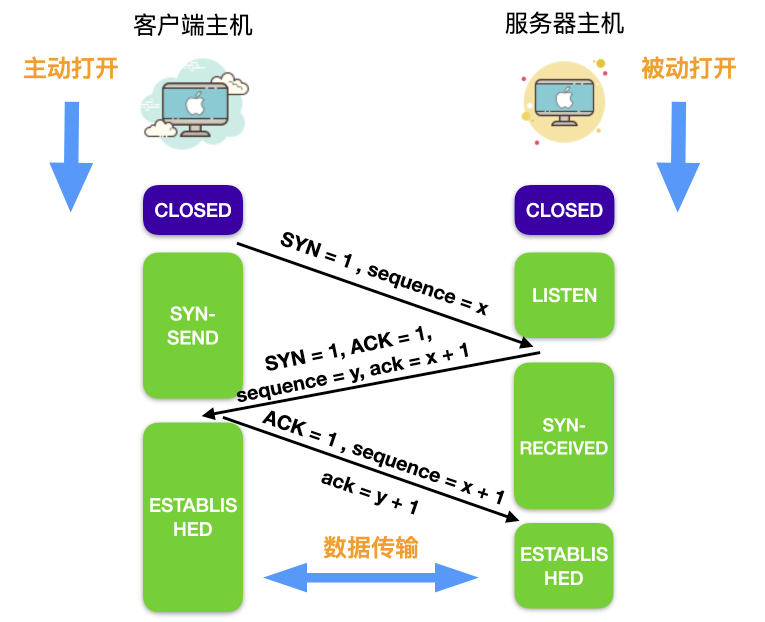
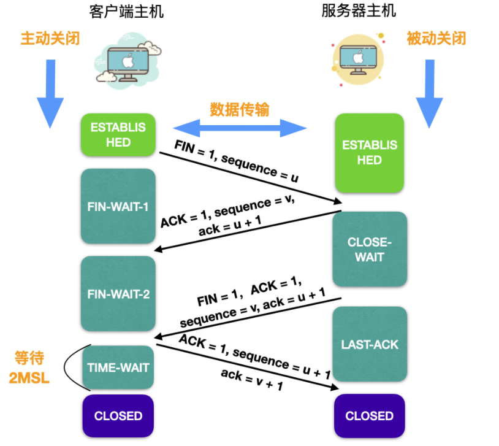
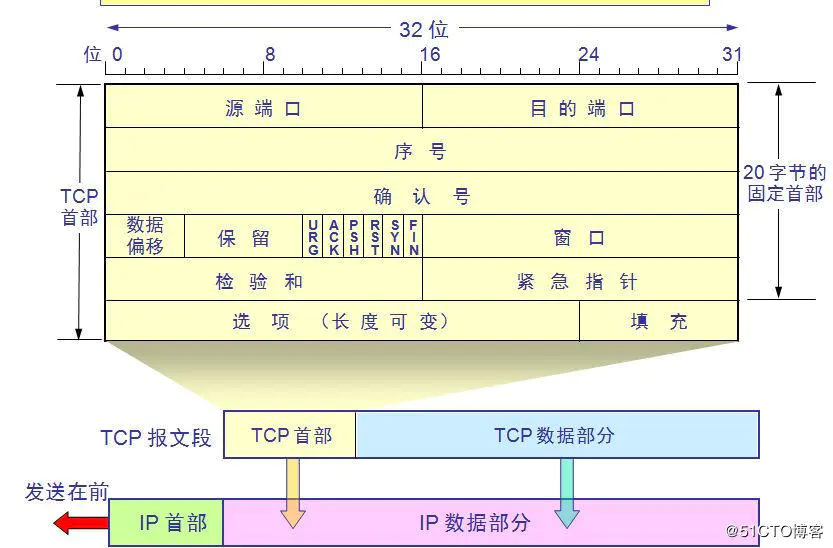
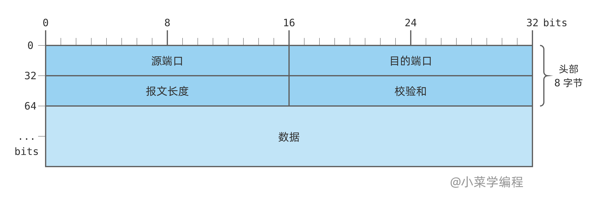

# TCP/UDP 系列

本文档中的内容主要摘自网络，内容可能不会十分严谨，请自行评估。

## 1. 简述TCP协议

- TCP是OSI模型中的传输层协议，提供可靠的连接服务，采用三次握手建立连接，采用四次挥手释放连接
- TCP是一种面向连接的**单播**协议，在TCP中，并不存在多播、广播的这种行为，因为 TCP 报文段中能明确发送方和接受方的 IP 地址
- TCP是一种稳定、可靠的全双工协议，因为它具有握手机制，并在数据传输时有确认、超时重传、窗口大小、拥塞控制等机制。支持双端收发
- 相比于UDP，TCP的效率较低，因为UDP不需要建立连接，也没有各种可靠机制
- 易被攻击，例如SYN Flood攻击

**三个阶段**

建立连接、数据传输、断开连接。

**四元组原则**

源IP地址、源端口、目的IP地址、目的端口**唯一**标识一个TCP连接。

> 五元组是在四元组基础上增加一个协议类型，用于区分不同的会话。一个Socket由IP、端口和协议类型组成。

### 1.1 简述TCP建立和断开连接过程

**建立连接：三次握手**

- client发送SYN数据包（SYN=1,seq=x）给server，表示希望建立连接，同时client进入SYN_SENT状态
- server收到SYN数据包后，发送SYN-ACK（SYN=1,ACK=y,seq=y,ack=x+1）给client，表示同意建立连接，然后server进入SYN_RCVD状态
- client收到SYN-ACK数据包后，发送ACK（ACK=1,seq=x+1,ack=y+1）给server，表示同意建立连接，然后client进入ESTABLISHED状态
- server收到ACK数据包后，进入ESTABLISHED状态，连接建立完成
- 其中：
    - SYN（标志位）：用于建立连接
    - ACK（标志位）：用于确认收到数据
    - seq（序列号）：是TCP数据段（segment）中用来表示**当前数据段承载的数据（data）**在发送者整体发送的数据流（stream）中的位置
        - 任何一方的第一个数据段中的seq都是自己随机生成的数字
        - 随后发送的seq等于上一个自己发送的seq+len(data)
    - ack（确认号）：用于确认收到的TCP数据段的序号（也表示期望收到的下一个TCP数据段的seq）
- 理解TCP中的数据段和数据流：
    - 数据段：是TCP协议的基本数据单元。数据流被分割存放到一个个数据段中，上面说的数据包即数据段；
    - 数据流：是TCP协议传输的应用层数据。**数据段是手段，数据流是目的**。

**断开连接：四次挥手**

- client**发送**FIN数据包（FIN=1,seq=u）给server，表示client想要关闭连接，然后client进入FIN_WAIT_1状态
- server收到FIN数据包后，发送ACK数据包(ACK=1,seq=v,ack=u+1)给client，然后server进入CLOSE_WAIT状态，还需要发完剩下的数据
    - client收到ACK数据包后，进入FIN_WAIT_2状态
- server**发送**FIN数据包（FIN=1,ACK=1,seq=v,ack=u+1）给client，表示server已经没有数据要发送了，然后server进入LAST_ACK状态
    - 通常是server程序主动触发内核调用函数`close()`
- client收到FIN数据包后，**发送**ACK（ACK=1,seq=u+1,ack=v+1）数据包给server，然后client进入TIME_WAIT状态
    - server收到ACK数据包后，进入CLOSED状态，连接断开
    - client等待2MSL（max segment lifetime）后，进入CLOSED状态，连接断开
- 其中：
    - FIN（标志位）：用于断开连接

> [!NOTE]
> 任何一方都可以通过发送FIN包来请求主动关闭连接，所以TIME_WAIT状态指的是**主动关闭方**而不总是client。

### 1.2 为什么需要三次握手和四次挥手

问题一延伸为：为什么需要三次握手，两次不行吗？

**为何两次不行**

若是两次，则可能是下面的流程：

- client发送SYN包
- server收到后，发送SYN+ACK包，然后进入ESTABLISHED状态
    - client收到后进入ESTABLISHED状态

这个流程缺少了最后一个client回复ACK的步骤，存在client可能已经断开的情况，而server的套接字仍处于open状态，浪费server资源。
若存在大量这种情况，就产生了对server的SYN Flood攻击。

问题二延伸为：为什么需要四次挥手，三次不行吗？

**为何三次不行**

重点是server将FIN-ACK流程分为了两个步骤进行，这一步无法避免。因为server需要确保自己已经将数据发送完毕后再回复client FIN包。

### 1.3 为什么需要TIME_WAIT状态

原因有两点：

- **确保被动关闭方收到ACK包**：当被动方接收ACK包超时后，会再次发送FIN包，主动方会重发ACK包，此过程持续到主动方TIME_WAIT状态超时（2MSL）
- **阻止延迟数据段影响新连接**：主动关闭方虽然不会再发送数据流，但仍然保持接收数据流的能力，
  因为网络中可能还有对方发送的延迟数据包未到达。等待2MSL可以确保大部分延迟数据包在当前的连接中被接收到，而不会影响下一个相同四元组的TCP连接。

**如果错误的数据段被下一个连接收到会发生什么**

会造成下一个连接的数据混乱，影响可靠性。

### 1.4 TIME_WAIT带来的问题

每个TCP连接在关闭时都需要占用多达2MSL（通常是2min）的时间，若大量连接处于TIME_WAIT状态，则会导致主机资源很快耗尽:

- 第一是占用系统资源，比如文件描述符、内存资源、CPU 资源等；
- 第二是占用端口资源

**如何解决**

- 这种问题通常出现在进行高并发压测的客户端上，可通过`net.ipv4.tcp_tw_reuse` 选项来使客户端内核重用处于 TIME_WAIT 状态的TCP连接
- 在Linux系统中，客户端可以使用的端口范围是32,768 ~ 61,000。可修改`net.ipv4.ip_local_port_range`选项，增加可同时存在的
  TCP 连接数上限（**服务端不受此影响**）

### 1.5 为何服务端出现大量TIME_WAIT

通常只有客户端会出现TIME_WAIT，这是因为它仅作为主动关闭方的一种连接状态。但是当Server端出现大量TIME_WAIT时，通常意味着出现了不寻常的现象。

- 客户端或服务端没有开启HTTP长连接（Keep-Alive）
    - 当出现这种情况时，服务端在响应完请求后，会立即关闭连接。
    - 解决：两端开启长连接即可
- HTTP 长连接超时
    - 大量的客户端建立HTTP长连接后没有发送请求，导致服务端在一段时间后主动关闭连接
    - 解决：可能正在遭受攻击，应在网络边缘添加防火墙等安全产品
- HTTP 长连接的请求数量达到上限
    - web代理通常有个参数设置单个HTTP连接能处理的请求数量，超出限制时则关闭连接，比如 nginx 的 `keepalive_requests`
      这个参数（默认值是 100）；
    - 对于一些 QPS 比较高的场景，这时候就 nginx 就会很频繁地关闭连接，那么此时服务端上就会出大量的 TIME_WAIT 状态
    - 解决：增加`keepalive_requests`参数的值，比如设置为 1000

### 1.6 为何服务端出现大量CLOSE_WAIT

根据四次挥手过程可知，CLOSE_WAIT是被动关闭方在收到对方的FIN包后的状态。大量CLOSE_WAIT的出现，通常意味着server程序出现崩溃或死锁，
导致没有调用关闭连接的函数。解决方式是排查Server程序代码。

### 1.7 TCP数据段格式

- 源端口和目的端口：共占用 4 bytes；
- 序号：占 4 bytes，TCP 连接中传送的数据流中的每一个字节都编上一个序号。序号字段的值则指的是本报文段所发送的数据的第一个字节的序号；
- 确认号：占 4 bytes，期望收到对方下一个报文段的第一个数据字节的序号；
- 数据偏移：占 4 **bits**，它指出报文数据距TCP报头的起始处有多远(TCP报文头长度)；
- 保留：占 6 bits，保留今后使用，目前统一为 0；
- 标志位：占 6 bits，共 6 种标志位，分别代表不同含义，一个报文段可同时设置多个标志位（置为1表示有效）；
    - URG：紧急比特，表明紧急指针字段有效。它告诉系统此报文段中有紧急数据，应尽快传送(相当于高优先级的数据)
    - ACK：确认比特，用于确认收到对方的报文
    - PSH：推送比特，告知接收方应尽快交付数据给应用层，而不再等到整个缓存都填满了后再向上交付
    - RST：复位比特，表明TCP连接中出现严重差错(如由于主机崩溃或其他原因)，必须释放连接，然后再重新建立连接
    - SYN：同步比特，表示这是一个连接请求或连接接受报文
    - FIN：终止比特，用来释放一个连接。表明此报文段的发送端的数据已发送完毕，并要求释放连接
- 窗口：占 2 bytes，用来控制对方发送的数据量，单位为字节
- 校验和：占 2 bytes，检验报文段是否损坏或被篡改
- 紧急指针：占 2 bytes，指出在数据部分中紧急数据的字节长度

以上部分固定长度20字节，下面是变长部分：

- 选项：长度可变，最长 40 bytes，用来设置TCP连接的性能参数或提供其他选项
- 填充：占可变长，为了确保TCP头部能够被正确对齐到32位边界，从而满足某些系统架构对数据对齐的要求
    - 对齐后可提高处理效率以及在不同系统中的兼容性

### 1.8 什么是TCP粘包，如何处理

**定义**

TCP是传输字节流的协议，在数据传递时，TCP并不知道上层应用传送的数据大小，它会将从上层接收到的数据按照字节流的方式进行拆解或拼接。

**解决**

这个问题应该由应用层来解决：

- 方法1：在单个应用包前添加长度信息。
- 方法2：在单个应用包尾添加特定分隔符。

### 1.9 TCP如何保证可靠传输

- 数据包被分割成TCP认为最适合发送的数据块（MSS，最大报文长度）
- 给每个TCP数据段编号以及收到时回复ACK
- 校验和：使用收到数据段中的校验和来验证整个数据段在传输过程中是否损坏
- 接收方会抛弃收到的重复数据（通过编号识别）
- 流量控制：使用滑动窗口机制来控制发送方的发送速度。
- 拥塞控制：根据网络的拥塞情况，发送方使用拥塞 窗口来控制数据的发送速度
    - 具体来说，包含慢启动、拥塞避免、拥塞发生和快速恢复四个算法
- 重传机制：包含超时重传、快速重传、SACK方法、D-SACK方法
    - 超时重传：当发送方发送数据后长时间未收到ACK时，重发数据（数据或ACK包丢失/堵塞）
    - 快速重传：当收到三个相同的 ACK 报文时，重传丢失的报文段
    - SACK（选择性确认）：通过在ACK报文中的【选项】字段中携带需要重传的报文段编号（可能多个），通知发送方只重传丢失的报文段，提高重传效率
    - Duplicate SACK：通过在ACK报文中的【选项】字段中携带重复收到的报文段编号（这个包可能被延迟了），通知发送方丢弃重复的报文段

### 1.10 什么是TCP半连接和全连接队列

在 TCP 三次握手的时候，Linux 内核会维护两个队列，分别是：

- 半连接队列，也称 SYN 队列；
- 全连接队列，也称 accept 队列；

服务端收到客户端发起的 SYN 请求后，内核会把该连接存储到**半连接队列**，并向客户端响应 SYN+ACK；接着客户端会返回 ACK，
服务端收到第三次握手的ACK 后，内核会把连接从半连接队列移除，然后创建新的完全的连接，并将其添加到 accept 队列，等待进程调用
accept 函数时把连接取出来。

> 不管是半连接队列还是全连接队列，都有最大长度限制，超过限制时，内核会直接丢弃，或返回 RST 包。

- [实战：查看TCP全连接队列溢出](https://xiaolincoding.com/network/3_tcp/tcp_queue.html#实战-tcp-全连接队列溢出)
- [实战：查看TCP半连接队列溢出](https://xiaolincoding.com/network/3_tcp/tcp_queue.html#实战-tcp-半连接队列溢出)

### 1.x 应用场景

Telnet/SSH，FTP、POP3/IMAP/SMTP、HTTP系列、gRPC、WebSocket、MQTT等；

## 2. 简述UDP协议

- UDP（User Datagram Protocol，用户数据报协议）是一种无连接的、不可靠的传输层协议
- UDP提供了数据包的传输功能，但不保证数据的可靠性和顺序性
- UDP主要用于实时性要求较高、对数据可靠性要求较低的应用场景，例如音频、视频流传输以及网络游戏等。
- UDP的头部比TCP头部要短，只有8个字节（TCP是20 ~ 60字节），但仍然有校验和字段
- 由于UDP的无连接、轻量级和低延迟特性，所以它支持TCP所不支持的广播、多播功能
    - UDP支持使用多播/广播地址作为目的端口，交换机会将数据包分发到所有订阅了改组的成员。路由器支持多播但不支持广播（避免网络瘫痪）
- UDP没有长连接和粘包的概念，因为一次就发送一个完整的UDP报文段

### 2.1 UDP优缺点有哪些

- 优点：
    - 低延迟（无需建立连接）
    - 简单性（没有复杂的控制机制）
    - 快速传输（没有ACK和重传机制）
    - 支持多播和广播（在某些应用程序中非常有用）
    - 资源消耗低（不需要维护复杂的连接状态）
- 缺点：
    - 不可靠性：不保证数据包的顺序、完整性或可靠传输。数据包可能会丢失、重复或乱序到达
    - 无流量控制：发送方可以无限制地发送数据，不考虑接收方的处理能力，这可能导致接收方被大量数据淹没
    - 无拥塞控制：不会根据网络状况调整发送速率，可能加剧网络拥塞

### 2.2 UDP如何支持多播和广播

**多播支持**

- 多播地址：在IPv4中，多播地址范围从224.0.0.0到239.255.255.255。在IPv6中，多播地址以FF开头。这些特殊的IP地址范围用于标识一组接口，而不是单个设备。
- 加入多播组：要接收多播流量，设备必须加入相应的多播组。这通常通过Internet组管理协议（IGMP）在IPv4中完成，或者通过类似机制在IPv6中完成。
- 路由器支持：网络中的路由器必须支持多播路由协议，如IGMP Snooping或PIM（Protocol Independent Multicast），
  以便正确地将多播流量分发到订阅了该多播组的设备。
- 发送多播数据包：当应用程序使用UDP发送数据时，它将目的地址设置为多播组地址。然后，网络中的路由器会根据多播路由表将数据包复制并转发到所有订阅了该多播组的接口。

**广播支持**

- 广播地址：支持两种类型的广播地址：本地广播地址和全局广播地址
    - 本地广播地址：单个网断的广播地址，例如192.168.1.0/24的广播地址是192.168.1.255/24（主机标志部分的二进制全部为1）。
    - 全局广播地址：所有网络的广播地址，255.255.255.255/32。
- 发送广播数据包：程序将UDP报文的目的地址设置为广播地址，网络中的交换机会将这个UDP数据包转发给同一子网中的所有设备或局域网内所有主机（全局广播）。
- 路由器行为：路由器不会将广播数据包转发到其他网络，广播仅限于局域网。

### 2.3 UDP数据报文格式

其中**伪首部**用于校验和计算，不包含在UDP数据报文中。

### 2.x UDP应用场景

常见的有DHCP、DNS、SNMP、TFTP、RTP/RTSP、VoIP、NTP和QUIC等。

---

待补充。

## 参考

- https://blog.nnwk.net/article/126
- https://zhangbinalan.gitbooks.io/protocol/content/tcpbao_wen_ge_shi.html
- https://xiaolincoding.com/network/3_tcp/tcp_feature.html