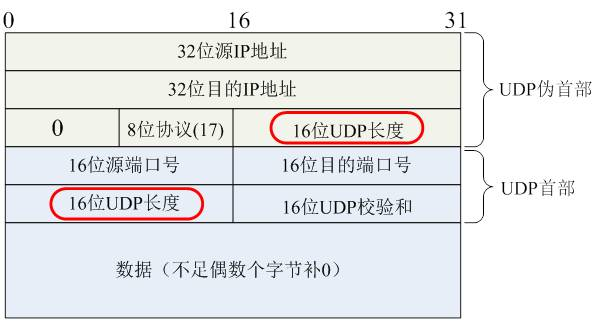

# TCP/UDP 系列

本文档中的内容主要参考自网络，笔者尽可能保证内容准确性，但仍可能存在部分错误，若发现其提 issue 或 PR。

## 1. 简述 TCP 协议

- TCP(Transmission Control Protocol) 是 OSI 模型中的传输层协议，提供可靠的连接服务，采用三次握手建立连接，采用四次挥手释放连接
- TCP 是一种面向连接的**单播**协议，在 TCP 中，并不存在多播、广播的这种行为，因为 TCP 报文段中明确了发送方和接收方的 IP 地址
- TCP 是一种稳定、可靠的全双工协议，因为它具有握手机制，并在数据传输时有确认、超时重传、窗口大小、拥塞控制等机制
- 相比于 UDP，TCP 的效率较低，因为 UDP 不需要建立连接，也没有各种可靠机制
- 易被攻击，例如 SYN Flood 攻击

**三个阶段**

建立连接、数据传输、断开连接。

**四元组原则**

源 IP 地址、源端口、目的 IP 地址、目的端口**唯一**标识一个 TCP 连接。

> 五元组是在四元组基础上增加一个协议类型（TCP/UDP），用于区分不同的会话。一个 Socket 由 IP、端口和协议类型组成。

### 1.1 简述 TCP 建立和断开连接过程

**建立连接：三次握手**

- client 发送 SYN 数据包（SYN=1,seq=x）给 server，表示希望建立连接，同时 client 进入 SYN_SENT 状态
- server 收到 SYN 数据包后，发送 SYN-ACK（SYN=1,ACK=y,seq=y,ack=x+1）给 client，表示同意建立连接，然后 server 进入 SYN_RCVD
  状态
- client 收到 SYN-ACK 数据包后，发送 ACK（ACK=1,seq=x+1,ack=y+1）给 server，表示同意建立连接，然后 client 进入 ESTABLISHED 状态
- server 收到 ACK 数据包后，进入 ESTABLISHED 状态，连接建立完成
- 其中：
    - SYN（标志位）：用于建立连接
    - ACK（标志位）：用于确认收到数据
    - seq（序列号）：是 TCP 数据段（segment）中用来表示**当前数据段承载的数据（data）**在发送者整体发送的数据流（stream）中的位置
        - 任何一方的第一个数据段中的 seq 都是自己随机生成的数字
        - 随后发送的 seq 等于上一个自己发送的 seq+len(data)
    - ack（确认号）：用于确认收到的 TCP 数据段的序号（也表示期望收到的下一个 TCP 数据段的 seq）
- 理解 TCP 中的数据段和数据流：
    - 数据段：是 TCP 协议的基本数据单元。数据流被分割存放到一个个数据段中，上面说的数据包即数据段；
    - 数据流：是 TCP 协议传输的应用层数据。**数据段是手段，数据流是目的**。

**断开连接：四次挥手**

- client**发送**FIN 数据包（FIN=1,seq=u）给 server，表示 client 想要关闭连接，然后 client 进入 FIN_WAIT_1 状态
- server 收到 FIN 数据包后，发送 ACK 数据包(ACK=1,seq=v,ack=u+1)给 client，然后 server 进入 CLOSE_WAIT 状态，还需要发完剩下的数据
    - client 收到 ACK 数据包后，进入 FIN_WAIT_2 状态
- server**发送**FIN 数据包（FIN=1,ACK=1,seq=v,ack=u+1）给 client，表示 server 已经没有数据要发送了，然后 server 进入
  LAST_ACK 状态
    - 通常是 server 程序主动触发内核调用函数`close()`
- client 收到 FIN 数据包后，**发送**ACK（ACK=1,seq=u+1,ack=v+1）数据包给 server，然后 client 进入 TIME_WAIT 状态
    - server 收到 ACK 数据包后，进入 CLOSED 状态，连接断开
    - client 等待 2MSL（max segment lifetime）后，进入 CLOSED 状态，连接断开
- 其中：
    - FIN（标志位）：用于断开连接

> [!NOTE]
> 任何一方都可以通过发送 FIN 包来请求主动关闭连接，所以 TIME_WAIT 状态指的是**主动关闭方**而不总是 client。

### 1.2 为什么需要三次握手和四次挥手

问题一延伸为：为什么需要三次握手，两次不行吗？

**为何两次不行**

主要是为了避免服务器端开启一个无用的连接占用资源。因为在 2 次握手的流程中，客户端可能在发送 SYN 报文后就失联了（有意或无意），
而服务器就已经创建了对应的套接字资源以准备收发数据，此时对服务器来说就是一个无用连接。针对服务器的 SYN Flood 攻击就是这种情况。

问题二延伸为：为什么需要四次挥手，三次不行吗？

**为何三次不行**

因为 TCP 是全双工的连接协议，两端都需要单独关闭自己的数据传输。第一次 FIN 用来关闭客户端到服务器的数据传输，第二次 ACK
用来确认收到了客户端的 FIN。第三次 FIN 用来关闭服务器到客户端的数据传输，第四次 ACK 用来确认收到了 FIN。简单来说，就是两次
FIN-ACK 流程。

### 1.3 为什么需要 TIME_WAIT 状态

原因有两点：

- **确保被动关闭方收到 ACK 包**：当被动关闭方接收 ACK 包超时后，会再次发送 FIN 包，主动方会重发 ACK 包，此过程持续到主动方
  TIME_WAIT 状态超时（2MSL）
- **阻止延迟数据段影响新连接**：主动关闭方虽然不会再发送数据流，但仍然保持接收数据流的能力，
  因为网络中可能还有对方发送的延迟数据包未到达。等待 2MSL 可以确保大部分延迟数据包在当前的连接中被接收到，而不会影响下一个相同四元组的
  TCP 连接。

**如果错误的数据段被下一个连接收到会发生什么**

会造成下一个连接的数据混乱，影响 TCP 的可靠性。

### 1.4 TIME_WAIT 带来的问题

每个 TCP 连接在关闭时，主动关闭方都需要占用多达 2MSL（通常是 2min）的时间，若大量连接处于 TIME_WAIT
状态，则会导致主机资源很快耗尽:

- 第一是占用大量系统资源，比如文件描述符、内存资源、CPU 资源等；
- 第二是占用大量端口资源

**如何解决**

- 这种问题通常出现在进行高并发压测的客户端侧，可通过`net.ipv4.tcp_tw_reuse` 选项来使客户端系统内核重用处于 TIME_WAIT 状态的
  TCP 连接
- 在 Linux 系统中，客户端可以使用的端口范围是 32,768 ~ 61,000。可修改`net.ipv4.ip_local_port_range`选项，增加可同时存在的
  TCP 连接数上限（**服务端不受此影响**）

### 1.5 为何业务服务器出现大量 TIME_WAIT

通常只有（通俗意义上的）客户端会出现 TIME_WAIT，这是因为它仅作为主动关闭方的一种连接状态。但是当 Server 端出现大量 TIME_WAIT
时，通常意味着出现了不寻常的现象。

- 客户端或服务端没有开启 HTTP 长连接（Keep-Alive）
    - 当出现这种情况时，服务端在响应完请求后，会立即关闭连接。
    - 解决：两端开启长连接即可
- HTTP 长连接超时
    - 大量的客户端建立 HTTP 长连接后没有发送请求（一种攻击形式），导致服务端在一段时间后主动关闭连接
    - 解决：可能正在遭受攻击，应在网络边缘添加防火墙等安全产品
- HTTP 长连接的请求数量达到上限
    - web 代理通常有个参数设置单个 HTTP 连接能处理的请求数量，超出限制时则关闭连接，比如 nginx 的 `keepalive_requests`
      这个参数（默认值是 100）；
    - 对于一些 QPS 比较高的场景，这时候就 nginx 就会很频繁地关闭连接，那么此时服务端上就会出大量的 TIME_WAIT 状态
        - 解决：增加`keepalive_requests`参数的值，比如设置为 1000

### 1.6 为何服务端出现大量 CLOSE_WAIT

根据四次挥手过程可知，CLOSE_WAIT 是被动关闭方在收到对方的 FIN 包后的状态。大量 CLOSE_WAIT 的出现，通常意味着 Server
程序出现崩溃或死锁，导致没有调用关闭连接的函数。解决方式是排查 Server 侧错误堆栈。

### 1.7 TCP 数据段格式

- 源端口和目的端口：共占用 4 bytes；
- 序号：占 4 bytes，TCP 连接中传送的数据流中的每一个字节都编上一个序号。序号字段的值则指的是本报文段所发送的数据的第一个字节的序号；
- 确认号：占 4 bytes，期望收到对方下一个报文段的第一个数据字节的序号；
- 数据偏移：占 4 **bits**，它指出报文数据距 TCP 报头的起始处有多远(TCP 报文头长度)；
- 保留：占 6 bits，保留今后使用，目前统一为 0；
- 标志位：占 6 bits，共 6 种标志位，分别代表不同含义，一个报文段可同时设置多个标志位（置为 1 表示有效）；
    - URG：紧急比特，表明紧急指针字段有效。它告诉系统此报文段中有紧急数据，应尽快传送(相当于高优先级的数据)
    - ACK：确认比特，用于确认收到对方的报文
    - PSH：推送比特，告知接收方应尽快交付数据给应用层，而不再等到整个缓存都填满了后再向上交付
    - RST：复位比特，表明 TCP 连接中出现严重差错(如由于主机崩溃或其他原因)，必须释放连接，然后再重新建立连接
    - SYN：同步比特，表示这是一个连接请求或连接接受报文
    - FIN：终止比特，用来释放一个连接。表明此报文段的发送端的数据已发送完毕，并要求释放连接
- 窗口：占 2 bytes，用来控制对方发送的数据量，单位为字节
- 校验和：占 2 bytes，检验报文段是否损坏或被篡改
- 紧急指针：占 2 bytes，指出在数据部分中紧急数据的字节长度

以上部分固定长度 20 字节，下面是变长部分：

- 选项：长度可变，最长 40 bytes，用来设置 TCP 连接的性能参数或提供其他选项
- 填充：占可变长，为了确保 TCP 头部能够被正确对齐到 32 位边界，从而满足某些系统架构对数据对齐的要求
    - 对齐后可提高处理效率以及在不同系统中的兼容性

### 1.8 什么是 TCP 粘包，如何处理

**定义**

TCP 是传输字节流的协议，在数据传递时，TCP 并不知道上层应用传送的数据大小，它会将从上层接收到的数据按照字节流的方式进行拆解或拼接。

**解决**

这个问题应该由应用层来解决：

- 方法 1：在单个应用包前添加长度信息。
- 方法 2：在单个应用包尾添加特定分隔符（缺点是载荷数据不能包含分隔符）。

### 1.9 TCP 如何保证可靠传输

- 分段发送：数据流被分割成 TCP 认为最适合发送的数据段大小（MSS，最大报文长度）
- ACK 机制：给每个 TCP 数据段编号以及收到时回复 ACK
- 校验和（checksum）：使用收到数据段中的校验和来验证整个数据段在传输过程中是否损坏
- 递增序号：很重要，有多个作用。
    - 保证数据传输的顺序性和完整性: 接收方通过序号来判断数据是否按顺序到达，如果接收到的数据段序号与期望的序号不一致，则说明数据丢失或乱序到达。
    - 支持重传机制：当发送方没有收到对应 seq 号的 ACK 时,会重传该数据段。接收方通过检查 seq 号来识别重复数据并丢弃。
- 流量控制：TCP 使用滑动窗口机制来控制数据传输速率，避免发送方发送过快而导致接收方缓存溢出
    - TCP 数据段中有个 Window 字段，表示窗口的大小。它在 ACK 报文中有意义，表示接收方还有多少缓冲区可用。
    - 当发送方发送数据时，会根据接收方的 Window 字段来控制发送速率，而无需等待接收方的确认。
    - 接收方的窗口大小会根据应用层的处理效率进行动态调整。
    - ACK 报文：接收方通过发送 ACK 包来告诉发送方两个信息：一是期望接收到的下一数据段的序号 n，二是当前的窗口大小 m。
        - 发送方可以通过收到的 ACK 包中的信息计算出下一次发送的数据量。
- 拥塞控制：根据网络的拥塞情况，发送方使用拥塞窗口来控制数据的发送速度
    - 具体来说，包含慢启动、拥塞避免、拥塞发生、快速重传和快速恢复五个步骤
- 重传机制：包含超时重传、快速重传、SACK 方法、D-SACK 方法
    - 超时重传：当发送方发送数据段后，在等待一个RTO（Retransmission Timeout）之后还未收到对应数据段的 ACK 报文，就会重传该数据段
    - 快速重传：当发送方收到三个相同的 DACK 报文时，立即重传丢失的报文段（而不再等待RTO）
    - SACK（选择性确认）：通过在 ACK 报文中的【选项】字段中携带需要重传的报文段编号（可能多个），通知发送方只重传丢失的报文段，提高重传效率
    - Duplicate SACK：比SACK更进一步，通过在常规 ACK 报文中的【选项】字段中携带重复收到的报文段编号，通知发送方不要再重发该报文段（可能是ACK丢失了）

### 1.10 拥塞控制细节

TCP 的流量控制只考虑了接收端的接收能力，而没有考虑到网络的传输能力。TCP 拥塞控制则考虑了整个网络的传输能力，其目的是避免网络拥塞，确保网络资源的合理使用。
拥塞控制的过程通常包括以下几个主要步骤：

- **慢启动**（Slow Start）：
    - 在 TCP 连接开始时，发送方以一个较小的窗口开始发送数据，称为慢启动。
    - 发送方维持一个名为拥塞窗口（Congestion Window，cwnd）的状态变量，它限制了可以被发送的数据量。
    - cwnd 以 MSS（最大报文段大小）为单位，初始为 1。在慢启动阶段以指数方式增长，每通过一次 RTT 就加倍。
- **拥塞避免**（Congestion Avoidance）：
    - 当 cwnd 增长到一个阈值（ssthresh）时，发送方从慢启动阶段过渡到拥塞避免阶段。
    - 在拥塞避免阶段，cwnd 的增长变得保守（线性增长），防止网络过早出现拥塞。通常每经过一个往返时间（RTT）只增加一个 MSS 的量。
- **拥塞发生**：
    - 在上述两个阶段中，如果发送方检测到一个超时（即重传计时器超时），这通常表明网络中可能发生了拥塞。
    - 发送方将 ssthresh 设置为 cwnd 的一半，并将 cwnd 设置为 1，然后重新进入慢启动阶段。
- **快速重传**（Fast Retransmit）：
    - 如果发送方接收到三个对同一个数据段的重复确认，它会立即重传被确认丢失的数据段，而不是等待重传计时器超时。
    - 这可以尽早重传丢失的报文段，能提高整个网络的吞吐量。
- **快速恢复**（Fast Recovery）：
    - 在快速重传后，发送方可以进入快速恢复阶段。将 ssthresh 设置为 cwnd 的一半，并将 cwnd 设置为新的 ssthresh 值，然后执行拥塞避免算法。
    - 在快速恢复阶段，发送方继续发送新数据，同时等待丢失数据段的确认。

注意，发送方可发送的数据是由拥塞窗口 cwnd 和接收窗口 rwnd 共同决定的，即取二者较小值。

**拥塞控制全过程**

**三次重复 ACK**

### 1.11 什么是 TCP 半连接和全连接队列

在 TCP 三次握手的时候，Linux 内核会维护两个队列，分别是：

- 半连接队列，也称 SYN 队列；
- 全连接队列，也称 ACCEPT 队列；

服务端收到客户端发起的 SYN 请求后，内核会把该连接存储到**半连接队列**，并向客户端响应 SYN+ACK；接着客户端会发送 ACK，
服务端收到第三次握手的 ACK 后，内核会把连接从半连接队列移除，然后创建新的完全连接，并将其添加到 ACCEPT 队列，等待进程调用
`accept` 函数时把连接取出来。

> 不管是半连接队列还是全连接队列，都有最大长度限制，超过限制时，内核会直接丢弃，或返回 RST 包（一种 TCP 标志报文，通知客户端重新建立连接）。

- [实战：查看 TCP 全连接队列溢出](https://xiaolincoding.com/network/3_tcp/tcp_queue.html#实战-tcp-全连接队列溢出)
- [实战：查看 TCP 半连接队列溢出](https://xiaolincoding.com/network/3_tcp/tcp_queue.html#实战-tcp-半连接队列溢出)

### 1.x 应用场景

Telnet/SSH，FTP、POP3/IMAP/SMTP、HTTP 系列、gRPC、WebSocket、MQTT 等；

## 2. 简述 UDP 协议

- UDP（User Datagram Protocol，用户数据报协议）是一种无连接的、不可靠的传输层协议
- UDP 提供了数据包的传输功能，但不保证数据的可靠性和顺序性
- UDP 主要用于实时性要求较高、对数据可靠性要求较低的应用场景，例如音频、视频流传输以及网络游戏等
- UDP 的头部比 TCP 头部要短，只有 8 个字节（TCP 是 20 ~ 60 字节），但仍然有校验和字段
- 由于 UDP 的无连接、轻量级和低延迟特性，所以它支持 TCP 所不支持的广播、多播功能
    - UDP 支持使用多播/广播地址作为目的端口，交换机会将数据包分发到所有订阅了该组的成员。路由器支持多播但不支持广播（避免网络瘫痪）
- UDP 没有长连接和粘包的概念，一次就发送一个完整的 UDP 报文段

### 2.1 UDP 优缺点有哪些

- 优点：
    - 低延迟（无需建立连接）
    - 简单性（没有复杂的控制机制）
    - 快速传输（没有 ACK 和重传机制）
    - 支持多播和广播（在某些应用程序中非常有用）
    - 资源消耗低（不需要维护复杂的连接状态）
- 缺点：
    - 不可靠性：不保证数据包的顺序、完整性或可靠传输。数据包可能会丢失、重复或乱序到达
    - 无流量控制：发送方可以无限制地发送数据，不考虑接收方的处理能力，这可能导致接收方被大量数据淹没
    - 无拥塞控制：不会根据网络状况调整发送速率，可能加剧网络拥塞

### 2.2 UDP 如何支持多播和广播

**多播支持**

- 多播地址：在 IPv4 中，多播地址范围从 224.0.0.0 到 239.255.255.255。在 IPv6 中，多播地址以 FF 开头。这些特殊的 IP
  地址范围用于标识一组接口，而不是单个设备。
- 加入多播组：要接收多播流量，设备必须加入相应的多播组。这通常通过 Internet 组管理协议（IGMP）在 IPv4 中完成，或者通过类似机制在
  IPv6 中完成。
- 路由器支持：网络中的路由器必须支持多播路由协议，如 IGMP Snooping 或 PIM（Protocol Independent Multicast），
  以便正确地将多播流量分发到订阅了该多播组的设备。
- 发送多播数据包：当应用程序使用 UDP 发送数据时，它将目的地址设置为多播组地址。然后，网络中的路由器会根据多播路由表将数据包复制并转发到所有订阅了该多播组的接口。

**广播支持**

- 广播地址：支持两种类型的广播地址：本地广播地址和全局广播地址
    - 本地广播地址：单个网段的广播地址，例如 192.168.1.0/24 的广播地址是 192.168.1.255/24（主机标志部分的二进制全部为 1）。
    - 全局广播地址：所有网段的广播地址，255.255.255.255/32。
- 发送广播数据包：程序将 UDP 报文的目的地址设置为广播地址，**网络中的交换机**会将这个 UDP 数据包转发给同一子网中的所有设备或局域网内所有主机（全局广播）。
- 路由器行为：路由器不会将广播数据包转发到其他网络，广播仅限于局域网。

### 2.3 UDP 数据报文格式

其中**伪首部**用于校验和计算，不包含在 UDP 数据报文中。

### 2.x UDP 应用场景

常见的有 DHCP、DNS、SNMP、TFTP、RTP/RTSP、VoIP、NTP 和 QUIC 等。

---

待补充。

## 参考

- https://blog.nnwk.net/article/126
- https://zhangbinalan.gitbooks.io/protocol/content/tcpbao_wen_ge_shi.html
- https://xiaolincoding.com/network/3_tcp/tcp_feature.html
- https://cloud.tencent.com/developer/article/2102715