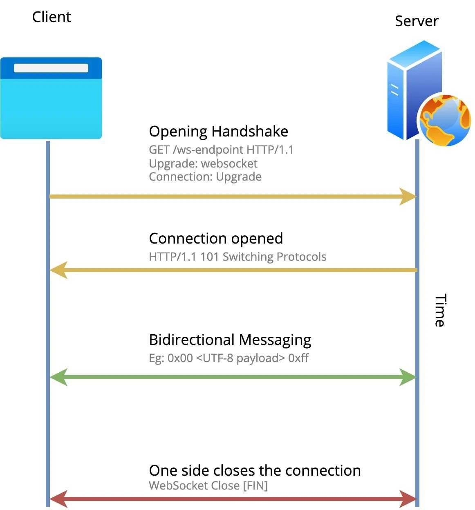
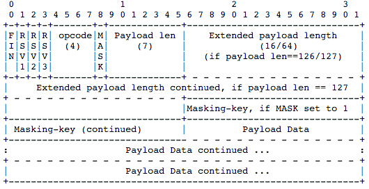

# WebSocket 系列

本文档中的内容主要摘自网络，内容可能不会十分严谨，请自行评估。

## 简介 WS 协议

WebSocket（简称 WS）是一种在单个 TCP 连接上进行全双工通信的网络协议。它使得浏览器和 Web 服务器之间可以进行实时的、双向的通信，而无需借助传统的
HTTP 请求-响应模式。

**目的**：WS 的出现是为了解决 HTTP 无法实现的双向通信问题。

**场景**：适用于需要实时、低延迟通信的场景。例如在线游戏、实时聊天、实时数据更新等。

## 重要特点

1. **全双工通信**：WS 建立在单个 TCP 连接上，并且支持全双工通信，客户端和服务器可以同时发送和接收数据。
2. **低延迟**：由于 WS 建立的是持久连接，不需要像 HTTP 请求-响应模式那样频繁地建立和断开连接，因此可以实现低延迟的实时通信。
3. **轻量级**：WS 的消息头较小，且连接建立时的握手过程相对简单，因此在通信时的数据头部较小。（服务端到客户端的包头只有 2~10
   字节（取决于数据包长度），客户端到服务端的的话，需要加上额外的 4 字节的掩码。而 HTTP 协议每次通信都需要携带完整的头部。）
4. **跨域支持**：支持跨域通信，可以在浏览器和任意 WS 服务器之间进行通信。
5. **端口友好**：与 HTTP 协议使用相同的端口（80 和 443），可以与现有的 HTTP 服务器进行无缝集成。
6. **安全性**：支持加密传输，可以通过 TLS/SSL 进行加密通信，保障通信数据的安全性。
7. **支持扩展**。WS 协议定义了扩展，用户可以扩展协议，或者实现自定义的子协议。（比如支持自定义压缩算法等）

## 工作原理

WS 的工作原理非常简单，具体步骤如下：

- WebSocket 协议通过 HTTP/HTTPS 协议建立连接，然后协议升级到 WebSocket；
- 客户端发送一个 HTTP 请求给服务器，请求中包含了特殊的头部信息 `Upgrade: websocket`，表示希望升级到 WebSocket 协议。
- 服务器收到请求后，如果支持 WebSocket 协议，则返回一个状态码 `101 Switching Protocols`，表示协议切换成功。
- 之后，客户端和服务器之间就可以使用 WebSocket 协议进行全双工通信，可以发送和接收字符串或二进制消息，直到连接关闭。

<div align="left">

</div>

### 具体握手流程

#### 客户端发起握手请求

首先，客户端发送一个 HTTP 请求给服务器，请求中包含了特殊的头部信息 `Upgrade: websocket`，表示希望升级到 WebSocket 协议。

```plain
GET / HTTP/1.1
Host: localhost:8080
Origin: http://127.0.0.1:3000
*Connection: Upgrade
*Upgrade: websocket
*Sec-WebSocket-Version: 13
*Sec-WebSocket-Key: w4v7O6xFTi36lq3RNcgctw==
Sec-WebSocket-Protocol: json, xml
Sec-WebSocket-Extensions: permessage-compress, permessage-deflate
```

其中标星的字段都是 WebSocket 协议规定的必需的握手头部信息。其中：

- `Upgrade` 表示希望升级到 WebSocket 协议；
- `Upgrade: websocket` 表示希望升级到 WebSocket 协议；
- `Sec-WebSocket-Version` 表示 WebSocket 协议的版本号（多个以逗号分隔），如果服务端不支持该版本，需要返回一个
  Sec-WebSocket-Version header，里面包含服务端支持的版本号；
- `Sec-WebSocket-Key` 是一个 Base64 编码的值，是浏览器随机生成的，用于握手过程中的安全验证。
- `Sec-WebSocket-Protocol` 是客户端希望与服务器传输数据时使用的子协议（一般是指消息数据类型，比如 JSON/Protobuf
  等），服务端可以根据客户端提供的子协议列表选择一个或多个子协议。协议的值不做规定。
- `Sec-WebSocket-Extensions` 是客户端希望与服务器传输数据时使用的扩展（比如压缩、加密和心跳检测等），服务端可以根据客户端提供的扩展列表选择一个或多个扩展。扩展的值不做规定。
    - 每个扩展还可以携带参数，例如`a=1`；
    - 不同的 WS 实现可能支持不同的扩展，因此需要进行两端协商；

#### 服务器响应升级

服务器收到请求后，如果支持 WebSocket 协议，则返回一个状态码 `101 Switching Protocols`，表示协议切换成功。响应如下：

```plain
HTTP/1.1 101 Switching Protocols
Connection:Upgrade
Upgrade: websocket
Sec-WebSocket-Accept: Oy4NRAQ13jhfONC7bP8dTKb4PTU=
Sec-WebSocket-Protocol: json
Sec-WebSocket-Extensions: permessage-compress
```

其中`Sec-WebSocket-Accept`字段用于响应客户端的`Sec-WebSocket-Key`字段，是一个 Base64 编码的值，
是服务器根据客户端的`Sec-WebSocket-Key`计算得出的，用于握手过程中的安全验证。计算公式为：

- 将`Sec-WebSocket-Key`跟`258EAFA5-E914-47DA-95CA-C5AB0DC85B11`拼接。
- 通过 SHA1 计算出摘要，并转成 base64 字符串。

`Sec-WebSocket-Protocol: json`表示服务器希望使用 json 子协议。`Sec-WebSocket-Extensions`表示服务器支持的扩展。

### 消息格式

在握手完成后，WS 协议就可以在长连接上进行双向通信了。WS 规定双端以数据帧格式通信，即二进制格式。一条 WS 消息可以由一个或多个数据帧组成。

**数据帧的格式**如下图

<div align="left">

</div>

细节如下：

- **FIN**：1 bit，表示是否是消息的最后一个帧。
- **RSV1, RSV2, RSV3**：三个标志 bit， 表示不同的 WS 扩展功能，对应标志位为 1 则启用。
- **opcode**：4 bit，表示数据帧的类型，重要！
    - 0x0：表示一个延续帧。当一个消息需要分多个帧发送时，需要将 `opcode` 设置为 `0x0`。
    - 0x1：表示一个文本帧。
    - 0x2：表示一个二进制帧。
    - 0x3-7：保留，用于后续定义的非控制帧。
    - 0x8：表示请求连接关闭的帧。（可能会在载荷数据中携带错误码，其中的前 2 个字节为无符号整型，表示错误码）
    - 0x9：表示这是一个 ping 帧。（可以携带数据）
    - 0xA：表示这是一个 pong 帧，回应 ping 帧。（携带的数据需要和 ping 一致）
    - 0xB-F：保留的操作代码，用于后续定义的控制帧。
- **MASK**：1 bit，表示是否使用掩码。服务端发送给客户端的数据帧不能使用掩码，客户端发送给服务端的数据帧必须使用掩码。
  如果 Mask 是 1，那么在 Masking-key 中会定义一个掩码键（masking key），并用这个掩码键来对数据载荷进行反掩码。所有客户端发送到服务端的数据帧，Mask
  都是 1。
- **Payload len**：7 bit，当数据长度为 0 ~ 125 时，表示数据长度。
    - 当数据的长度为 126 个字节时，则用后面相邻的 2 个字节来保存一个 16bit 位的无符号整数作为数据的长度。
    - 当数据的长度大于 126 个字节时，则用后面相邻的 8 个字节来保存一个 64bit 位的无符号整数作为数据的长度。
- **Masking-key**：0 或 4 字节，当 MASK 位设置为 1 时，表示掩码键，用来与载荷数据进行 XOR 运算，是一种简单的编码，作为一项安全措施；
    - 注意：载荷数据的长度，不包括 Masking-key 的长度。
- **Payload data**：(x+y) 字节。载荷数据部分，包括了扩展数据、应用数据。其中，扩展数据 x 字节，应用数据 y 字节。
    - 扩展数据：如果没有协商使用扩展的话，扩展数据数据为 0 字节。所有的扩展都必须声明扩展数据的长度，或者可以如何计算出扩展数据的长度。
    - 应用数据：任意长度的应用数据，在扩展数据之后（如果存在扩展数据），也是数据帧的最后部分。载荷数据长度 减去
      扩展数据长度，就得到应用数据的长度。。

### 掩码 key 算法

掩码键（Masking-key）算法用于客户端向服务端发送数据时对数据载荷进行掩码处理，以增加安全性。掩码键是一个 32 位的随机数，由客户端生成，并在
WebSocket 握手过程中发送给服务端。服务端在接收到客户端的 WebSocket 数据帧时，会使用这个掩码键对数据进行反掩码处理，还原原始数据。

步骤如下：

- 生成掩码键：客户端生成一个 4 字节（32 位）的随机掩码键。
- 应用掩码：客户端将掩码键应用于数据帧的每个字节上。掩码操作不会影响数据载荷的长度。
- 掩码算法：对于数据载荷中的每个字节 original-octet-i，客户端使用掩码键中的一个字节 masking-key-octet-j 与
  original-octet-i 进行异或（XOR）操作，得到转换后的字节 transformed-octet-i。计算 j 的值的方法是 j = i MOD 4。
- 发送数据帧：客户端将经过掩码处理的数据帧发送给服务端。
- 反掩码处理：服务端接收到数据帧后，使用相同的掩码键和上述算法对数据进行反掩码处理，还原出原始的数据载荷。

掩码算法的伪代码表示为：

```plain
for i from 0 to PayloadLen - 1 do
    j = i MOD 4
    transformed-octet-i = original-octet-i XOR masking-key-octet-j
end for
```

**作用**

掩码算法的主要作用是增强协议的安全性，但数据掩码并不是为了保护数据本身，因为算法本身是公开的。具体是为了抵御一种针对早期不支持
WS 或实现不当的代理服务器的缓存污染攻击。

**代理缓存污染攻击**

首先存在一个实现 WS 不当的代理服务器，以及攻击者搭建的恶意服务器和运行在其之上的恶意页面。下面是具体步骤：

1. **阶段一**；
2. 攻击者访问恶意页面，该页面会通过代理服务器请求与恶意服务器建立 ws 连接；
3. 由于代理服务器实现不当，它只是原样转发 ws 的握手请求给恶意服务器，而恶意服务器会返回一个 ws
   响应给代理服务器。然后攻击者浏览器（通过代理服务器）与恶意服务器建立 ws 连接，
   但代理服务器没有建立任何 ws 连接；
4. 随后，攻击者浏览器开始发送 ws 消息帧。由于代理服务器并不认识 ws 消息帧，所以攻击者就伪造了一个符合 ws 消息帧格式的 HTTP
   GET 请求消息（明修栈道-暗度陈仓）。
    - 这是一个精心构造的 HTTP GET 请求，其中的 URL 字段指向恶意服务器，但 Host 字段指向 <u>被攻击服务器</u> 地址，
5. 代理服务器将 ws 消息帧识别为 HTTP GET 请求，并根据 URL 指示的地址请求恶意服务器，然后缓存恶意服务器返回的响应；
6. **阶段二**；
7. 攻击者通过某些方式诱导正常用户使用 HTTP GET 请求（通过代理服务器）访问被攻击服务器，且 URL-PATH 与之前构造的 URL-PATH
   相同；
8. 代理服务器（通过 Host 和 URL-PATH）检查到已经缓存了恶意服务器的响应，所以直接返回恶意数据给用户，而不会去请求
   <u>被攻击服务器</u>。

> 这里的代理服务器一般是指公共的正向代理服务器，它的影响面较大。

**使用掩码 key 的解决方案**

当采用掩码 key 方案后，客户端（此例是浏览器）在每次发送数据帧时，都会生成一个随机的 4 字节（32 位）的掩码 key（不能被 JS
猜出，否则可以反向构造），
并使用该掩码 key 对数据帧进行对称的异或处理，这样的消息编码方案导致攻击者无法获知消息帧在网络上传输的字节流序列的具体形式，自然也就无法被通过
WS
API 发送某些数据来构造出可以被代理误解为 HTTP 请求的数据帧了。

注意，掩码方案不会改变载荷数据的长度，并且可以被服务器使用掩码 key 解码。

**遗留的问题**

掩码 key 只是强制要求标准的 WS 客户端（一般是浏览器）对数据帧进行掩码处理，但攻击者可以自己实现一套 WS 客户端&服务器，使得攻击照常进行。
即便如此，但它仍然大大增加了攻击难度，减小了攻击影响范围。最好的办法是替换那些 WS 实现不当的代理服务器，杜绝它们将 WS 数据帧误解为
HTTP 请求的可能。

### 数据传输

客户端和服务端在建立连接后，就可以进行双向通信了。WebSocket 根据`opcode`来区分操作的类型。比如`0x8`表示断开连接，`0x0`-`0x2`
表示数据交互。

#### 数据分片

WebSocket 的每条消息可能被切分成多个数据帧。当 WebSocket 的接收方收到一个数据帧时，会根据 FIN 的值来判断，是否已经收到消息的最后一个数据帧。
FIN=1 表示当前数据帧为消息的最后一个数据帧，此时接收方已经收到完整的消息，可以对消息进行处理。FIN=0，则接收方还需要继续监听接收其余的数据帧。

**举例**  
在进行数据交换的过程中，WS 通常会在消息的第一个分片中设置`opcode`为`0x1`或`0x2`，表示正在传输的消息是文本或二进制类型，
后续分片中的`opcode`将会设置为`0x0`，表示为一个延续帧；最后一个分片中的 opcode 仍然为`0x0`，但 FIN=1。

```plain
Client: FIN=1, opcode=0x1, msg="hello"
Server: (process complete message immediately) Hi.
Client: FIN=0, opcode=0x1, msg="and a"
Server: (listening, new message containing text started)
Client: FIN=0, opcode=0x0, msg="happy new"
Server: (listening, payload concatenated to previous message)
Client: FIN=1, opcode=0x0, msg="year!"
Server: (process complete message) Happy new year to you too!
```

### 心跳保持

在某些场景中，即使没有数据传输，客户端和服务端也需要保持连接的活跃性。WebSocket 协议提供了两种控制消息类型来保持连接的活跃性：
ping 和 pong。发送方发送一个 ping 消息，希望收到一个 pong 消息。

ping/pong 的操作，对应的是 WebSocket 的两个控制帧，`opcode` 分别是`0x9`、`0xA`。

### Sec-WebSocket-Key/Accept 的作用

`Sec-WebSocket-Key`/`Sec-WebSocket-Accept` 在主要作用在于提供基础的防护，**减少恶意连接**、**意外连接**。

- 避免服务端收到非法的 websocket 连接（比如 http 客户端不小心请求连接 websocket 服务，此时服务端可以直接拒绝连接）
- 确保服务端理解 Websocket 连接。（正确的服务器行为是处理`Sec-WebSocket-Key`值，并返回`Sec-WebSocket-Accept`）
- 防止代理缓存污染。（避免在代理接收到两次 ws 连接请求时，返回所缓存的第一次请求的响应。当有了这个 key 后，每个连接请求的 key
  都是不同的）
- 避免非故意的连接升级。（在客户端使用 AJAX 发送请求时，`Sec-WebSocket-Key` 等与 WebSocket 握手相关的头部是被禁止的，这可以防止客户端不小心将
  HTTP 请求升级到 WebSocket 连接）

设计这两个字段的目的不是确保安全性，而是预防一些常见的意外情况。数据传输的安全性，需要通过 TLS/SSL 来实现。